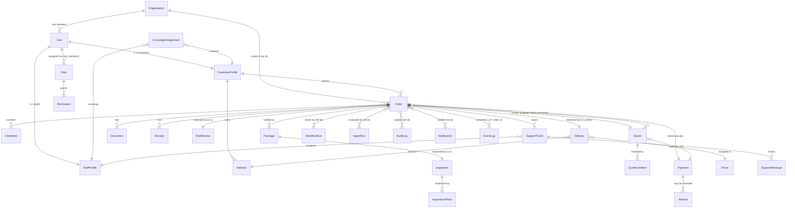

# BorderPass — Backend Contract Package

> **Status:** ACTIVE · **Version:** 1.0 (draft for review) · **Last updated:** 2026-06-29
> **Owner:** Principal Backend Architect (BorderPass) · **Audience:** coding agents + reviewers implementing the BorderPass backend on the Maralito Platform.

This package is the **single source of truth for implementation**. Every coding agent that builds an entity, endpoint, workflow, or event **must** conform to these contracts. It is **architecture/contract-level only** — no application code, no Drizzle/SQL DDL, no Zod runtime code, no full migrations. Type signatures and JSON examples are illustrative contracts, not implementation.

## What changed from the deferred scaffold

The previous `README.md` deliberately deferred these contracts until the Technical Architecture Document (TAD) was signed off. That gate is now passed: these contracts are **generated from** the approved TAD, PRD, and Maralito Platform/Automation architecture, and they encode an agreed design rather than a guess.

## Documents in this package

| File | Deliverables covered | Use it for |
|------|----------------------|------------|
| `00-README.md` (this file) | Data model overview, ER map, global conventions | Orientation, naming/ID/money/time rules, traceability |
| [`01-data-model.md`](./01-data-model.md) | Entity defs, field-level defs, required/optional/sensitive, retention, indexing, RLS, per-entity enums | Building tables/models |
| [`02-api-contracts.md`](./02-api-contracts.md) | API endpoint catalog, request/response, server actions, validation, side effects, events emitted, audit, error standards | Building the BFF (server actions + route handlers) |
| [`03-event-contracts.md`](./03-event-contracts.md) | Event envelope, event schema catalog, webhook contracts, workflow trigger events, agent-run + workflow-run contracts | Building producers/consumers, workflows, webhooks |
| [`04-state-machines.md`](./04-state-machines.md) | Order / Payment / Inspection / Delivery state machines, notification trigger matrix | Building the durable state machine + notifications |
| [`05-access-control-and-data-requirements.md`](./05-access-control-and-data-requirements.md) | RBAC, RLS, role-based data access, audit-log contract, validation rules, admin/customer/reporting data requirements | Enforcing authZ + building dashboards/screens/reports |

## Source-of-truth traceability

These contracts are derived from and must stay consistent with:

1. **BorderPass PRD / Product Architecture** — `borderpass/docs/` (esp. `09-order-state-machine.md`, `11-roles-and-permissions.md`, `14-notification-strategy.md`, `15-data-requirements.md`, `16-admin-ops-requirements.md`, `17-metrics-kpis.md`).
2. **BorderPass Technical Architecture (TAD)** — `borderpass/technical-architecture/docs/` (esp. `02-backend-api-and-admin.md`, `03-automation-workflow-and-events.md`, `06-auth-rbac-security-privacy.md`, `07-data-architecture.md`).
3. **Maralito Platform Architecture** — `maralito-platform/docs/` (esp. `05-authentication-authorization.md`, `06-api-and-events.md`).
4. **Maralito Automation Platform Architecture** — `maralito-platform/automation/docs/` (esp. `03-event-bus-and-schema.md`, `04-workflow-lifecycle.md`, `05-agent-orchestration.md`, `17-data-model.md`, `18-api-endpoints.md`).
5. **Approved Stitch UI design direction** — `borderpass/design-reference/`.

When this package and a source doc disagree, **fix this package** (or escalate) — do not silently diverge.

---

## 1. Data model overview (Deliverable 1)

BorderPass uses a **two-tier, reference-by-id** model (TAD §07):

- **Platform-owned entities** live in Maralito services and their own Neon Postgres DB. BorderPass **references them by id only** and resolves them through `@maralito/sdk`. There are **no cross-DB foreign keys**. Platform-owned: `User`, `Payment`, `Refund`, `Receipt`(financial ledger side), `Notification`, `AuditLog`, `AgentRun`, `WorkflowRun`, `EventLog`, `WebhookEvent`, file metadata.
- **BorderPass-owned domain entities** live in the BorderPass Neon Postgres DB with **RLS by `org_id`**: `CustomerProfile`, `StaffProfile`, `Address`, `Order`, `OrderItem`, `Package`, `Quote`, `QuoteLineItem`, `Document`, `Inspection`, `InspectionPhoto`, `RiskReview`, `Delivery`, `Driver`, `ConciergeAssignment`, `SupportTicket`, `SupportMessage`.
- `Organization`, `Role`, `Permission` are **platform identity/RBAC primitives** referenced by BorderPass; BorderPass registers app-scoped roles (e.g. `inspector`) and permissions against the platform catalog.

Cross-DB integrity is maintained by **reference-by-id + events (eventual consistency) + idempotent reconciliation jobs**. Projections (Border Journey view, search index, analytics rollups) are **rebuildable from events**, never the system of record.

### Ownership map

| Entity | Owner DB | Notes |
|--------|----------|-------|
| User | Platform (Identity) | One human identity across all apps; customer/staff are **roles**, not separate identity tables |
| Organization | Platform (Identity) | Tenant boundary; `org_id` is the RLS key everywhere |
| Role, Permission | Platform (RBAC) | `resource.action[.qualifier]` permission strings; BorderPass registers app-scoped roles |
| Payment, Refund | Platform (Payments → Stripe) | Append-only ledger is system of record; no raw card data, Stripe refs only |
| Receipt | **Split** | Financial/issued receipts ride Payments ledger; customer-uploaded proof rides Files. BorderPass stores a `Document`/`Receipt` row referencing `file_id` + `payment_id` |
| Notification | Platform (Notifications → Resend/Twilio/WhatsApp) | BorderPass triggers + references by id |
| AuditLog | Platform (Audit) | Append-only, hash-chained, immutable |
| AgentRun, WorkflowRun, EventLog, WebhookEvent | Platform (Automation) | BorderPass references by id; reads via Automation API |
| CustomerProfile, StaffProfile, Address | BorderPass | PII — Restricted class, field-encrypted |
| Order, OrderItem, Package | BorderPass | Order is the aggregate root; `correlation_id = order_id` |
| Quote, QuoteLineItem | BorderPass | Financial |
| Document, Inspection, InspectionPhoto, RiskReview | BorderPass | Compliance/Confidential |
| Delivery, Driver, ConciergeAssignment | BorderPass | Operational |
| SupportTicket, SupportMessage | BorderPass | Confidential (PII content) |

---

## 2. Entity relationship map (Deliverable 2)

> Dashed/`}o--o{` relations to `WorkflowRun`, `AgentRun`, `AuditLog`, `Notification`, `EventLog` are **logical references by id across the DB boundary**, not foreign keys.

---

## 3. Global conventions (apply to every contract)

### 3.1 Identifiers
- All primary keys are **prefixed ULIDs/UUIDs**: `usr_`, `org_`, `ord_`, `itm_`, `pkg_`, `qte_`, `qli_`, `pay_`, `ref_`, `rcpt_`, `doc_`, `insp_`, `iph_`, `risk_`, `dlv_`, `drv_`, `cona_`, `tkt_`, `msg_`, `addr_`, `cust_`, `staff_`, `evt_`, `wfr_`, `agr_`, `whk_`, `aud_`, `ntf_`.
- `Order` additionally carries a **human-facing reference** `order_ref` formatted `BP-####` (e.g. `BP-8492`), and a corridor tracking id shown to customers as `BP-####-MX`.
- `correlation_id` for everything in an order's lifecycle **equals `order_id`** so the whole journey is queryable/replayable.

### 3.2 Money
- All monetary amounts are **integer minor units** (`amount_minor: int`) **plus an ISO-4217 `currency` code** (`USD` or `MXN`). Never floats. A `Money` shape is `{ amount_minor: int, currency: "USD" | "MXN" }`.

### 3.3 Time
- All timestamps are **UTC ISO-8601** strings (`created_at`, `updated_at`, `occurred_at`, …). Durations use ISO-8601 (`"PT30M"`, `"P30D"`).

### 3.4 Sensitivity classes
Every field is classified. RLS, encryption, audit, and retention follow the class.

| Class | Meaning | Handling |
|-------|---------|----------|
| **Public** | Non-sensitive, shareable | None special |
| **Internal** | Operational, staff-visible | RLS + RBAC |
| **Confidential** | Business/financial, limited access | RLS + RBAC + access audit |
| **Restricted** | PII, financial PII, KYC, compliance | RLS + RBAC + **field-level KMS encryption** + access audit + retention controls |

### 3.5 Tenancy
- Every BorderPass row carries `org_id` (and `app_id = "borderpass"`). **RLS is enforced on every table.** `org_id` is **derived from the validated session token by the BFF — never client-supplied**.

### 3.6 Validation, idempotency, errors (API)
- **Zod validation at every boundary** before any side effect.
- All mutations accept an **`Idempotency-Key`** header (and event effects are keyed by `idempotency_key`); retries are safe.
- Canonical error shape: **`{ code, message, details?, request_id, trace_id }`** (see `02-api-contracts.md` §Error standards).
- **Cursor-based pagination** with stable ordering; no offset pagination on large sets.

### 3.7 Events
- Envelope and naming follow the platform standard (`03-event-contracts.md`). BorderPass events are `borderpass.<entity>.<pastTenseVerb>`; platform events (`payment.*`, `notification.*`, `workflow.*`, `approval.*`, `task.*`, `agent.*`, `file.*`, `user.*`) are reused as-is.
- **At-least-once** delivery; **idempotent consumers keyed by `event.id`**; **outbox pattern** (state change + event in one transaction).

### 3.8 Human-approval gates
- Actions marked **`HUMAN-APPROVAL`** can never be finalized by an AI agent. Agents **recommend**; a recorded human decision advances the workflow. Separation of duties applies (requester ≠ approver for refunds/compliance).

### 3.9 Placeholders
- Values marked **`⚠️ VERIFY`** (duty rates, thresholds, retention periods, prohibited categories, quote-expiry window, abandonment grace) are **placeholders pending the Compliance & Customs Operating Model and licensed legal/tax review**. They must be configurable via the versioned rules engine, **never hard-coded**.

---

## 4. Open items to reconcile (carried from source docs)

These are tracked so implementers don't re-litigate them ad hoc. Resolutions adopted by this package are noted.

1. **State naming** `ready_for_crossing` vs `border_documentation_ready` — **adopted: both are distinct states**; docs are split into `border_documentation_ready` → `ready_for_crossing` (see `04-state-machines.md`).
2. **`service_type` enum vs journey labels** — **adopted enum:** `buy_for_me | package_reception | local_pickup | business_delivery`. "Deliver to Juárez" is a delivery attribute of an order, not a separate service type. (Reconciles PRD 15's `pickup` → `local_pickup`.)
3. **Order↔Delivery cardinality** — **adopted: 1 active Delivery per Order (1-1 active), with delivery attempts modeled on the Delivery row** (`attempts`), and historical re-deliveries allowed (logical 1-N over time). Contracts treat "current delivery" as 1-1.
4. **Event envelope shape** (nested `metadata`/`subject`/`actor` vs flat) — **adopted: automation `§5.1` nested envelope is the wire contract; flat columns are the persistence projection.**
5. **Per-entity status enums** not enumerated in source (`Package.status`, `Quote.status`, `Delivery.status`, `Payment.status`, ticket fields) — **defined in this package** (`01-data-model.md` + `04-state-machines.md`).
6. **Storage provider** (R2 vs Supabase Storage) and **workflow engine** (Inngest vs Trigger.dev) — `⚠️ VERIFY`, undecided; contracts stay provider-agnostic.

See each file's footer for the deliverables it satisfies.
