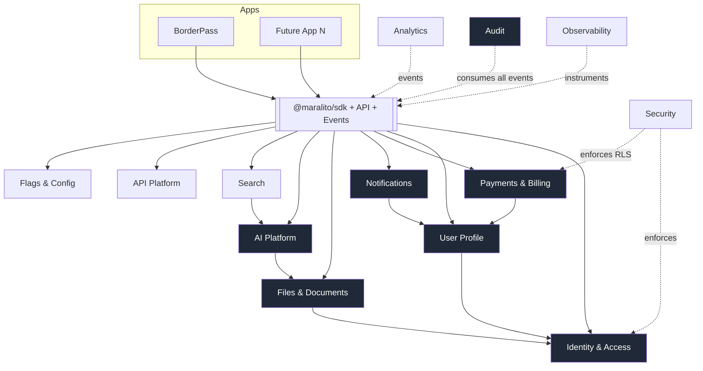

# 03 · Service Catalog

The catalog is the canonical list of platform services. Each entry defines the service's **responsibility**, **owned data**, **key capabilities**, **contracts it exposes**, **events it emits/consumes**, and **primary stack**. Service *boundaries* and *data ownership* are formalized in [System Architecture](./04-system-architecture.md); this file is the breadth-first inventory.

> **Reading note:** "Owns" means this service is the single writer/source of truth for that data. Other services read it only through contracts (SDK/API/events), never by direct table access (Principle **P2**).

---

## Catalog at a glance

| # | Service | Tier | Owns (source of truth) | MVP? |
|---|---------|------|------------------------|------|
| S1 | Identity & Access | Core | Users, orgs, memberships, roles, API keys, sessions | ✅ |
| S2 | User Profile | Core | Customer profile, addresses, contacts, preferences, payment-method refs, KYC metadata | ✅ |
| S3 | Payments & Billing | Core | Customers↔Stripe, payment intents, invoices, subscriptions, usage, fees, financial ledger | ✅ (core) |
| S4 | Notifications | Core | Templates, messages, delivery status, channel prefs | ✅ (email + 1) |
| S5 | Files & Documents | Core | File metadata, tags, ACLs, expiration policies | ✅ |
| S6 | AI Platform | Core | Prompts, tools, agent graphs, memory, embeddings, AI cost ledger, eval results | ✅ (gateway) |
| S7 | Audit & Compliance | Core | Immutable audit/event history | ✅ |
| S8 | Analytics | Supporting | Event stream, metrics, funnels, dashboards config | ◻ v1 |
| S9 | Search & Knowledge | Supporting | Search indexes, vector indexes | ◻ v1 |
| S10 | API Platform | Cross-cutting | API keys (with S1), webhooks, rate-limit state, API versions, docs | ✅ (internal) |
| S11 | Localization | Cross-cutting | Locales, translations, formatting rules | ◻ v1 |
| S12 | Feature Flags & Config | Cross-cutting | Flags, config, rollout rules | ✅ |
| S13 | Observability | Cross-cutting | Logs, metrics, traces, alerts (mostly via vendors) | ✅ |
| S14 | Security | Cross-cutting | Secrets refs, encryption keys, RLS policies, abuse/fraud signals | ✅ |
| S15 | Developer Experience | Cross-cutting | Monorepo, SDK, UI kit, CLI, CI/CD, envs | ✅ |

---

## S1 · Identity & Access

**Responsibility:** Authenticate principals and authorize what they can do, across all apps and tenants.

**Capabilities**
- User authentication (email/password, magic link, OAuth/social, SSO-ready for enterprise later).
- **Organizations/tenants** — create org, invite members, org settings, org-scoped everything.
- **Roles & permissions** — RBAC with org-scoped and app-scoped roles; permission checks exposed via SDK.
- **Principal types:** admin users (Maralito staff), customer users (end users of an app), staff users (org-internal operators). Modeled as roles, not separate user tables.
- **API keys** — per-org, per-app, scoped, hashed at rest, revocable, with usage attribution (shared with S10).
- **Session management** — issue/refresh/revoke sessions; device/session listing; forced logout.
- **MFA-ready** — TOTP/WebAuthn-ready data model and flows even if MFA enforcement is phased in.

**Owned data:** `users`, `orgs`, `org_members` (user×org×roles), `roles`, `permissions`, `api_keys`, `sessions`, `auth_identities` (provider links), `mfa_factors`.

**Contracts:** `auth.*`, `orgs.*`, `rbac.*`, `apiKeys.*` SDK namespaces; OIDC-style tokens carrying `sub`, `org_id`, `app_id`, roles/permissions claims.

**Emits:** `user.created`, `user.invited`, `org.created`, `member.role_changed`, `session.revoked`, `apikey.created/revoked`.
**Consumes:** `payment.customer.linked` (to backfill profile), security signals from S14.

**Stack:** Supabase Auth **or** Auth.js on Postgres `⚠️ VERIFY` (decision in [AuthN/Z](./05-authentication-authorization.md)); Postgres (Neon) for identity tables; Upstash for session/refresh token rate limiting.

---

## S2 · User Profile

**Responsibility:** One canonical customer profile reused across all apps, separate from auth credentials.

**Capabilities:** shared profile (name, avatar, locale), **addresses** (multiple, typed: billing/shipping/inspection-site), **phone numbers** (verified flags), **language preference**, **notification preferences** (feeds S4), **saved payment methods** (references to Stripe — never raw card data), **KYC/identity metadata** when an app needs verification (status, level, provider refs — not raw documents, which live in S5 under stricter ACLs).

**Owned data:** `profiles`, `addresses`, `phone_numbers`, `profile_preferences`, `kyc_records` (metadata only).

**Contracts:** `profile.*`, `addresses.*`, `preferences.*` SDK namespaces.

**Emits:** `profile.updated`, `address.added`, `kyc.status_changed`.
**Consumes:** `user.created` (S1) to create profile shell; `payment_method.attached` (S3).

**Stack:** Postgres (Neon), RLS-scoped by `org_id`/`user_id`; sensitive KYC fields column-encrypted (see [Security](./08-security-architecture.md)).

---

## S3 · Payments & Billing

**Responsibility:** All money movement and the financial source of truth, abstracting Stripe.

**Capabilities:** Stripe integration; **payment intents** (one-time charges); **invoices**; **refunds**; **receipts**; **subscriptions**; **usage-based/metered billing**; **platform fees** (Stripe Connect for marketplace/split flows) `⚠️ VERIFY`; **financial audit trail** (immutable ledger mirrored to S7).

**Owned data:** `billing_customers` (org/user ↔ Stripe customer), `payment_intents`, `invoices`, `subscriptions`, `subscription_items`, `usage_records`, `refunds`, `platform_fees`, `financial_ledger` (append-only), `stripe_events` (webhook idempotency).

**Contracts:** `billing.*`, `subscriptions.*`, `usage.*`, `payments.*` SDK namespaces; Stripe webhooks ingested only here.

**Emits:** `payment.succeeded/failed`, `invoice.paid`, `subscription.created/updated/canceled`, `refund.issued`, `usage.recorded`.
**Consumes:** app-domain events that trigger charges (e.g., `borderpass.order.completed`); `entitlement.check` requests.

**Stack:** Stripe (+ Connect), Postgres ledger, Inngest/Trigger.dev for webhook processing and dunning, Upstash for idempotency keys.

---

## S4 · Notifications

**Responsibility:** Deliver messages across channels with templates, preferences, status, and retries.

**Capabilities:** **email** (Resend), **SMS** (Twilio), **WhatsApp** (Twilio/WhatsApp Business) `⚠️ VERIFY`, **push** (web/mobile), **in-app** notifications; **templates** (versioned, localized via S11); **delivery status** tracking; **retry logic** with backoff; **per-user preferences** (channel + category opt-in/out, quiet hours).

**Owned data:** `notification_templates`, `notifications` (one per send attempt), `deliveries` (status per channel), `notification_preferences` (or referenced from S2), `suppression_list` (bounces/unsubscribes).

**Contracts:** `notifications.send`, `notifications.template.*`, `notifications.prefs.*`.

**Emits:** `notification.sent/delivered/failed/bounced`, `notification.opened/clicked`.
**Consumes:** virtually every state-change event from other services (e.g., `payment.succeeded` → receipt email).

**Stack:** Resend, Twilio, web push (VAPID) / mobile push provider `⚠️ VERIFY`, Inngest/Trigger.dev for fan-out + retries, Upstash for rate limiting and dedupe.

---

## S5 · Files & Documents

**Responsibility:** Secure storage and lifecycle of all binary content with access control.

**Capabilities:** **uploads** (direct-to-storage signed URLs), receipts/invoices/PDFs/images/**inspection photos**; **secure storage**; **document tagging**; **expiration policies** (TTL, legal hold override); **access control** (org/app/role/owner-scoped, signed time-limited download URLs); virus/malware scan hook `⚠️ VERIFY`; image/PDF processing hooks.

**Owned data:** `files` (metadata: owner, org, app, content-type, size, checksum, storage key, tags, expires_at, classification), `file_acls`, `file_versions`.

**Contracts:** `files.upload`, `files.getSignedUrl`, `files.tag`, `files.setPolicy`.

**Emits:** `file.uploaded`, `file.scanned`, `file.expired`, `file.deleted`.
**Consumes:** `invoice.paid` (store receipt PDF), app events that attach documents.

**Stack:** **Cloudflare R2** (or Supabase Storage) for blobs `⚠️ VERIFY`; Postgres for metadata; signed URLs; KMS/CMEK for encryption; Inngest/Trigger.dev for scan/processing/expiration sweeps.

---

## S6 · AI Platform

**Responsibility:** The single, governed surface for all AI capabilities. Detailed design in [AI Platform](./07-ai-platform.md).

**Capabilities:** **LLM gateway** (one entry point for all model calls); **model routing** (by task, cost, latency, provider availability); **prompt library** (versioned, testable); **tool registry** (functions agents may call, with permission scoping); **LangGraph orchestration** (stateful, multi-step, human-in-the-loop graphs); **agent memory** (short- and long-term, org-scoped); **RAG knowledge base** + **embeddings**; **AI cost tracking** (tokens→$ per app/org/feature); **AI safety guardrails** (input/output filters, PII handling, jailbreak/prompt-injection defense); **human approval workflows**; **evaluation & testing** (offline evals, regression suites, online scoring).

**Owned data:** `prompts`, `prompt_versions`, `tools`, `agent_graphs`, `agent_runs`, `agent_steps`, `agent_memory`, `embeddings` (pgvector), `knowledge_sources`, `ai_cost_ledger`, `guardrail_events`, `approvals`, `evals`.

**Contracts:** `ai.complete`, `ai.embed`, `ai.agents.run`, `ai.rag.query`, `ai.tools.register`, `ai.approvals.*`.

**Emits:** `ai.run.started/completed/failed`, `ai.approval.requested/decided`, `ai.guardrail.triggered`, `ai.cost.recorded`.
**Consumes:** app requests to run agents/queries; `file.uploaded` (to ingest into RAG).

**Stack:** LangGraph orchestration; model providers behind the gateway `⚠️ VERIFY`; pgvector on Postgres (Neon) for embeddings; Upstash for caching/rate limits; Inngest/Trigger.dev for long-running/async agent runs; Sentry + custom AI observability.

---

## S7 · Audit & Compliance

**Responsibility:** Immutable, queryable history of who/what did what, when — for security, compliance, and forensics.

**Capabilities:** **audit logs**; **user activity tracking**; **admin action logs**; **agent action logs**; **payment logs** (mirror of S3 ledger events); **data access logs** (reads of sensitive data); **compliance reports** (export by org/date/actor/action); **immutable event history** (append-only, tamper-evident).

**Owned data:** `audit_events` (append-only: actor, actor_type[user/admin/staff/agent/system], org, app, action, resource, before/after hash, ip, ts, request_id, trace_id), `audit_exports`.

**Contracts:** `audit.record`, `audit.query`, `audit.export`. Write path is internal-only; the SDK auto-emits audit for sensitive ops so apps can't "forget."

**Emits:** `audit.exported`.
**Consumes:** a firehose of events from all services + explicit `audit.record` calls for sensitive reads.

**Stack:** Append-only Postgres table (write-once, with hash-chaining for tamper evidence) `⚠️ VERIFY`; optionally streamed to object storage (S5/R2) for long-term WORM retention; partitioned by month.

---

## S8 · Analytics

**Responsibility:** Product, revenue, operational, and agent metrics + dashboards.

**Capabilities:** **product analytics** (user events), **funnel tracking**, **revenue metrics** (from S3), **operational metrics** (from observability), **agent-performance metrics** (from S6), **dashboard design**.

**Owned data:** analytics event stream (PostHog) + a curated metrics warehouse view; dashboard configs.

**Contracts:** `analytics.track`, `analytics.identify`; dashboards in PostHog + internal admin.

**Stack:** **PostHog** for product analytics/funnels/flags/replay; Postgres/warehouse for revenue & ops rollups; events fed via SDK and event stream.

---

## S9 · Search & Knowledge

**Responsibility:** Find things — globally and per-app, lexical and semantic.

**Capabilities:** **global search**, **app-specific search**, **vector search** (semantic), **document search** (over S5 content via S6 embeddings), **customer search** (over S2), **order/entity search** (app-provided entities registered for indexing).

**Owned data:** search indexes, vector indexes (pgvector shared with S6), an entity-registration registry (apps declare searchable entities + ACL rules).

**Contracts:** `search.query`, `search.index`, `search.registerEntity`.

**Stack:** Postgres full-text + **pgvector** for semantic `⚠️ VERIFY`; optional dedicated search engine later if scale demands. ACL-aware result filtering by org/app/role.

---

## S10 · API Platform

**Responsibility:** Expose platform + app capabilities safely to internal and external consumers.

**Capabilities:** **internal APIs** (service-to-service), **public APIs** (partners/customers), **webhooks** (outbound, signed, retried), **API authentication** (keys from S1, OAuth client-credentials for partners), **rate limiting** (per key/org/route), **API versioning**, **developer documentation** (OpenAPI-driven).

**Owned data:** `webhook_endpoints`, `webhook_deliveries`, `api_versions`, `rate_limit_policies` (state in Upstash).

**Contracts:** the API gateway/middleware itself; `webhooks.*`, `apiVersions.*` for management.

**Stack:** Next.js route handlers / edge middleware as the gateway; Upstash for rate limiting; OpenAPI + Zod for spec/validation; signed webhooks with HMAC + retries via Inngest/Trigger.dev.

---

## S11 · Localization

**Responsibility:** Make every app speak the user's language and format correctly.

**Capabilities:** **EN/ES** to start; **translation management** (keyed strings, fallback, missing-key reporting); **currency formatting**; **date/time formatting**; **region-specific rules** (tax hints, address formats, legal text variants).

**Owned data:** `locales`, `translations` (namespace×key×locale), `formatting_rules`.

**Contracts:** `i18n.t`, `i18n.format.*`; build-time + runtime resolution.

**Stack:** Standard i18n library + Postgres-backed translation store; ICU message format; integrated into the UI kit (S15).

---

## S12 · Feature Flags & Configuration

**Responsibility:** Decouple deploy from release; configure behavior per environment/app/tenant.

**Capabilities:** **feature flags**, **environment config**, **app-specific config**, **tenant-specific config**, **rollout controls** (percentage, targeting, kill switch).

**Owned data:** `flags`, `flag_rules`, `config` (scoped: global/app/org/env).

**Contracts:** `flags.isEnabled`, `config.get`.

**Stack:** **PostHog feature flags** (or a dedicated flag store) `⚠️ VERIFY`; SDK-side evaluation with safe defaults and caching (Upstash).

---

## S13 · Observability

**Responsibility:** See and alert on system + AI + workflow health. Detailed in [Observability](./09-observability.md).

**Capabilities:** **logs**, **metrics**, **traces**, **error tracking**, **alerts**, **performance monitoring**, **AI observability** (token/latency/quality), **workflow observability** (durable job runs).

**Stack:** **Sentry** (errors/traces/perf), structured logging, OpenTelemetry-style tracing through the SDK, Inngest/Trigger.dev run dashboards, PostHog for product-side, custom AI metrics from S6.

---

## S14 · Security

**Responsibility:** The controls that make P3/P9 real. Detailed in [Security](./08-security-architecture.md).

**Capabilities:** **least privilege**, **RBAC** (with S1), **row-level security**, **secret management**, **encryption** (at rest/in transit, field-level for sensitive data), **secure file access** (with S5), **input validation** (Zod at every boundary), **abuse prevention** (rate limits, bot defense), **fraud prevention** (signals + rules, esp. payments), **backup & disaster recovery**.

**Owned data:** secret references (values in a secrets manager, not the DB), `rls_policies` (as code), `abuse_signals`, `fraud_rules`.

**Stack:** Cloudflare WAF/bot management, Upstash rate limiting, KMS/CMEK, secrets manager (Vercel/Cloudflare/Doppler/etc.) `⚠️ VERIFY`, Postgres RLS, automated backups + tested restores.

---

## S15 · Developer Experience

**Responsibility:** Make building on the platform fast and safe. Detailed in [Repo & Environments](./11-repo-and-environments.md) and [CI/CD](./10-cicd-devsecops.md).

**Capabilities:** **monorepo strategy**, **shared packages**, **shared UI components**, **shared SDK** (`@maralito/sdk`), **API client**, **CLI tooling**, **local development**, **preview environments** (per PR, with DB branch), **CI/CD**, **testing strategy**.

**Stack:** Turborepo/pnpm monorepo, shared TS packages, UI kit (React + Tailwind + shadcn/ui-style), Neon DB branching for previews, Vercel preview deployments, GitHub Actions, Vitest/Playwright.

---

## Service dependency overview

