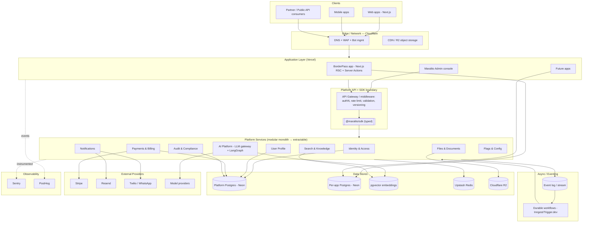
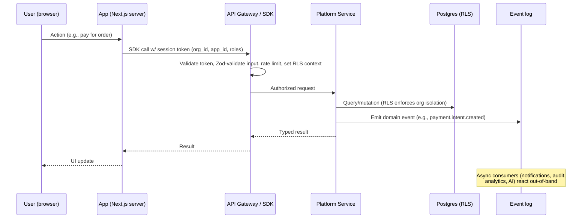
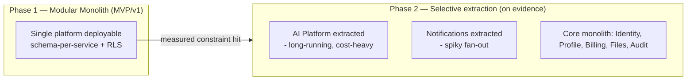
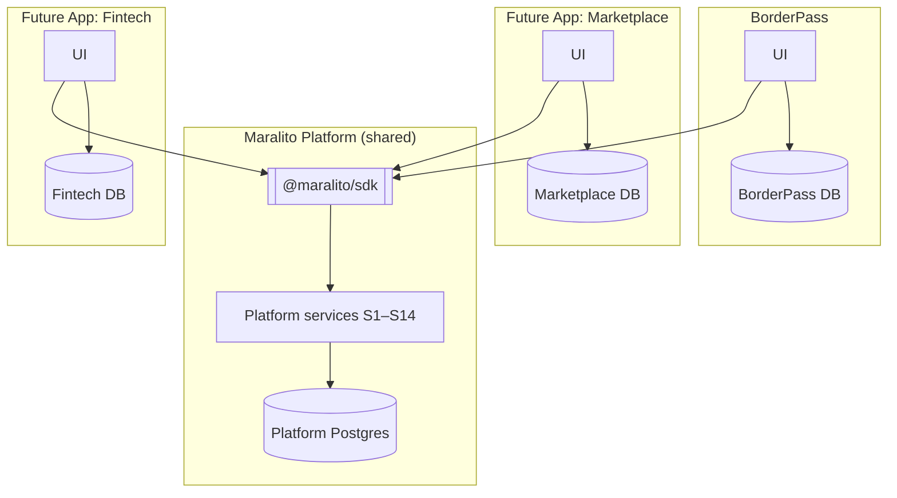
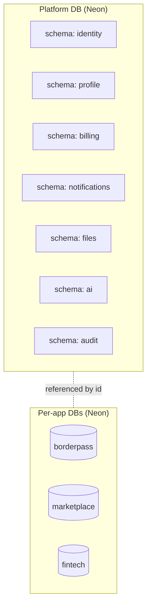

# 04 · System Architecture

Covers required outputs: **(5)** architecture diagram, **(6)** service boundaries, **(7)** data ownership, **(8)** multi-app architecture, **(9)** multi-tenant strategy, **(10)** shared vs app database.

---

## 5 · System architecture diagram (text form)

### 5.1 High-level layered view



### 5.2 Request lifecycle (synchronous read/write path)



### 5.3 Asynchronous side-effect path (event-driven)

```mermaid
sequenceDiagram
  participant Bus as Event log
  participant Jobs as Durable workflow (Inngest/Trigger.dev)
  participant S3 as Payments
  participant S4 as Notifications
  participant S7 as Audit
  participant S8 as Analytics

  S3->>Bus: payment.succeeded {idempotency_key}
  Bus->>Jobs: Deliver (at-least-once)
  Jobs->>S4: Send receipt (idempotent by key)
  Jobs->>S7: Record immutable audit event
  Jobs->>S8: Track revenue event
  Note over Jobs: Retries w/ backoff;<br/>each step idempotent (P11)
```

---

## 6 · Service boundaries

A **service** is a bounded context with: a single owner of its data, a public contract (SDK namespace + events), and an internal implementation no one else may reach.

### 6.1 Boundary rules

1. **One writer per dataset.** Only the owning service writes its tables (Principle **P2**). Others read via SDK/API/events.
2. **No cross-service joins in app code.** If an app needs data from two services, it composes via the SDK or a purpose-built read model — never by querying foreign schemas.
3. **Events are the integration seam.** Cross-service reactions happen via the event log, not synchronous chains, wherever latency allows (**P6**).
4. **Schemas are physically separated** (Postgres schema per service) even inside the monolith, so extraction later is a deploy change, not a data migration.
5. **The SDK is the only sanctioned client.** Apps never hit a service's internal endpoints directly; they go through the gateway + SDK (**P2**, **P15**).

### 6.2 Boundary map

| Service | Public contract | May read (via contract) | Never touches |
|---------|-----------------|--------------------------|---------------|
| Identity (S1) | `auth.*`, `orgs.*`, `rbac.*` | — | App domain data |
| Profile (S2) | `profile.*` | S1 (user existence) | Auth credentials, billing internals |
| Payments (S3) | `billing.*` | S2 (profile), S1 (org) | App domain tables |
| Notifications (S4) | `notifications.*` | S2 (prefs/contacts) | Billing internals |
| Files (S5) | `files.*` | S1 (RBAC) | App domain tables |
| AI (S6) | `ai.*` | S5 (docs), S9 (search) | Auth credentials, raw billing |
| Audit (S7) | `audit.query/export` (write internal) | consumes all events | — (append-only) |
| Search (S9) | `search.*` | registered entities only | Unregistered tables |
| API Platform (S10) | gateway + `webhooks.*` | all (as proxy) | — |

### 6.3 Modular monolith → microservices evolution



**Extraction triggers (Principle P5):** independent scaling need, blast-radius isolation, separate team ownership, compliance isolation, or a runtime mismatch (e.g., long-running AI vs. request/response). Until one of these is *measured*, the service stays a module.

---

## 7 · Data ownership model

### 7.1 Ownership principles

- Every table has **exactly one owning service**.
- Every customer-data table carries **`org_id`** (tenant) and, where app-specific, **`app_id`**.
- **Reference, don't copy.** Services store *references* (e.g., Stripe customer id, file id, user id) and resolve via contracts, rather than duplicating another service's data. Where a read-model copy is justified for performance, it is clearly a **projection** kept in sync via events, never authoritative.
- **PII minimization.** Sensitive fields live in the narrowest-scoped service (KYC docs in Files under strict ACL; payment instruments only as Stripe refs).

### 7.2 Ownership table

| Data domain | Owning service | Key identifiers | Sensitivity | Notes |
|-------------|----------------|-----------------|-------------|-------|
| Users, auth identities, sessions, API keys | Identity (S1) | `user_id`, `org_id` | High | Credentials never leave S1 |
| Orgs, memberships, roles | Identity (S1) | `org_id` | Med | Tenancy root |
| Profiles, addresses, contacts, prefs | Profile (S2) | `user_id`, `org_id` | Med/High | KYC metadata only |
| Billing customers, invoices, subscriptions, ledger | Payments (S3) | `org_id`, `stripe_*` | High (financial) | Ledger append-only |
| Templates, messages, deliveries | Notifications (S4) | `org_id`, `user_id` | Med | Suppression list |
| File metadata, ACLs, tags | Files (S5) | `file_id`, `org_id` | Varies (incl. High) | Blobs in R2 |
| Prompts, agents, memory, embeddings, AI cost | AI (S6) | `org_id`, `app_id` | Med | Memory org-scoped |
| Audit events | Audit (S7) | `org_id`, `actor` | High | Immutable |
| Analytics events/metrics | Analytics (S8) | `org_id`, `distinct_id` | Med | PostHog + warehouse |
| Search/vector indexes | Search (S9) | `org_id`, `app_id` | Varies | ACL-filtered |
| Flags/config | Flags (S12) | scope keys | Low | Safe defaults |
| **App domain data** | **The app itself** | `org_id`, app PKs | Varies | In app's own DB |

### 7.3 Who owns BorderPass data?

BorderPass owns its **domain** entities (e.g., crossings, inspections, shipments, orders — illustrative) in its **own database**. It does **not** own users, profiles, payments, notifications, files, or audit — those are platform-owned and referenced by id. This is the template every future app follows.

---

## 8 · Multi-app architecture

### 8.1 Model



### 8.2 App registration & contract

Each app is a **first-class registered entity** in the platform:

- An **`app` record** in Identity (id, name, allowed origins, redirect URIs, default roles, enabled services).
- **Scoped credentials**: app-specific API keys / OAuth client; the SDK is initialized with `appId` and resolves `org_id` from the session.
- **Enabled-services manifest**: an app declares which platform services it consumes (e.g., BorderPass uses S1–S7; a future app may add S8/S9). Unused services aren't wired in.
- **Per-app config & flags** (S12) and **per-app theming/i18n** (S11/S15 UI kit).

### 8.3 What's shared vs. per-app

| Concern | Shared (platform) | Per-app |
|---------|-------------------|---------|
| Identity, profile, billing, notifications, files, AI, audit | ✅ | — |
| Domain data & business logic | — | ✅ |
| UI shell / design system | ✅ (UI kit) | App composes it |
| Routing, pages, app-specific flows | — | ✅ |
| Feature flags / config | ✅ (engine) | ✅ (values) |
| Analytics events schema | ✅ (taxonomy) | ✅ (app events) |

### 8.4 Cross-app data

A user and their profile are **global** (one identity across apps), but **org membership and entitlements are per (org, app)**. Whether a user in App A is visible in App B depends on shared org membership and explicit consent — default is **isolated**. Cross-app data sharing is an opt-in, audited capability, never implicit.

---

## 9 · Multi-tenant strategy

### 9.1 Tenant model

- **Tenant = Organization (`org`).** Every customer-data row is stamped with `org_id`.
- A **user** can belong to multiple orgs (`org_members`), each with its own roles.
- The **active tenant** is established at auth time and carried in the token (`org_id` claim) and DB session (RLS context).

### 9.2 Isolation approach — pooled with RLS (DECISION)

`DECISION:` **Pooled multi-tenancy with Postgres Row-Level Security**, not a database-per-tenant model.

- **Why pooled + RLS:** one schema, dramatically simpler ops/migrations/cost at our scale, and **defense-in-depth** isolation enforced *in the database* (not just app code). RLS policies key off a session variable (e.g., `app.current_org_id`) set by the gateway per request.
- **Alternative considered — DB/schema per tenant:** stronger physical isolation and easier per-tenant export/delete, but heavy operational cost (thousands of migrations, connection sprawl) and overkill before we have large enterprise tenants. **Revisit** for specific high-compliance enterprise tenants via a *premium isolated tier* (schema- or DB-per-tenant) — the data model already carries `org_id`, so promotion is feasible.
- `⚠️ VERIFY:` Confirm RLS behavior with the chosen connection pooler (e.g., pooled/serverless drivers and PgBouncer transaction mode) — session-level `SET` must be applied per transaction. Use `SET LOCAL` within the transaction or the pooler-safe pattern. Test isolation explicitly.

### 9.3 RLS enforcement pattern (conceptual)

```text
-- Conceptual, not final DDL
ALTER TABLE invoices ENABLE ROW LEVEL SECURITY;
CREATE POLICY org_isolation ON invoices
  USING (org_id = current_setting('app.current_org_id')::uuid);

-- Gateway, per transaction:
SET LOCAL app.current_org_id = '<org from validated token>';
SET LOCAL app.current_app_id = '<app>';
SET LOCAL app.current_role   = '<role>';
```

- The **SDK/gateway is the only place** that sets these variables, from a *validated* token — apps cannot set them.
- **Service role** connections (for cross-tenant jobs like billing reconciliation) bypass RLS and are tightly restricted, audited, and never exposed to app code.

### 9.4 Isolation testing (non-negotiable)

Automated tests assert that org A can never read/write org B's rows across **every** RLS-protected table, run in CI as a gate (see [CI/CD](./10-cicd-devsecops.md)). A tenant-isolation test is required for any new table holding customer data.

### 9.5 Noisy-neighbor & fairness

Per-org rate limits and quotas (Upstash) on expensive operations (AI, notifications, file processing, search) prevent one tenant from degrading others. AI and messaging budgets are per-org (**P12**).

---

## 10 · Shared database vs. app database — recommendation

### 10.1 Recommendation

`DECISION:` **Two-tier database model.**

1. **One platform database** (Neon Postgres) for all platform-owned services (S1–S14), with **schema-per-service** and **RLS** for tenant isolation.
2. **One database per app** (Neon Postgres) for each app's domain data (BorderPass DB, future app DBs), also RLS-scoped by `org_id`.



### 10.2 Why this split

- **Platform data is shared and cross-cutting** (one identity, one billing ledger, one audit). Keeping it in a single platform DB with schema-per-service gives strong consistency for cross-service platform operations *and* clean boundaries, while staying cheap and operable.
- **App data is app-specific and independently evolving.** A per-app DB gives each app a clean blast radius, independent migration cadence, independent scaling, and trivially clear ownership. A runaway query or migration in one app cannot touch another app or the platform.
- **Isolation & compliance:** app domain data (which may include regulated content) is physically separated from platform identity/billing, simplifying reasoning about data flows and per-app data residency later.

### 10.3 Why not a single shared DB for everything

A single database holding both platform and all app data couples migration cadence, blast radius, and scaling across unrelated products, and erodes boundaries (apps would be tempted to join across schemas). It also complicates per-app data residency/portability. Rejected.

### 10.4 Why not a DB per service from day one

Premature. Schema-per-service inside one platform DB gives 90% of the boundary benefit with a fraction of the operational cost. We extract a service to its own DB only when an extraction trigger (§6.3) fires.

### 10.5 Cross-database integrity

Because platform and app DBs are separate, there are no cross-DB foreign keys. Integrity is maintained by:
- **Reference by id + contract reads** (app stores `user_id`/`org_id`, resolves via SDK).
- **Events for eventual consistency** (e.g., app reacts to `org.deleted` to clean up its rows).
- **Idempotent, replayable reconciliation jobs** for critical invariants (e.g., billing ↔ app entitlements).

`⚠️ VERIFY:` Neon connection limits, branching limits, and serverless cold-start behavior for the per-app + platform topology before committing; confirm pooling strategy (Neon serverless driver vs. pooled endpoint) for Vercel functions.

### 10.6 Where Supabase fits (evaluation note)

Supabase bundles Postgres + Auth + Storage + Realtime + RLS tooling. `DECISION:` Use Supabase **selectively** — most valuable for **Auth** and rapid RLS/Realtime — but **standardize the primary datastore on Neon Postgres** for branching-based preview environments and a clean per-app DB topology. Avoid spreading the source of truth across both Supabase-managed and Neon Postgres instances; pick one as the platform DB host to keep operations simple. Final pick (Supabase-hosted Postgres + Auth vs. Neon Postgres + Auth.js) is an ADR in [AuthN/Z](./05-authentication-authorization.md). `⚠️ VERIFY` current Supabase vs. Neon pricing, limits, and branching capabilities before locking in.
