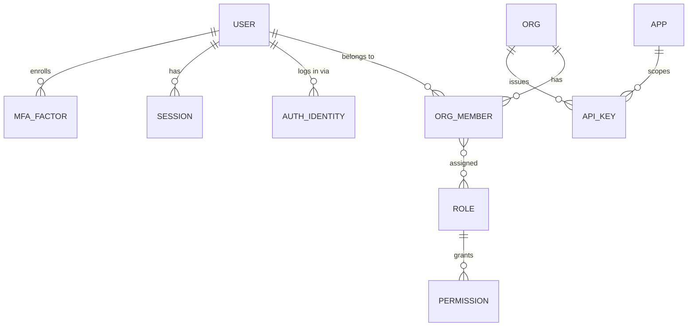
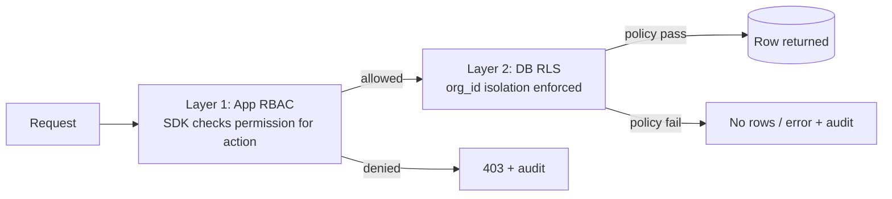

# 05 · Identity, Authentication & Authorization Model

Covers required output **(11)**.

---

## 11.1 Goals

- One identity per human across all Maralito apps; one set of credentials.
- Tenancy-aware: a user acts *within an org*, with org-scoped roles.
- Three principal classes (admin/staff/customer) plus non-human principals (API keys, services, AI agents).
- MFA-ready, SSO-ready (enterprise later), least-privilege by default.
- Authorization enforced in **two layers**: application (RBAC checks via SDK) **and** database (RLS).

---

## 11.2 Principal model



**Principal types**

| Principal | What it is | Auth method | Scope |
|-----------|------------|-------------|-------|
| Customer user | End user of an app | Password / magic link / OAuth / (SSO later) | Their org(s), customer roles |
| Staff user | Org-internal operator (a tenant's employee) | Same as customer + stronger MFA policy | Their org, elevated roles |
| Admin user | Maralito employee | SSO + mandatory MFA | Cross-org admin scopes (audited) |
| API key | Machine credential | Hashed secret / OAuth client-credentials | One org + app, scoped permissions |
| Service principal | Internal service-to-service | mTLS / signed internal tokens `⚠️ VERIFY` | Specific service permissions |
| AI agent | An agent run acting on behalf of a user/org | Delegated, time-boxed token | Subset of the delegating principal's permissions, tool-scoped |

> **Key idea:** admin/staff/customer are **roles**, not separate user tables. One `users` table; authority comes from `org_members` + `roles`. Maralito admins are users in a special internal org with cross-org scopes that are always audited.

---

## 11.3 Authentication

### Methods (phased)
- **MVP:** email+password (with breach-check + strong hashing) and magic-link/OTP; OAuth social (Google) — `⚠️ VERIFY` provider config.
- **v1:** TOTP and WebAuthn/passkeys MFA; enforced MFA for staff/admin.
- **Later:** enterprise SSO (SAML/OIDC) per org for B2B tenants.

### Sessions & tokens
- Short-lived **access token** (JWT or opaque) carrying `sub`, `org_id`, `app_id`, `roles`, `permissions` (or a compact scope set), `session_id`, `exp`.
- Longer-lived **refresh token**, rotating, revocable; refresh-token reuse detection triggers session revocation.
- **Session registry** in S1: list/revoke sessions, device metadata, forced logout, "log out everywhere."
- Org switching mints a new token with the new `org_id` (and re-checks membership).

`DECISION (auth provider):` Evaluate **Supabase Auth** vs **Auth.js (NextAuth) on our Postgres**.
- **Supabase Auth** — fastest path, built-in providers/MFA primitives, integrates with Supabase RLS. Cost: ties identity to Supabase. `⚠️ VERIFY` MFA/passkey + SSO support and limits.
- **Auth.js on Neon** — maximum control, no identity vendor lock, but we own more (MFA, breach checks, rate limiting).
- **Recommendation:** start on **Supabase Auth** for MVP speed *behind our own `auth.*` SDK abstraction* so identity can be re-hosted later without touching apps (Principle **P2**). Record as an ADR; revisit before enterprise SSO.

### MFA-ready design
Even before enforcement: `mfa_factors` table, enrollment/verify flows, and an `amr` (auth methods) claim so policies (e.g., "refunds require MFA within last 15 min") can be expressed later without schema change.

---

## 11.4 Authorization (RBAC + RLS)

### Two-layer model



- **Layer 1 — RBAC (application):** "Can this role perform this action?" Checked in the SDK/gateway before the operation. Permissions are fine-grained (`billing.refund.create`, `files.read`, `ai.agent.run`), grouped into roles.
- **Layer 2 — RLS (database):** "Can this org see this row?" Enforced unconditionally in Postgres. Even a logic bug in Layer 1 cannot cross tenant boundaries.

### Role model
- **System roles** (platform-defined defaults): `owner`, `admin`, `member`, `billing_manager`, `support_readonly`, plus Maralito-internal `platform_admin`, `platform_support`.
- **App-scoped roles**: roles that only mean something in one app (e.g., a BorderPass `inspector`). Apps register their roles + the permissions they map to; the engine is shared, the role catalog is per-app.
- **Custom org roles** (later): orgs compose roles from permissions for their own staff.

### Permission representation
- `permission = resource.action[.qualifier]`. Roles → set of permissions. Token carries either the permission set or a role set the SDK expands against a cached catalog (Upstash) with safe defaults.
- **Resource-level / ownership checks**: beyond role, some actions require ownership or relationship (e.g., "can read *this* file"); enforced by `file_acls` (S5) and RLS predicates, not just role.

### Elevation for powerful actions (Principle P9)
Refunds, data exports, destructive deletes, cross-org admin actions, and AI agent **writes** require: an eligible role **plus** a contextual condition (fresh MFA, explicit confirmation, or human approval via S6) **plus** a mandatory audit record. Expressed as policy, evaluated centrally.

---

## 11.5 API keys & machine auth

- Generated per (org, app), shown once, **stored only as a hash**; prefix stored for identification.
- Scoped to a permission subset and optionally IP-allowlisted; rotatable; revocable; usage attributed for analytics + audit.
- Partner/public API: OAuth 2.0 **client-credentials** for server-to-server; rate-limited per client (S10).

---

## 11.6 AI agent authorization (delegated authority)

A core platform control (ties to **P7/P9**): when an app runs an agent "on behalf of" a user, S6 mints a **delegated, time-boxed, tool-scoped token** that can do **at most** what the delegating user can do, often less. Agent actions:
- Run under their own principal type (`agent`) so audit clearly distinguishes human vs. agent actions.
- Are constrained by the **tool registry** permissions (an agent can only call tools it's granted).
- Require **human approval** for any action above a configured risk threshold.

---

## 11.7 Authorization decision flow (worked example: refund)

```mermaid
sequenceDiagram
  participant App
  participant SDK as SDK/Gateway (RBAC)
  participant Pol as Policy engine
  participant S3 as Payments
  participant DB as Postgres (RLS)
  participant S7 as Audit

  App->>SDK: billing.refund.create(invoiceId)
  SDK->>Pol: can(role, "billing.refund.create", ctx)
  Pol-->>SDK: requires role=billing_manager + fresh MFA
  alt conditions met
    SDK->>S3: createRefund (org context set)
    S3->>DB: SET LOCAL org_id; insert refund (RLS checks org)
    S3->>S7: audit.record(actor, refund, before/after)
    S3-->>App: refund result
  else not met
    SDK->>S7: audit.record(denied)
    SDK-->>App: 403 + reason (e.g., MFA required)
  end
```

---

## 11.8 Acceptance criteria (authZ)

`ACCEPTANCE:`
- Every RLS-protected table has an org-isolation policy and an automated cross-tenant test.
- No app code sets the RLS org context directly; only the gateway, from a validated token.
- Powerful actions cannot succeed without role + condition + audit record (verified by tests).
- Admin cross-org access always produces an audit event with justification.
- Agent actions are attributable to an `agent` principal and bounded by delegated scope + tool grants.
