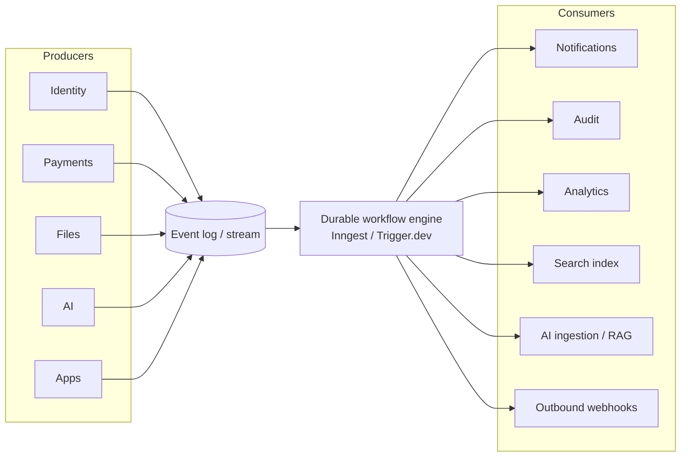

# 06 · API Design & Event-Driven Architecture

Covers required outputs **(12)** API design strategy and **(13)** event-driven architecture.

---

## 12 · API design strategy

### 12.1 Three API surfaces

| Surface | Consumers | Auth | Style |
|---------|-----------|------|-------|
| **SDK / internal** | Maralito apps (BorderPass, future) | Session token (user) or service principal | Typed function calls over RPC; the *only* sanctioned app→platform path |
| **Public API** | Partners, customers, integrators | API key / OAuth client-credentials | REST + JSON, OpenAPI-documented, versioned |
| **Webhooks (outbound)** | Partner systems reacting to platform events | Signed (HMAC), verified by receiver | Event POSTs, retried |

### 12.2 The SDK is the primary contract (DECISION)

`DECISION:` Apps consume the platform through **`@maralito/sdk`**, a typed TypeScript client, not by hand-writing HTTP calls. Rationale:
- End-to-end type safety (**P10**): one Zod schema defines input/output, reused by server, SDK, and UI.
- The SDK is where cross-cutting concerns live: auth token handling, tenant context, idempotency keys, retries, tracing headers, and **automatic audit emission** for sensitive ops (so apps can't forget).
- We can change transport (RPC/REST/edge) under the SDK without touching app code.

`⚠️ VERIFY:` Choose transport — typed RPC (e.g., a tRPC-style or OpenAPI-typed client) vs. REST + generated client. Recommendation: typed RPC for internal SDK, OpenAPI/REST for the public API. Confirm fit with Next.js server actions / route handlers.

### 12.3 Design conventions

- **Validation at every boundary** with **Zod** (**P10**). No unvalidated input reaches a service.
- **Idempotency**: all mutating endpoints accept an `Idempotency-Key`; the platform stores results per key (Upstash + DB) so retries are safe (**P11**).
- **Pagination**: cursor-based, stable ordering; no offset pagination on large sets.
- **Errors**: typed error shape (`code`, `message`, `details`, `request_id`, `trace_id`), consistent HTTP status mapping; no leaking internals.
- **Consistency**: resource naming, timestamps in UTC ISO-8601, money as integer minor units + currency, IDs as prefixed UUIDs (`usr_`, `org_`, `inv_`).
- **Tenant context** is implicit from the token, never a body parameter the caller can spoof.

### 12.4 API authentication & rate limiting

- Internal: session tokens (users) / service principals (jobs). Public: API keys or OAuth client-credentials.
- **Rate limiting** (S10, Upstash) per key/org/route with tiered limits; standard `RateLimit-*` headers; 429 with retry-after.
- **Abuse defense** at the edge (Cloudflare WAF/bot) before requests reach the app (S14).

### 12.5 API versioning strategy

`DECISION:` **URL-major + header-minor**, with additive-by-default evolution.
- **Public API**: major version in the path (`/v1/...`). Breaking changes → new major (`/v2/...`); old major supported through a published deprecation window.
- **Additive changes** (new optional fields/endpoints) ship without a version bump; consumers must ignore unknown fields.
- **SDK**: semver; breaking platform changes ship behind new SDK majors with codemods/migration notes (**P1** — never break consumers silently).
- **Deprecation policy**: documented sunset dates, `Deprecation`/`Sunset` headers, telemetry on deprecated-endpoint usage, proactive outreach to affected app teams.

### 12.6 Developer documentation

- **OpenAPI spec generated from Zod** schemas (single source of truth) for the public API.
- Auto-published docs portal (interactive), per-version, with auth setup, examples, webhook catalog, and the **event catalog** (below).
- SDK reference generated from TypeScript types + TSDoc.
- A **changelog** and **deprecation tracker** are part of the docs (**P1**).

### 12.7 Webhooks (outbound)

- Partners subscribe `webhook_endpoints` to event types; deliveries are **signed (HMAC)**, **retried with backoff**, and **logged** (`webhook_deliveries`) with replay tooling.
- At-least-once delivery; receivers must be idempotent (we send an event id + idempotency hint).
- Endpoint health: auto-disable after sustained failures, with notification.

---

## 13 · Event-driven architecture strategy

### 13.1 Why events (Principle P6)

Synchronous chains (Payments → calls Notifications → calls Audit → ...) are fragile and slow. Instead, services **emit domain events**; interested consumers react **asynchronously** via durable workflows. This decouples side effects from the request path, absorbs spikes, and makes retries/replays safe.

### 13.2 Event taxonomy & contract

- **Event = past-tense fact**: `payment.succeeded`, `user.created`, `file.uploaded`, `ai.run.completed`.
- **Envelope** (standard for every event):
  ```text
  {
    id: "evt_...",            // unique, for idempotency
    type: "payment.succeeded",
    version: 1,                // event schema version
    org_id, app_id,            // tenancy
    actor: { type, id },       // who caused it
    occurred_at, trace_id,
    data: { ... }              // typed, Zod-validated payload
  }
  ```
- **Versioned & validated**: each event type has a Zod schema; consumers pin to versions. Events are part of the public contract (cataloged in docs).

### 13.3 Topology



### 13.4 Workflow engine choice (DECISION)

`DECISION:` Use a **durable, event-driven workflow engine** for all async side effects and long-running jobs. Evaluate **Inngest** vs **Trigger.dev**:

| Criterion | Inngest | Trigger.dev |
|-----------|---------|-------------|
| Model | Event-triggered functions, steps, fan-out, concurrency/throttle controls | Long-running tasks/jobs, durable steps |
| Fit for fan-out (notifications) | Strong | Strong |
| Fit for long AI runs | Good | Strong (long-duration tasks) |
| Local dev | Local dev server | Local dev |
| Hosting | Managed + self-host options `⚠️ VERIFY` | Managed + self-host options `⚠️ VERIFY` |

**Recommendation:** Pick **one** to standardize (avoid running both). Lean **Inngest** if event-fan-out + concurrency control dominates; lean **Trigger.dev** if long-running AI/agent jobs dominate. Decide via a short spike against BorderPass's actual workloads. `⚠️ VERIFY` current pricing, execution-time limits, concurrency limits, and self-host options for whichever is chosen — these directly affect AI and notification design.

### 13.5 Delivery guarantees & idempotency

- **At-least-once delivery.** Every consumer is **idempotent by `event.id`** (or a derived key) — processing the same event twice has no extra effect (**P11**).
- **Ordering**: do not assume global ordering; where order matters (e.g., subscription lifecycle), use per-entity sequencing/versioning and reconcile.
- **Dead-letter handling**: failed events after max retries go to a DLQ with alerting and a replay tool.
- **Outbox pattern**: services write the domain change and the event in the **same transaction** (outbox table) so we never emit an event for a change that rolled back, or vice-versa. `⚠️ VERIFY` outbox relay approach with the chosen engine.

### 13.6 Event sourcing? (scoped NO, with one exception)

We are **not** doing full event sourcing for general state. Services keep authoritative current-state tables. The **exceptions** are **Audit (S7)** and the **financial ledger (S3)**, which are append-only/immutable by design and effectively event-sourced for their domains. This keeps complexity contained while preserving the strong auditability those domains require (**P8**).

### 13.7 Read models / projections

When a consumer needs a denormalized view (e.g., a search index, an analytics rollup, an app-side cache of profile data), it builds a **projection** from events. Projections are clearly non-authoritative, rebuildable by replaying events, and owned by the consuming service.

### 13.8 Acceptance criteria (events)

`ACCEPTANCE:`
- Every emitted event has a versioned Zod schema in the catalog.
- Every consumer is idempotent and has a DLQ + replay path.
- State change + event emission are transactional (outbox), proven by a failure-injection test.
- The event catalog is published in developer docs alongside the API.
