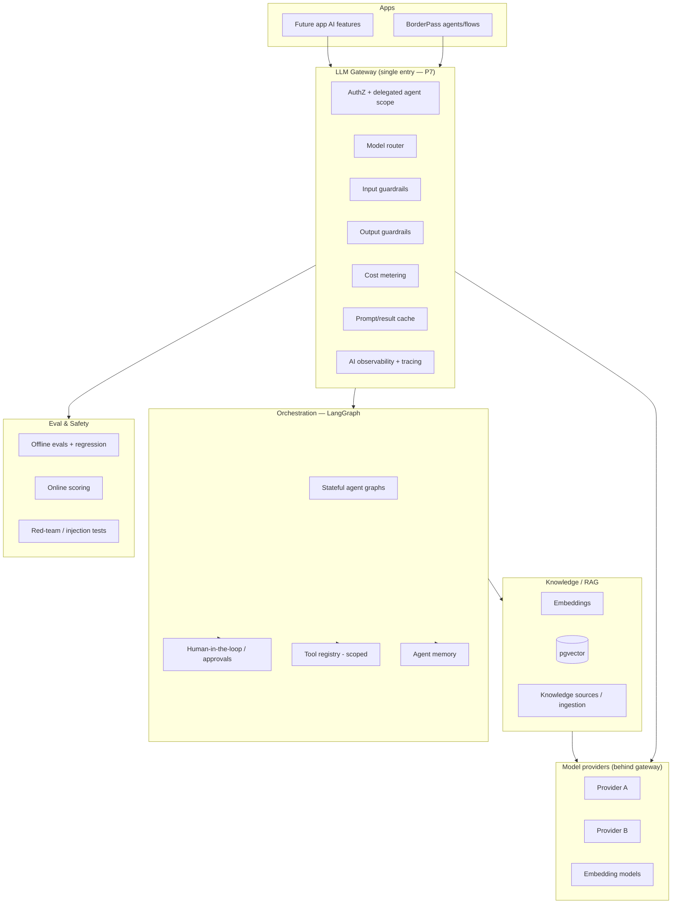

# 07 · AI Platform Architecture

Covers required output **(14)**. This is the platform's key differentiator (Principle **P7**: AI is governed centrally; **P9**: least privilege; **P12**: cost is a constraint).

---

## 14.1 Goals

- **One governed surface** for all AI. No app calls a model provider directly.
- Reusable across apps: BorderPass's document-understanding/agent needs and a future app's chatbot share the same gateway, memory, RAG, guardrails, cost ledger, and approval workflow.
- Safe, observable, attributable, and cost-controlled by default.

## 14.2 Layered architecture



## 14.3 LLM gateway

The mandatory choke point for every model interaction. Responsibilities:

- **AuthZ**: validates caller + (for agents) delegated, tool-scoped token (see [AuthN/Z §11.6](./05-authentication-authorization.md)).
- **Model routing**: selects provider/model by task type, cost target, latency target, context-window need, and provider availability; supports fallback on provider error/timeout. Routing policy is config-driven (S12), not hard-coded.
- **Guardrails (in/out)**: prompt-injection and jailbreak defense on input; PII detection/redaction; output filtering (toxicity, leakage, schema conformance). Guardrail hits are events (`ai.guardrail.triggered`) + audit.
- **Cost metering**: every call records tokens→$ in the **AI cost ledger** attributed to `app_id`, `org_id`, feature, and principal (**P12**). Budgets + alerts per org/app; hard caps optional.
- **Caching**: optional prompt/result cache (Upstash) for idempotent/deterministic calls to cut cost/latency.
- **Observability**: full request/response tracing (with PII handling), latency, token, and quality metrics to Sentry + custom AI dashboards (S13).
- **Rate limiting & quotas**: per org/app to prevent runaway spend and noisy neighbors.

`DECISION:` Build a thin **provider-abstraction** in the gateway so models are swappable; do not couple app code to any single provider SDK. `⚠️ VERIFY` provider model names, context limits, pricing, and rate limits before wiring — these change frequently and must come from official docs.

## 14.4 Model routing policy (example shape)

```text
route(task) =>
  task=="extract_fields"     -> small/cheap model, strict JSON schema, low temp
  task=="summarize_doc"      -> mid model, RAG context
  task=="agent_reasoning"    -> strong model, tools enabled
  task=="embedding"          -> embedding model
  fallback on error/timeout  -> next provider in tier
  always: enforce budget, guardrails, trace
```

Routing rules live in config/flags (S12) so they can change without redeploy and can differ per org/app/environment.

## 14.5 Prompt library

- **Versioned, testable prompts** (`prompts`, `prompt_versions`) — never inline string literals in app code.
- Each prompt has: template (with typed variables), metadata, owner, eval set, and a changelog.
- Prompt changes go through review + eval (regression) before promotion (**P1**, ties to §14.11).
- Localization-aware (S11) where prompts are user-facing.

## 14.6 Tool registry (scoped function-calling)

- Central registry of **tools** an agent may call (e.g., `lookup_order`, `create_refund`, `send_notification`).
- Each tool declares: input/output Zod schema, **required permissions**, side-effect class (read/write/expensive), and whether it requires human approval.
- An agent can only invoke tools explicitly granted to its graph **and** within its delegated permission scope (**P9**). A `create_refund` tool inherits the refund elevation rules from [AuthN/Z §11.4](./05-authentication-authorization.md).

## 14.7 LangGraph orchestration

- **Stateful graphs** model multi-step agent workflows with branches, loops, retries, and checkpoints.
- **Durable execution**: long-running graphs run on the workflow engine (Inngest/Trigger.dev) so they survive restarts and can wait (e.g., for human approval) without holding a request open. `⚠️ VERIFY` LangGraph persistence/checkpoint integration with the chosen engine and Postgres checkpointer.
- **Human-in-the-loop** is a first-class node type: a graph can pause at an `approval` node, emit `ai.approval.requested`, and resume on decision.
- Every graph run (`agent_runs`) and step (`agent_steps`) is logged for observability, audit, and eval.

## 14.8 Agent memory

- **Short-term** (within a run): graph state/checkpoints.
- **Long-term** (across runs): `agent_memory`, **org-scoped** and RLS-isolated — an agent never sees another org's memory.
- Memory writes are policy-gated (what's allowed to persist) and subject to retention/expiration (ties to Files/Privacy).
- Memory is a *projection-like* store, rebuildable and clearable per org (supports data-deletion requests).

## 14.9 RAG knowledge base & embeddings

- **Ingestion pipeline**: `file.uploaded` (S5) or explicit source registration → chunk → embed → store in **pgvector** with `org_id`/`app_id`/ACL tags.
- **Retrieval**: ACL-aware semantic search (S9) — results filtered by the caller's org and permissions *before* they reach the model, so RAG can't leak cross-tenant or unauthorized content.
- **Freshness**: re-embed on source change; deletion of a source removes its vectors.
- `⚠️ VERIFY` pgvector index type/limits (e.g., HNSW availability) and embedding model dimensions before sizing.

## 14.10 AI safety & guardrails (Principle P7)

- **Input**: prompt-injection/jailbreak detection, PII redaction, max-context enforcement, content policy checks.
- **Output**: schema validation (especially for tool args), toxicity/leakage filters, citation/grounding checks for RAG answers.
- **Prompt-injection defense for agents**: untrusted content (retrieved docs, user files, web) is treated as data, never as instructions; tools that act on the world require approval; the agent's authority is bounded by delegated scope.
- **Guardrail failures** are events + audit, and can block or downgrade a response.

## 14.11 Human approval workflows

A reusable platform control any app/agent can require:
- Configurable **risk thresholds** (action class, amount, confidence) trigger an approval gate.
- Approval requests route to authorized humans (via Notifications S4), appear in an admin queue, and the agent run **pauses** (durably) until decided.
- Decision (approve/reject/modify) is audited (S7) and resumes/halts the graph.
- Default posture: **agent writes to the real world require human approval** until an action class is explicitly trusted (**P9**).

## 14.12 AI cost tracking (Principle P12)

- Every model/embedding call writes to `ai_cost_ledger`: tokens (in/out), model, $ estimate, `app_id`, `org_id`, feature, principal, run_id.
- **Budgets** per org/app with alerts at thresholds; optional hard caps; per-feature cost dashboards (S8/S13).
- Cost is attributable end-to-end so we can price AI features and catch runaway loops early.
- `⚠️ VERIFY` token pricing per model from official provider pricing — never hard-code stale rates; load from config.

## 14.13 Evaluation & testing

- **Offline evals**: curated datasets per prompt/agent with pass/fail + scored metrics; run in CI on prompt/graph changes (regression gate).
- **Red-team suite**: injection, jailbreak, data-exfiltration, and PII-leak tests run regularly.
- **Online scoring**: sample production runs scored (heuristics + model-graded) with dashboards; quality regressions alert.
- **A/B of prompts/models** behind flags (S12) with cost + quality comparison.
- No prompt/agent change ships if it regresses the eval suite beyond threshold.

## 14.14 How BorderPass (and future apps) consume AI

- BorderPass calls `ai.agents.run("inspection_assistant", input)` — it never sees a provider, never manages keys, never tracks cost itself.
- A future app calls `ai.complete` / `ai.rag.query` through the same gateway.
- Both inherit guardrails, cost tracking, memory isolation, approvals, and observability for free. New AI features are mostly **new prompts/tools/graphs in the registry**, not new infrastructure.

## 14.15 Acceptance criteria (AI platform)

`ACCEPTANCE:`
- No code path reaches a model provider except through the gateway (enforced by lint/arch test + network policy).
- Every model call is metered to the cost ledger with full attribution.
- Agent tool calls are permission-checked and high-risk actions require human approval.
- RAG retrieval is ACL-filtered; a cross-tenant retrieval test passes.
- Prompt/agent changes run the eval + red-team suite in CI before promotion.
