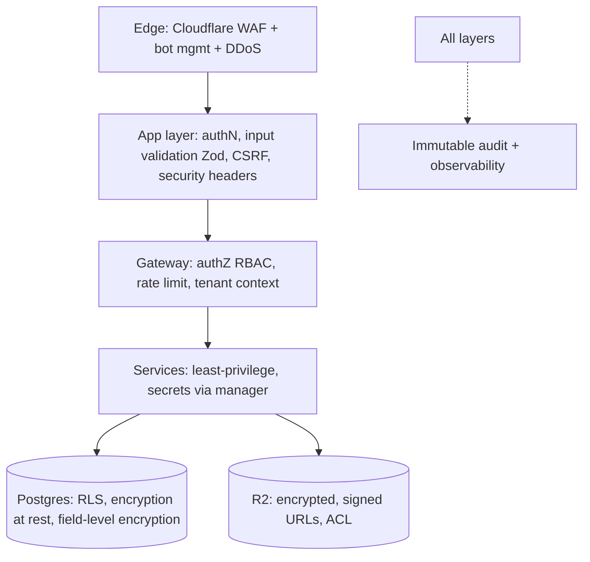

# 08 · Security Architecture

Covers required output **(15)**. Realizes Principles **P3** (secure by default), **P9** (least privilege), **P11** (idempotency/replay), and the DevSecOps preferences (least-privilege IAM, KMS, secrets, audit, threat modeling, compliance-aware design).

---

## 15.1 Security model overview (defense in depth)

Each layer assumes the one outside it can fail. Tenant isolation, in particular, is enforced **twice** (RBAC + RLS).

## 15.2 Identity & access security (least privilege — P9)

- Least privilege for **humans** (RBAC + elevation), **services** (scoped service principals), **CI** (scoped, short-lived cloud credentials via OIDC — no long-lived keys in CI) `⚠️ VERIFY`, and **AI agents** (delegated, time-boxed, tool-scoped tokens).
- Strong auth: hashed+salted passwords (modern KDF), breach-password checks, MFA-ready, enforced MFA for staff/admin (v1).
- Admin cross-org access is always audited with justification.
- API keys hashed at rest, scoped, rotatable, revocable, optionally IP-allowlisted.

## 15.3 RBAC & row-level security

- **RBAC** at the application boundary (SDK/gateway) — see [AuthN/Z](./05-authentication-authorization.md).
- **RLS** in Postgres on every customer-data table, keyed by `org_id` from a validated token, set per-transaction by the gateway only. Service-role connections that bypass RLS are tightly scoped, never exposed to app code, and audited.
- **RLS-as-code**: policies live in migrations, reviewed like code, and covered by automated cross-tenant tests (CI gate).

## 15.4 Secret management

`DECISION:` Secrets live in a **dedicated secrets manager**, never in the database, repo, or client bundles. Evaluate Vercel/Cloudflare environment secrets + a manager such as Doppler/Infisical/cloud KMS-backed store `⚠️ VERIFY`.
- The DB stores only **references** to secrets, not values (S14).
- Short-lived, rotated credentials; rotation runbook; break-glass procedure with audit.
- Client never receives provider secrets; all privileged calls (Stripe, Twilio, model providers) happen server-side behind the SDK/gateway.

## 15.5 Encryption

- **In transit**: TLS everywhere (strong TLS config at the edge — Cloudflare). Internal service traffic encrypted; mTLS for service-to-service when services are extracted `⚠️ VERIFY`.
- **At rest**: Postgres + R2 encrypted at rest (KMS/CMEK where available) `⚠️ VERIFY`.
- **Field-level encryption** for the most sensitive columns (KYC metadata, certain PII) using app-layer envelope encryption with keys in the KMS — so even DB access doesn't expose them in plaintext.
- **Key management**: KMS-managed keys, rotation policy, separation of duties on key access.

## 15.6 Secure file access (with S5)

- Direct-to-storage uploads via **short-lived signed URLs**; downloads via signed, time-limited, permission-checked URLs only.
- **Object-level ACLs** (`file_acls`) enforced before any URL is issued; RLS on file metadata.
- **Classification** drives policy: sensitive docs (KYC, inspection evidence) get stricter ACLs, shorter URL TTLs, and stronger encryption.
- **Malware scanning** hook on upload before a file is usable `⚠️ VERIFY` (scanner choice).
- **Expiration / retention** policies with legal-hold override; deletion cascades to derived data (embeddings, projections).

## 15.7 Input validation & output safety

- **Zod validation at every boundary** (API, SDK, events, tools) — nothing untrusted reaches a service unvalidated (**P10**).
- Output encoding / safe rendering in UI; strict Content-Security-Policy and security headers (HSTS, X-Frame-Options, etc.) at the edge/app.
- SQL via parameterized ORM (Drizzle) only — no string-built queries.
- File/URL/SSRF defenses on any server-side fetch (allowlists), important for AI tools and webhooks.

## 15.8 Abuse prevention

- **Cloudflare WAF + bot management + DDoS** at the edge.
- **Rate limiting / quotas** per IP, key, org, and route (Upstash) — tighter on auth, payments, AI, and messaging.
- Account-takeover defenses: refresh-token rotation + reuse detection, anomalous-login signals, optional step-up MFA.
- CAPTCHA/challenge on suspicious flows `⚠️ VERIFY`.

## 15.9 Fraud prevention (esp. payments)

- **Signals**: device, velocity, geo/IP, BIN/issuer (via Stripe Radar) `⚠️ VERIFY`, behavioral anomalies, KYC status.
- **Rules + review**: configurable fraud rules (S14) feed a review queue; high-risk payments require step-up or human approval (reuses S6 approval workflow).
- **Marketplace/platform-fee fraud**: payout holds, seller verification, dispute/chargeback handling via Stripe Connect `⚠️ VERIFY`.
- Fraud signals are events → audit + analytics for tuning.

## 15.10 Threat model (STRIDE summary)

| Threat | Examples | Primary mitigations |
|--------|----------|---------------------|
| **S**poofing | Stolen tokens, fake API keys | Short-lived tokens, refresh rotation+reuse detection, hashed keys, MFA |
| **T**ampering | Modify data, replay requests | RLS, idempotency keys, signed webhooks, audit hash-chaining |
| **R**epudiation | "I didn't do that" | Immutable audit (S7) of users/admins/agents |
| **I**nfo disclosure | Cross-tenant leak, PII exposure | RLS + RBAC, field-level encryption, ACL-filtered RAG, least privilege |
| **D**oS | Flooding, runaway AI loops | WAF/DDoS, rate limits/quotas, AI budgets + caps |
| **E**levation | Privilege escalation, agent overreach | Elevation rules, delegated agent scope, tool permissions, approvals |

A lightweight threat-model review is required for each new service and each new AI tool that performs writes.

## 15.11 Compliance posture (design-aware, certification later)

- Build to **SOC 2 / ISO 27001 / NIST**-aligned controls from day one (access control, encryption, audit, change management, vendor management) even before formal certification, so certification is a documentation exercise, not a re-architecture.
- **Data privacy**: data classification, PII minimization, per-org data export & deletion (right-to-be-forgotten) supported by the data-ownership model and event-driven cleanup; consent tracking for cross-app sharing.
- **Data residency**: per-app DB topology + Cloudflare/Neon region controls make future regional residency feasible `⚠️ VERIFY` regional options.
- **Financial**: PCI scope minimized by never touching raw card data (Stripe-hosted elements; we store only refs). `⚠️ VERIFY` current PCI SAQ applicability for the integration pattern chosen.
- For any DoD/government-adjacent work later, isolate into a dedicated, hardened environment rather than retrofitting the commercial platform.

## 15.12 Backup & disaster recovery

- **Backups**: automated Postgres backups (platform + each app DB) with point-in-time recovery; R2 versioning/replication for blobs `⚠️ VERIFY` retention + PITR window.
- **Tested restores**: scheduled restore drills — a backup isn't real until a restore is verified.
- **RPO/RTO targets** (proposed, to ratify): RPO ≤ 5 min (PITR), RTO ≤ 1 hr for platform-critical services; documented per service.
- **DR strategy**: infrastructure-as-code (Terraform) so environments are reproducible; runbooks for region/provider failover; dependency-failure playbooks (Stripe/Twilio/provider outages → degrade gracefully, queue and retry).
- **Immutable audit** retained per compliance schedule, optionally WORM to object storage.

## 15.13 Acceptance criteria (security)

`ACCEPTANCE:`
- No secret in repo/client; secret scanning gate in CI passes (see [CI/CD](./10-cicd-devsecops.md)).
- Cross-tenant isolation tests pass for every customer-data table.
- All sensitive PII columns are field-encrypted; key access is least-privilege and audited.
- Files are never accessible without an ACL check; signed URLs are short-lived.
- Restore drills succeed within RTO; DR runbooks exist and are exercised.
- A threat model exists for each service and each write-capable AI tool.
