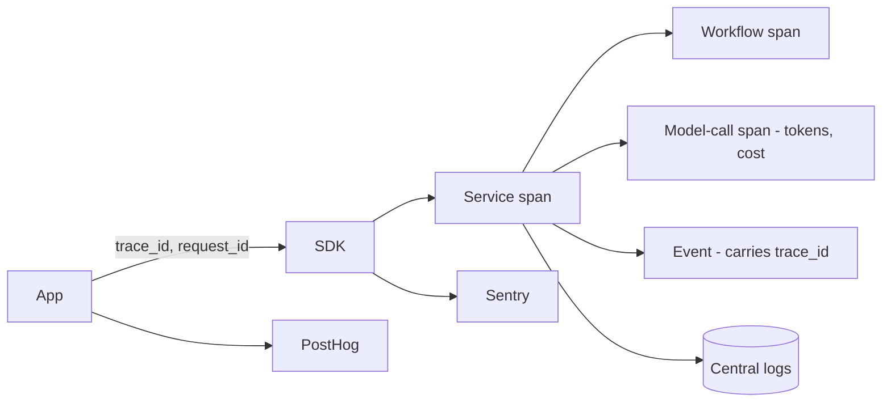

# 09 · Observability Architecture

Covers required output **(16)**. Realizes Principle **P8** (everything observable and auditable).

---

## 16.1 Pillars

| Pillar | Purpose | Primary tool(s) |
|--------|---------|-----------------|
| **Logs** | Structured, queryable records of what happened | App/edge logs → centralized logging `⚠️ VERIFY` sink |
| **Metrics** | Numeric time-series (latency, throughput, error rate, cost) | Sentry perf + custom metrics + PostHog (product) |
| **Traces** | End-to-end request causality across SDK→service→job→model | Sentry tracing / OpenTelemetry-style propagation |
| **Errors** | Exceptions with context + grouping + alerting | **Sentry** |
| **Alerts** | Notify humans on SLO breaches / anomalies | Sentry alerts + on-call routing `⚠️ VERIFY` |
| **Performance** | p50/p95/p99 latency, Core Web Vitals | Sentry + Vercel analytics |
| **AI observability** | Tokens, latency, cost, quality, guardrail hits | Custom (S6) + Sentry |
| **Workflow observability** | Durable job runs, retries, DLQ | Inngest/Trigger.dev dashboards |
| **Product analytics** | User events, funnels, retention | **PostHog** |

## 16.2 Telemetry flows through the SDK

Because apps talk to the platform through `@maralito/sdk`, the SDK is where we inject:
- a **`request_id`** and **`trace_id`** (propagated to services, jobs, events, and model calls),
- structured logging with tenancy context (`org_id`, `app_id`, principal),
- automatic spans around platform calls,
- automatic error capture to Sentry.

This means apps get tracing/logging/error-tracking **for free** by using the SDK — consistent across all apps (**P15**).

## 16.3 Logging standards

- **Structured JSON** logs; never log secrets or raw PII (redaction in the logger).
- Every log line carries: `ts`, `level`, `service`, `org_id`, `app_id`, `principal`, `request_id`, `trace_id`, `event` name.
- Log levels disciplined (error = actionable, warn = notable, info = state changes, debug = dev only).
- **Sensitive-data access** is logged to **audit** (S7), not just app logs.

## 16.4 Tracing

- A single `trace_id` spans the user action → SDK → service → durable workflow → model call → emitted events → downstream consumers.
- Critical for debugging async flows (e.g., "why didn't this receipt send?") and AI agent runs (each step is a span).
- `⚠️ VERIFY` Sentry's distributed tracing support across Vercel serverless + workflow engine + browser, and whether to layer OpenTelemetry for vendor-neutral export.

## 16.5 Metrics & SLOs

Define **SLIs/SLOs** per critical service; alert on burn rate, not just thresholds.

| Service | SLI | Proposed SLO (ratify) |
|---------|-----|------------------------|
| Auth | Login success latency p95 | < 500 ms; 99.9% availability |
| Payments | Charge success rate (excl. legit declines) | ≥ 99.5%; webhook processing < 1 min p95 |
| Notifications | Delivery success / queue latency | ≥ 99% delivered; < 30 s p95 enqueue→send |
| Files | Upload/download success | ≥ 99.9%; signed-URL issue < 200 ms p95 |
| AI gateway | Availability / p95 latency / cost-per-feature | 99.5%; latency budget per task; budget adherence |
| API platform | 5xx rate / p95 latency | < 0.1% 5xx; p95 < 300 ms |

- **Error budgets** govern release risk: if a service is burning its budget, releases pause (ties to CI/CD).

## 16.6 AI observability (extends S6 / §14)

- Per-run + per-step metrics: model, tokens (in/out), $ cost, latency, cache hit, guardrail outcome, tool calls, approval waits.
- **Quality** signals: eval scores, online sampled scoring, user feedback (thumbs), grounding/citation checks.
- **Cost dashboards** by app/org/feature with budget burn + anomaly alerts (runaway loop detection).
- Guardrail and red-team events surfaced prominently.

## 16.7 Workflow observability

- Durable workflow engine (Inngest/Trigger.dev) provides run history, step status, retries, and DLQ visibility.
- Alerts on DLQ growth, stuck/long-running runs, and elevated failure rates.
- Each run links back to the originating event and `trace_id`.

## 16.8 Alerting & on-call

- Alerts routed by severity to the right channel (Notifications S4 / on-call tool) `⚠️ VERIFY`.
- **Actionable alerts only** — every alert maps to a runbook; noisy alerts are tuned or deleted.
- Incident process: detect → triage → mitigate → resolve → blameless postmortem → action items tracked in the backlog.
- **Synthetic monitoring / uptime checks** on critical user journeys (login, pay, upload, run-agent).

## 16.9 Dashboards

- **Platform health**: availability, latency, error rate, queue depth per service.
- **Cost**: infra + AI + messaging spend by app/org/feature (**P12**).
- **Product** (S8/PostHog): activation, funnels, retention, feature adoption per app.
- **Reliability**: SLO compliance + error-budget burn.
- A single "one pane" exec view aggregates the above across all apps (vision goal).

## 16.10 Acceptance criteria (observability)

`ACCEPTANCE:`
- A user action can be traced end-to-end (UI→SDK→service→job→model→events) by `trace_id`.
- No secret/PII appears in logs (verified by a redaction test + periodic scan).
- Every critical service has an SLO, a dashboard, and at least one runbook-linked alert.
- AI spend is visible per app/org/feature with budget-burn alerts.
- DLQ and stuck-workflow alerts exist and have been tested.
