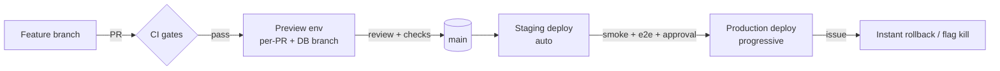
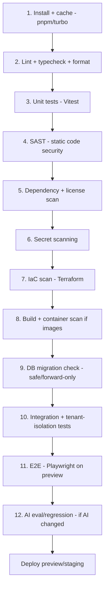

# 10 · CI/CD & DevSecOps Plan

Covers required output **(17)**. Realizes the engineering standards: Terraform-first IaC, GitOps, policy-as-code, CI/CD with security gates (SAST, IaC scanning, container scanning), safe rollbacks.

---

## 17.1 Principles

- **Everything as code**: app, infra (Terraform), policies, DB schema (Drizzle migrations), CI pipelines, flags config.
- **GitOps**: main is always deployable; changes flow via PRs; environments reconcile from git.
- **Security gates are blocking**, not advisory — a failing security check fails the build.
- **Progressive delivery**: deploy ≠ release; ship behind flags, roll out gradually, roll back instantly.
- **Least-privilege CI**: pipelines authenticate to cloud via short-lived **OIDC** federation, not stored long-lived keys `⚠️ VERIFY`.

## 17.2 Branching & GitOps flow

- Trunk-based with short-lived feature branches.
- Every PR gets a **preview environment** (Vercel preview + Neon DB branch) — see [Repo & Environments](./11-repo-and-environments.md).
- Merge to `main` → auto-deploy to **staging**; promotion to **production** is gated (checks + approval), then **progressive** (canary/percentage via flags).

## 17.3 CI pipeline stages (GitHub Actions)

### Security gates (blocking) — DevSecOps core

| Gate | What it catches | Example tooling `⚠️ VERIFY choices` |
|------|-----------------|-------------------------------------|
| **SAST** | Insecure code patterns | CodeQL / Semgrep |
| **Dependency scan (SCA)** | Vulnerable/abandoned deps, license issues | GitHub Dependabot / OSV / Snyk |
| **Secret scanning** | Committed secrets | GitHub secret scanning / Gitleaks / TruffleHog |
| **IaC scanning** | Misconfigured Terraform (open buckets, weak IAM) | tfsec / Checkov / Terrascan |
| **Container scanning** | Vulnerable base images (when containers used) | Trivy / Grype |
| **DAST** (later) | Runtime web vulns | OWASP ZAP against staging |
| **Tenant-isolation tests** | Cross-org data leakage | Custom RLS test suite |
| **Policy-as-code** | Org guardrails (no public S3, required tags) | OPA/Conftest on Terraform plans |

A red gate blocks merge/deploy. Exceptions require documented, time-boxed, approved waivers.

## 17.4 Infrastructure as code (Terraform-first)

- **Terraform** provisions all cloud/managed resources where providers support it (Cloudflare, Neon, Upstash, etc.) `⚠️ VERIFY` provider availability/coverage; what isn't Terraform-managed is documented and scripted.
- **Remote state** with locking, encrypted; separate state per environment.
- **Policy-as-code** (OPA/Conftest) runs on `terraform plan` in CI — guardrails enforced before apply.
- **Environments are reproducible**: dev/staging/prod differ by variables, not by hand-built drift.
- **Drift detection** scheduled; drift alerts.

> Note: parts of the recommended stack (Vercel, Supabase, PostHog, Sentry, Stripe) are managed SaaS configured via their own dashboards/APIs/Terraform providers. Standardize on Terraform where a provider exists; otherwise capture config in versioned, scripted form so it's reviewable and reproducible.

## 17.5 Database CI/CD (Drizzle migrations)

- Migrations are **forward-only**, reviewed, and **expand→migrate→contract** for zero-downtime schema changes.
- CI checks: migration applies cleanly on a fresh DB branch, is reversible-by-design (no destructive step without a guard), and passes tenant-isolation tests on changed tables.
- Preview env runs migrations against its **own Neon branch** so schema changes are validated per PR.

## 17.6 Progressive delivery & rollback

- **Feature flags (S12)** decouple deploy from release; new code ships dark, enabled per percentage/org.
- **Canary**: route a slice of traffic/orgs first; watch SLOs/error budget; auto-halt on regression.
- **Instant rollback**: redeploy previous build (Vercel) or flip the flag off — no waiting on a re-deploy for behavioral rollback.
- **Migration safety**: because schema changes are expand/contract, code can roll back without breaking the DB.

## 17.7 Testing strategy (the test pyramid)

| Level | Scope | Tooling | Gate |
|-------|-------|---------|------|
| Unit | Pure logic, schemas (Zod), utils | Vitest | Every PR |
| Integration | Service + DB (with RLS), contracts | Vitest + ephemeral Neon branch | Every PR |
| **Tenant isolation** | Cross-org access denied on every table | Custom suite | Every PR (blocking) |
| Contract | SDK ↔ service ↔ events schemas stay compatible | Schema/snapshot tests | Every PR |
| E2E | Critical journeys (login, pay, upload, run agent) | Playwright on preview | Pre-merge / pre-prod |
| AI eval | Prompt/agent quality + red-team | Eval harness (S6) | When AI changes |
| Load/soak (periodic) | Capacity, rate limits, noisy-neighbor | k6 or similar `⚠️ VERIFY` | Scheduled |
| DR drill (periodic) | Restore + failover | Runbook-driven | Scheduled |

Target: high coverage on platform core (auth, billing, RLS) where bugs are most costly; pragmatic coverage elsewhere.

## 17.8 Supply-chain security

- Pin dependencies; verify lockfile integrity; SCA on every build.
- Sign build artifacts / generate **SBOM** for releases `⚠️ VERIFY` tooling.
- Restrict and review third-party GitHub Actions (pin by SHA); least-privilege workflow permissions.
- Protect `main` (required reviews, required checks, no force-push).

## 17.9 Secrets in CI/CD

- No long-lived cloud keys in CI — use **OIDC** to mint short-lived credentials `⚠️ VERIFY`.
- App/runtime secrets injected from the secrets manager at deploy/runtime, never printed in logs.
- Secret rotation automated where possible; rotation runbook for the rest.

## 17.10 Acceptance criteria (CI/CD & DevSecOps)

`ACCEPTANCE:`
- A PR cannot merge with a failing security gate (SAST, SCA, secret, IaC, container, tenant-isolation).
- Every PR produces an isolated preview env with its own DB branch.
- Production deploys are progressive and reversible in < 5 minutes (flag or redeploy).
- All infra is Terraform-managed or documented-as-script; policy-as-code runs on every plan.
- CI authenticates to cloud via OIDC short-lived credentials; no static cloud keys stored.
- DB migrations follow expand/contract and pass isolation tests on changed tables.
