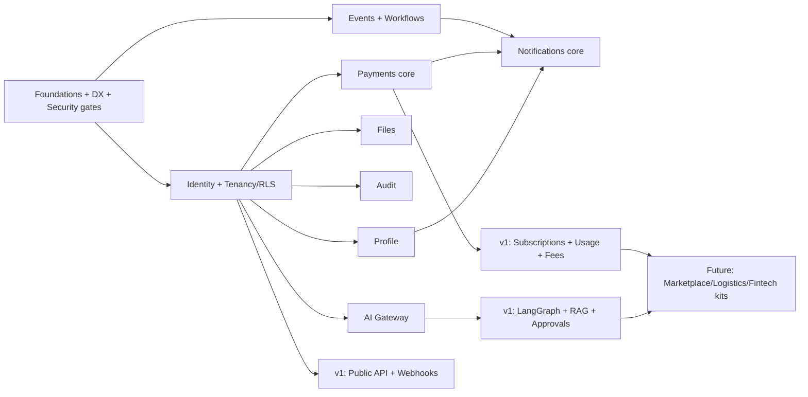

# 12 · Platform Roadmap

Covers required outputs **(20)** MVP, **(21)** v1, **(22)** future. Phases are sized in relative effort, not committed calendar dates — ratify dates against team capacity. The driving constraint for MVP is "**enough platform for BorderPass to ship**" without making the platform BorderPass-specific.

> Sequencing rule: build the **thinnest vertical slice** that lets BorderPass run end-to-end (sign in → do domain action → pay → get notified → store a file → be audited → be observed), then deepen each service.

---

## 20 · Platform MVP roadmap (≈ Quarter 1)

**Theme:** Foundations + first vertical slice. Ship the shared primitives BorderPass cannot launch without, with security and observability baked in from line one.

### In scope

| Area | MVP scope |
|------|-----------|
| **Foundation / DX** | Monorepo (pnpm+Turbo), `@maralito/sdk` v0, `@maralito/schemas`, UI kit v0, CLI `new-app`/`register-app`, CI with **security gates**, preview envs (Neon branch), Terraform skeleton, secrets manager |
| **Identity (S1)** | Email/password + magic link, orgs/tenants, RBAC (system roles + app-scoped roles), sessions, API keys, **MFA-ready** schema |
| **Tenancy/Security (S14)** | RLS on all customer-data tables, tenant-context in gateway, **tenant-isolation test suite**, encryption at rest, input validation (Zod) |
| **Profile (S2)** | Core profile, addresses, contacts, language + notification preferences |
| **Payments (S3) — core** | Stripe one-time payments (payment intents), invoices, receipts, refunds, **financial ledger**, webhook ingestion (idempotent) |
| **Notifications (S4) — core** | Email (Resend) + **one** second channel (SMS or in-app), templates, delivery status, retries, preferences |
| **Files (S5)** | Signed-URL uploads, metadata, ACLs, tagging, basic expiration, R2/Storage |
| **AI (S6) — gateway only** | LLM gateway (routing, cost ledger, basic guardrails, tracing), prompt library v0, `ai.complete`/`ai.embed`; **no autonomous writes** yet |
| **Audit (S7)** | Immutable audit log; SDK auto-emits audit for sensitive ops; admin/agent action logging |
| **Events (§06)** | Event log + one workflow engine (Inngest/Trigger.dev), outbox pattern, idempotent consumers, DLQ |
| **Flags/Config (S12)** | Feature flags + scoped config with safe defaults |
| **Observability (S13)** | Sentry (errors/traces), structured logging, PostHog events, basic SLO dashboards + alerts |
| **API (S10)** | Internal API/SDK + gateway (authN, rate limit, validation, versioning scaffold); webhooks scaffold |

### Explicitly deferred from MVP
WhatsApp/push, subscriptions/usage/platform-fees, full AI orchestration (LangGraph agents, RAG, approvals, evals), analytics dashboards beyond basics, public API GA, localization beyond a single default, search beyond basic.

### MVP exit criteria
`ACCEPTANCE:`
- BorderPass runs the full vertical slice on the platform using only the SDK.
- All customer-data tables have RLS + passing isolation tests.
- A new app skeleton can be scaffolded and registered via CLI in < 1 day.
- CI security gates (SAST/SCA/secret/IaC/isolation) are green and blocking.
- Every sensitive action is audited; a user action is traceable end-to-end.
- AI calls flow only through the gateway and are cost-metered.

---

## 21 · Platform v1 roadmap (≈ Quarters 2–3)

**Theme:** Depth, monetization, AI-native, and "second app ready." After v1, a *second* app should reuse ≥ 80% of services with no re-implementation.

| Area | v1 scope |
|------|----------|
| **Identity** | TOTP + WebAuthn MFA (enforced for staff/admin), custom org roles, enterprise SSO groundwork |
| **Payments** | **Subscriptions**, **usage-based/metered billing**, **platform fees (Stripe Connect)**, dunning, entitlements API, tax handling `⚠️ VERIFY` |
| **Notifications** | **WhatsApp + push**, full preference center (quiet hours, categories), localized templates, suppression management |
| **AI Platform** | **LangGraph orchestration**, **tool registry** (scoped), **agent memory**, **RAG + embeddings (pgvector)**, **human approval workflows**, **guardrails v2**, **eval/red-team suites**, AI budgets + dashboards |
| **Analytics (S8)** | Product analytics taxonomy, funnels, revenue + operational + agent-performance dashboards |
| **Search (S9)** | Global + app search, vector search, document/customer/entity search with ACL filtering |
| **API Platform** | **Public API GA** (OpenAPI docs portal), OAuth client-credentials, **outbound webhooks GA**, versioning + deprecation policy live |
| **Localization (S11)** | EN/ES end-to-end, translation management, currency/date/region formatting |
| **Security/Compliance** | Field-level encryption for PII, fraud rules + review queue, abuse defenses hardened, **SOC 2 readiness** controls + evidence collection, DR drills |
| **Observability** | Full SLO/error-budget governance, AI + workflow observability, on-call + incident process, synthetic monitoring |
| **DX** | Preview env polish, `gen:service` scaffolding, contract tests, load/soak testing, docs portal |

### v1 exit criteria
`ACCEPTANCE:`
- A second (pilot) app onboards reusing auth, profile, billing, notifications, files, AI, audit with zero re-implementation.
- Subscriptions + usage + platform fees process real money with a reconciled ledger.
- Agents can run multi-step workflows with tools, memory, RAG, guardrails, and human approval — all cost-tracked.
- Public API + webhooks are documented, versioned, and rate-limited.
- SOC 2 control set is implemented with evidence pipeline (certification can begin).

---

## 22 · Future platform roadmap (post-v1)

**Theme:** Scale, new verticals, and platform-as-product maturity.

### Vertical primitives (reusable building blocks for new product types)
- **Marketplace**: multi-party listings, escrow/split payments, seller onboarding/KYC, ratings/disputes (builds on Connect + KYC + search).
- **Logistics**: location/tracking, geofencing, route/job state machines, inspection workflows (generalized from BorderPass learnings — *extracted as reusable, not BorderPass-specific*).
- **Fintech**: ledgered balances/wallets, payouts, stronger KYC/AML, transaction monitoring, regulatory reporting `⚠️ VERIFY` licensing/compliance scope before building.

### Platform maturity
- **Selective service extraction** (AI, Notifications) to independent deployables when scale/blast-radius/ownership justify (§04 §6.3).
- **Multi-region** deployment + **data residency** options per app/org.
- **Premium isolated tenancy tier** (schema/DB-per-tenant) for large enterprise customers.
- **Partner developer platform**: external developers build on public APIs; app marketplace; sandbox + keys self-serve.
- **Advanced AI**: model fine-tuning/distillation where ROI-positive, richer eval/observability, autonomous-action trust tiers, cost-optimized routing.
- **Compliance expansion**: ISO 27001, region-specific regimes; hardened isolated environment for any government/DoD-adjacent work.
- **Reliability**: chaos testing, automated failover, capacity planning, FinOps cost governance across all apps.

### Future "north-star" capabilities
- One-week new-app onboarding is routine and measured.
- Single pane for cost/reliability/usage across all apps + AI spend.
- Reusable vertical kits (SaaS, marketplace, logistics, fintech, AI) so a new product is *assembly*, not *construction*.

---

## Roadmap dependency view

