# 14 · Implementation Backlog — Epics & User Stories

Covers required output **(24)**. This is a ready-to-import backlog. Conventions:

- **Epic** = a deliverable slice of platform capability. **Story** = a unit of work with acceptance criteria.
- **Estimates** use story points (Fibonacci: 1,2,3,5,8,13). 8+ should usually be split.
- **Phase**: `MVP`, `V1`, `FUT` (future). **Priority**: P0 (must), P1 (should), P2 (later).
- Story format: *As a [role], I want [capability], so that [value]* + **AC** (acceptance criteria).
- Roles: **CU** customer user, **SU** staff user, **AU** admin (Maralito), **AppDev** app engineer, **PlatEng** platform engineer.

> Import note: epics map 1:1 to services/areas in the [Service Catalog](./03-service-catalog.md). IDs are stable (`E#`, `S#.#`) for tracker import and cross-reference.

---

## Epic index

| Epic | Area | Phase focus | Pts (approx) |
|------|------|-------------|--------------|
| E1 | Foundation & Monorepo | MVP | 34 |
| E2 | Identity & Access | MVP→V1 | 55 |
| E3 | Multi-tenancy & RLS | MVP | 29 |
| E4 | User Profile | MVP | 21 |
| E5 | Payments & Billing | MVP→V1 | 63 |
| E6 | Notifications | MVP→V1 | 42 |
| E7 | Files & Documents | MVP | 29 |
| E8 | Event Bus & Workflows | MVP | 34 |
| E9 | AI Platform | MVP→V1 | 76 |
| E10 | Audit & Compliance | MVP | 26 |
| E11 | Analytics | V1 | 26 |
| E12 | Search & Knowledge | V1 | 26 |
| E13 | API Platform | MVP→V1 | 34 |
| E14 | Localization | V1 | 18 |
| E15 | Feature Flags & Config | MVP | 16 |
| E16 | Observability | MVP→V1 | 34 |
| E17 | Security & DevSecOps | MVP→V1 | 47 |
| E18 | Developer Experience & CLI | MVP→V1 | 29 |
| E19 | App Onboarding (BorderPass + 2nd app) | MVP→V1 | 24 |

---

## E1 · Foundation & Monorepo `MVP`

**Goal:** A working monorepo, shared packages skeleton, and CI so every later epic builds on solid DX.

| ID | Story | Pts | Pri | AC |
|----|-------|-----|-----|----|
| S1.1 | As **PlatEng**, I want a pnpm + Turborepo monorepo with the agreed layout, so all packages/apps share tooling | 5 | P0 | Layout from [Repo doc](./11-repo-and-environments.md) exists; `pnpm dev`/`build`/`test` run via Turbo; caching works |
| S1.2 | As **PlatEng**, I want shared tsconfig/eslint/prettier/tailwind presets, so code style is uniform | 3 | P0 | `packages/config` consumed by all packages; lint passes in CI |
| S1.3 | As **PlatEng**, I want `@maralito/schemas` (Zod) scaffolded, so DTOs/events have one source of truth | 3 | P0 | Package builds; example schema reused by a service + SDK |
| S1.4 | As **PlatEng**, I want `@maralito/sdk` v0 scaffold, so apps have a single client entry | 5 | P0 | SDK initializes with appId; injects auth/tenancy/idempotency/trace headers; typed |
| S1.5 | As **PlatEng**, I want import-boundary lint rules, so apps can't reach service internals | 3 | P0 | CI fails if `apps/*` imports `platform/services/*` internals |
| S1.6 | As **PlatEng**, I want a base CI pipeline (install/lint/typecheck/unit), so every PR is validated | 5 | P0 | GitHub Actions runs on PR; caches deps; required check |
| S1.7 | As **PlatEng**, I want Terraform skeleton + remote state + envs, so infra is reproducible | 5 | P0 | `infra/` with modules + dev/staging/prod; state locked/encrypted |
| S1.8 | As **PlatEng**, I want secrets manager wired, so no secrets live in repo | 5 | P0 | Secrets pulled at build/runtime; secret-scan gate green |

---

## E2 · Identity & Access (S1) `MVP→V1`

**Goal:** AuthN/AuthZ, orgs/tenants, roles, sessions, API keys, MFA-ready. See [AuthN/Z](./05-authentication-authorization.md).

| ID | Story | Pts | Pri | Phase | AC |
|----|-------|-----|-----|-------|----|
| S2.1 | As a **CU**, I want to sign up/in via email+password, so I can access an app | 5 | P0 | MVP | Strong hashing; breach check; rate-limited; emits `user.created` |
| S2.2 | As a **CU**, I want magic-link/OTP login, so I can sign in without a password | 3 | P1 | MVP | Single-use, expiring links; audited |
| S2.3 | As a **CU**, I want social login (Google), so onboarding is faster | 3 | P1 | MVP | OAuth flow; identity linked in `auth_identities` `⚠️ VERIFY` config |
| S2.4 | As an **org owner**, I want to create an org and invite members, so my team can collaborate | 5 | P0 | MVP | Org + membership + invite flow; emits `org.created`, `user.invited` |
| S2.5 | As **PlatEng**, I want an RBAC engine (system + app-scoped roles → permissions), so authZ is centralized | 8 | P0 | MVP | `can(role, permission, ctx)` in SDK/gateway; app role registration; tested |
| S2.6 | As a **CU**, I want session management (list/revoke, refresh rotation), so I control my access | 5 | P0 | MVP | Refresh rotation + reuse detection; "log out everywhere"; `session.revoked` |
| S2.7 | As an **org admin**, I want to issue/scope/revoke API keys, so machines can call the platform | 5 | P0 | MVP | Hashed at rest; scoped; revocable; usage attributed |
| S2.8 | As **PlatEng**, I want MFA-ready data model + flows (no enforcement), so MFA can be turned on later | 3 | P1 | MVP | `mfa_factors`, `amr` claim; enrollment stub |
| S2.9 | As a **CU**, I want to enroll TOTP/passkey MFA, so my account is more secure | 8 | P1 | V1 | TOTP + WebAuthn; recovery codes; emits events |
| S2.10 | As an **AU**, I want enforced MFA for staff/admin, so privileged access is protected | 3 | P0 | V1 | Policy: staff/admin must have MFA; blocked otherwise |
| S2.11 | As an **org admin**, I want custom roles from permissions, so I can model my team | 5 | P2 | V1 | Org-defined roles; bounded by allowed permissions |
| S2.12 | As an enterprise **org admin**, I want SSO (SAML/OIDC) groundwork, so my company can federate later | 5 | P2 | V1 | SSO connection model + one provider POC `⚠️ VERIFY` |

---

## E3 · Multi-tenancy & RLS (S14) `MVP`

**Goal:** Database-enforced tenant isolation. See [System Arch §9](./04-system-architecture.md).

| ID | Story | Pts | Pri | AC |
|----|-------|-----|-----|----|
| S3.1 | As **PlatEng**, I want every customer-data table to carry `org_id` (+`app_id` where relevant), so tenancy is uniform | 3 | P0 | Schema convention + migration lint enforces it |
| S3.2 | As **PlatEng**, I want RLS policies on all such tables, so isolation is DB-enforced | 8 | P0 | Policies key off session var; service-role bypass restricted |
| S3.3 | As **PlatEng**, I want the gateway to set tenant context per transaction from a validated token only, so apps can't spoof it | 5 | P0 | `SET LOCAL` per tx; apps cannot set; `⚠️ VERIFY` pooler behavior |
| S3.4 | As **PlatEng**, I want an automated tenant-isolation test harness, so leakage is caught in CI | 8 | P0 | For each table: org A cannot read/write org B; blocking gate |
| S3.5 | As **PlatEng**, I want per-org rate limits/quotas on expensive ops, so noisy neighbors don't degrade others | 5 | P1 | Upstash-backed per-org limits on AI/notifications/files/search |

---

## E4 · User Profile (S2) `MVP`

| ID | Story | Pts | Pri | AC |
|----|-------|-----|-----|----|
| S4.1 | As a **CU**, I want a shared profile (name, avatar, locale), so my identity is consistent across apps | 3 | P0 | Created on `user.created`; editable; emits `profile.updated` |
| S4.2 | As a **CU**, I want to manage multiple typed addresses, so apps can use billing/shipping/site addresses | 5 | P0 | Typed addresses; validation; events |
| S4.3 | As a **CU**, I want verified phone numbers, so apps can contact me reliably | 3 | P1 | Add/verify; verified flag |
| S4.4 | As a **CU**, I want language + notification preferences, so I'm contacted how I prefer | 3 | P0 | Prefs feed S4; quiet hours scaffold |
| S4.5 | As a **CU**, I want saved payment methods (as Stripe refs), so checkout is fast | 3 | P1 | Refs only, no raw card data; `payment_method.attached` |
| S4.6 | As an **app**, I want KYC metadata storage (status/level/provider refs), so verification state is reusable | 5 | P1 | Metadata only; documents in Files under strict ACL; `kyc.status_changed` |

---

## E5 · Payments & Billing (S3) `MVP→V1`

**Goal:** Stripe-based money movement + financial source of truth.

| ID | Story | Pts | Pri | Phase | AC |
|----|-------|-----|-----|-------|----|
| S5.1 | As **PlatEng**, I want Stripe integration + customer linking, so orgs/users map to Stripe | 5 | P0 | MVP | `billing_customers`; created on demand |
| S5.2 | As a **CU**, I want to pay a one-time charge (payment intent), so I can buy in an app | 5 | P0 | MVP | Hosted elements; no raw card data; `payment.succeeded/failed` |
| S5.3 | As **PlatEng**, I want idempotent Stripe webhook ingestion, so events aren't double-processed | 5 | P0 | MVP | `stripe_events` dedupe; durable processing; replayable |
| S5.4 | As a **CU**, I want invoices + receipts, so I have proof of payment | 5 | P0 | MVP | Invoice records; receipt PDF stored in Files; `invoice.paid` |
| S5.5 | As an **org admin**, I want refunds, so I can correct charges | 3 | P0 | MVP | Elevation + audit (see AuthN/Z); `refund.issued` |
| S5.6 | As **PlatEng**, I want an append-only financial ledger mirrored to audit, so finances are tamper-evident | 8 | P0 | MVP | Every money event ledgered; reconciles with Stripe |
| S5.7 | As a **CU**, I want subscriptions, so I can pay recurring | 8 | P1 | V1 | Plans/items; lifecycle events; proration `⚠️ VERIFY` |
| S5.8 | As **PlatEng**, I want usage-based/metered billing, so apps can bill on consumption | 8 | P1 | V1 | `usage_records`; aggregation; invoicing |
| S5.9 | As **PlatEng**, I want platform fees via Stripe Connect, so marketplace/split flows work | 8 | P1 | V1 | Connect onboarding; split + fees; payouts `⚠️ VERIFY` |
| S5.10 | As **PlatEng**, I want an entitlements API, so apps can gate features by plan | 5 | P1 | V1 | `entitlement.check`; derived from subs/usage |
| S5.11 | As **PlatEng**, I want dunning + failed-payment recovery, so revenue isn't lost | 3 | P2 | V1 | Retry schedule; notifications; status transitions |

---

## E6 · Notifications (S4) `MVP→V1`

| ID | Story | Pts | Pri | Phase | AC |
|----|-------|-----|-----|-------|----|
| S6.1 | As **PlatEng**, I want a `notifications.send` API with templates, so apps send consistent messages | 5 | P0 | MVP | Versioned templates; variables; localized-ready |
| S6.2 | As a **CU**, I want transactional email (Resend), so I get receipts/alerts | 5 | P0 | MVP | Delivery status tracked; bounces → suppression |
| S6.3 | As a **CU**, I want a second channel (SMS or in-app), so I'm reachable beyond email | 5 | P0 | MVP | One of SMS(Twilio)/in-app; status tracked |
| S6.4 | As **PlatEng**, I want retry + delivery-status tracking, so failures recover | 5 | P0 | MVP | Backoff retries; `notification.delivered/failed`; DLQ |
| S6.5 | As a **CU**, I want a preference center (channels, categories, quiet hours), so I control contact | 5 | P1 | V1 | Per-category opt-in/out; quiet hours respected |
| S6.6 | As a **CU**, I want WhatsApp notifications, so I get messages where I am | 5 | P1 | V1 | Twilio/WhatsApp Business; templates approved `⚠️ VERIFY` |
| S6.7 | As a **CU**, I want push notifications (web/mobile), so I get real-time alerts | 8 | P1 | V1 | Web push (VAPID) + mobile provider `⚠️ VERIFY`; opt-in |
| S6.8 | As **PlatEng**, I want suppression + compliance handling, so we honor unsubscribes/regulations | 3 | P1 | V1 | Suppression list enforced pre-send |

---

## E7 · Files & Documents (S5) `MVP`

| ID | Story | Pts | Pri | AC |
|----|-------|-----|-----|----|
| S7.1 | As a **CU**, I want to upload files via signed URLs, so uploads are secure and direct | 5 | P0 | Direct-to-R2; metadata recorded; `file.uploaded` |
| S7.2 | As **PlatEng**, I want file metadata + checksum + classification, so files are governed | 3 | P0 | `files` table; content-type/size/checksum/classification |
| S7.3 | As a **CU**, I want permission-checked, time-limited download URLs, so only authorized users access files | 5 | P0 | ACL check before URL; short TTL; RLS on metadata |
| S7.4 | As a **CU**, I want to tag documents, so they're organized/searchable | 2 | P1 | Tagging API; tags indexed |
| S7.5 | As **PlatEng**, I want expiration/retention policies (with legal hold), so files don't linger | 5 | P1 | TTL sweep job; legal-hold override; `file.expired` |
| S7.6 | As **PlatEng**, I want malware scanning on upload, so unsafe files aren't usable | 5 | P1 | Scan hook before usable; `file.scanned` `⚠️ VERIFY` scanner |
| S7.7 | As **PlatEng**, I want field/object encryption for sensitive files, so KYC/evidence is protected | 3 | P1 | KMS-backed; stricter ACL/TTL for sensitive class |

---

## E8 · Event Bus & Workflows (§06) `MVP`

| ID | Story | Pts | Pri | AC |
|----|-------|-----|-----|----|
| S8.1 | As **PlatEng**, I want a standard event envelope + versioned Zod schemas, so events are a real contract | 5 | P0 | Envelope (id/type/version/org/app/actor/trace); catalog |
| S8.2 | As **PlatEng**, I want the outbox pattern, so events and state changes are transactional | 8 | P0 | Same-tx write; relay to engine; failure-injection test passes |
| S8.3 | As **PlatEng**, I want one durable workflow engine integrated (Inngest/Trigger.dev), so async work is reliable | 8 | P0 | Engine wired; local dev; retries; concurrency controls `⚠️ VERIFY` |
| S8.4 | As **PlatEng**, I want idempotent consumers + DLQ + replay, so at-least-once delivery is safe | 5 | P0 | Idempotency by event id; DLQ alerting; replay tool |
| S8.5 | As **PlatEng**, I want reconciliation jobs for critical invariants, so eventual consistency stays correct | 8 | P1 | e.g., billing↔entitlements reconcile; scheduled + alerting |

---

## E9 · AI Platform (S6) `MVP→V1`

**Goal:** Governed, observable, cost-controlled AI. See [AI Platform](./07-ai-platform.md).

| ID | Story | Pts | Pri | Phase | AC |
|----|-------|-----|-----|-------|----|
| S9.1 | As **PlatEng**, I want an LLM gateway as the sole model entry point, so AI is governed | 8 | P0 | MVP | All calls via gateway; arch test blocks direct provider calls |
| S9.2 | As **PlatEng**, I want config-driven model routing + fallback, so we optimize cost/latency/availability | 5 | P0 | MVP | Routing by task; provider fallback; rules in config (S12) |
| S9.3 | As **PlatEng**, I want an AI cost ledger with attribution, so spend is visible per app/org/feature | 5 | P0 | MVP | Tokens→$ recorded; `ai.cost.recorded`; dashboards later |
| S9.4 | As **PlatEng**, I want a versioned prompt library, so prompts are testable not inline | 5 | P0 | MVP | `prompts`/`prompt_versions`; no inline prompts in app code |
| S9.5 | As **PlatEng**, I want basic in/out guardrails (PII, injection, schema), so AI is safer by default | 8 | P0 | MVP | Guardrail hits = events+audit; can block/redact |
| S9.6 | As an **app**, I want `ai.complete`/`ai.embed` via SDK, so I can use AI without managing providers | 3 | P0 | MVP | SDK methods; traced; cost-metered |
| S9.7 | As **PlatEng**, I want LangGraph orchestration for multi-step agents, so complex flows are stateful/durable | 8 | P1 | V1 | Durable runs on workflow engine; checkpoints `⚠️ VERIFY` |
| S9.8 | As **PlatEng**, I want a scoped tool registry, so agents only do what they're permitted | 5 | P1 | V1 | Tools declare schema+permissions+side-effect class |
| S9.9 | As **PlatEng**, I want org-scoped agent memory, so agents remember without cross-tenant leak | 5 | P1 | V1 | RLS-isolated; clearable per org; retention policy |
| S9.10 | As **PlatEng**, I want RAG + embeddings (pgvector) with ACL-filtered retrieval, so AI answers from authorized knowledge | 8 | P1 | V1 | Ingest from Files; ACL filter pre-retrieval; cross-tenant test |
| S9.11 | As an **app/SU**, I want human approval workflows for risky agent actions, so humans stay in control | 8 | P1 | V1 | Approval node pauses run; routed via S4; audited |
| S9.12 | As **PlatEng**, I want AI eval + red-team suites in CI, so quality/safety don't regress | 8 | P1 | V1 | Eval gate on prompt/agent changes; red-team scheduled |
| S9.13 | As **PlatEng**, I want AI budgets + anomaly alerts, so runaway cost is caught | 3 | P1 | V1 | Per-org/app budgets; burn alerts; optional hard cap |

---

## E10 · Audit & Compliance (S7) `MVP`

| ID | Story | Pts | Pri | AC |
|----|-------|-----|-----|----|
| S10.1 | As **PlatEng**, I want an append-only `audit_events` store, so history is immutable | 5 | P0 | Write-once; partitioned; hash-chaining for tamper evidence `⚠️ VERIFY` |
| S10.2 | As **PlatEng**, I want the SDK to auto-emit audit for sensitive ops, so apps can't forget | 5 | P0 | Sensitive ops auto-audited; actor type captured (user/admin/staff/agent/system) |
| S10.3 | As an **AU**, I want to query audit by actor/resource/time, so I can investigate | 5 | P0 | Query API; RLS-respecting; performant |
| S10.4 | As a **compliance owner**, I want audit exports/compliance reports, so I can satisfy audits | 5 | P1 | Export by org/date/actor/action; `audit.exported` |
| S10.5 | As **PlatEng**, I want sensitive data-access logging, so reads of PII are recorded | 3 | P1 | `audit.record` on sensitive reads; tested |
| S10.6 | As **PlatEng**, I want WORM long-term retention to object storage, so records survive per schedule | 3 | P2 | Stream to R2 WORM; retention policy `⚠️ VERIFY` |

---

## E11 · Analytics (S8) `V1`

| ID | Story | Pts | Pri | AC |
|----|-------|-----|-----|----|
| S11.1 | As **PlatEng**, I want a product-analytics taxonomy + `analytics.track/identify`, so events are consistent | 5 | P1 | Naming standard; SDK methods; PostHog wired |
| S11.2 | As a **PM**, I want funnels + retention dashboards, so I understand product usage | 5 | P1 | Funnels per app; retention cohorts |
| S11.3 | As **Finance**, I want revenue metrics (from billing), so I track MRR/ARR/churn | 5 | P1 | Revenue rollups; reconciled with ledger |
| S11.4 | As **Ops**, I want operational metrics dashboards, so I see system health trends | 3 | P1 | Ops rollups from observability |
| S11.5 | As **AI owner**, I want agent-performance metrics, so I track AI quality/cost/throughput | 5 | P1 | From S6: success rate, cost, latency, approvals |
| S11.6 | As an **exec**, I want a cross-app one-pane dashboard, so I see the whole business | 3 | P2 | Aggregates product+revenue+ops+AI across apps |

---

## E12 · Search & Knowledge (S9) `V1`

| ID | Story | Pts | Pri | AC |
|----|-------|-----|-----|----|
| S12.1 | As **PlatEng**, I want an entity-registration API, so apps declare searchable entities + ACL rules | 5 | P1 | `search.registerEntity`; ACL rules honored |
| S12.2 | As a **CU**, I want app-specific search (lexical), so I can find my data | 5 | P1 | Postgres FTS; ACL-filtered results |
| S12.3 | As a **CU**, I want vector/semantic search, so I find by meaning | 5 | P1 | pgvector; ACL-filtered; shared with RAG `⚠️ VERIFY` index type |
| S12.4 | As a **CU**, I want document search over my files, so I find content inside docs | 5 | P1 | Uses S6 embeddings; permission-checked |
| S12.5 | As an **SU**, I want customer/entity search, so I can support users | 3 | P1 | Over Profile + registered entities; audited |
| S12.6 | As a **CU**, I want global search across what I can access, so I find anything quickly | 3 | P2 | Federated across registered entities; ACL-filtered |

---

## E13 · API Platform (S10) `MVP→V1`

| ID | Story | Pts | Pri | Phase | AC |
|----|-------|-----|-----|-------|----|
| S13.1 | As **PlatEng**, I want a gateway (authN, validation, rate limit, tenant context), so all calls are safe/consistent | 8 | P0 | MVP | Single entry; Zod validation; Upstash rate limit; sets tenant ctx |
| S13.2 | As **PlatEng**, I want API versioning scaffold + conventions, so we evolve without breaking | 3 | P0 | MVP | URL-major path; additive rules documented |
| S13.3 | As a **partner**, I want a public REST API with OAuth client-credentials, so I can integrate | 8 | P1 | V1 | `/v1` API; OAuth; per-client rate limits |
| S13.4 | As a **partner**, I want signed, retried outbound webhooks, so I react to platform events | 5 | P1 | V1 | `webhook_endpoints`; HMAC; retries; replay; auto-disable on failure |
| S13.5 | As an **AppDev/partner**, I want an OpenAPI docs portal generated from Zod, so integration is self-serve | 5 | P1 | V1 | Generated spec; interactive docs; event catalog; changelog |
| S13.6 | As **PlatEng**, I want a deprecation policy + telemetry, so we sunset safely | 3 | P2 | V1 | `Deprecation`/`Sunset` headers; usage telemetry; outreach |

---

## E14 · Localization (S11) `V1`

| ID | Story | Pts | Pri | AC |
|----|-------|-----|-----|----|
| S14.1 | As a **CU**, I want EN/ES UI end-to-end, so I use the app in my language | 5 | P1 | i18n in UI kit; locale from profile; fallback |
| S14.2 | As **PlatEng**, I want a translation-management store + missing-key reporting, so translations are maintainable | 5 | P1 | Keyed strings; missing-key telemetry; ICU format |
| S14.3 | As a **CU**, I want correct currency/date/time formatting per locale, so content reads naturally | 3 | P1 | Locale-aware formatters in SDK/UI |
| S14.4 | As **PlatEng**, I want region-specific rule hooks (tax/address/legal text), so apps adapt per region | 5 | P2 | Formatting rules + variants; consumed by apps |

---

## E15 · Feature Flags & Config (S12) `MVP`

| ID | Story | Pts | Pri | AC |
|----|-------|-----|-----|----|
| S15.1 | As **PlatEng**, I want a flag engine with safe defaults + caching, so we deploy ≠ release | 5 | P0 | `flags.isEnabled`; cached (Upstash); default-off safety |
| S15.2 | As **PlatEng**, I want scoped config (global/app/org/env), so behavior is configurable | 5 | P0 | `config.get` with scope resolution; typed |
| S15.3 | As **PlatEng**, I want rollout controls (%/targeting/kill switch), so releases are progressive | 3 | P1 | Percentage + org targeting; instant kill switch |
| S15.4 | As **PlatEng**, I want tenant-specific config, so orgs can be tuned | 3 | P2 | Per-org overrides; audited changes |

---

## E16 · Observability (S13) `MVP→V1`

| ID | Story | Pts | Pri | Phase | AC |
|----|-------|-----|-----|-------|----|
| S16.1 | As **PlatEng**, I want structured logging w/ tenancy+trace context via SDK, so logs are consistent/safe | 5 | P0 | MVP | JSON logs; redaction; org/app/trace fields |
| S16.2 | As **PlatEng**, I want Sentry error tracking wired through the SDK, so errors are captured everywhere | 3 | P0 | MVP | Auto-capture; grouped; alerting |
| S16.3 | As **PlatEng**, I want distributed tracing (UI→SDK→service→job→model), so async flows are debuggable | 8 | P1 | MVP | `trace_id` propagates across all hops `⚠️ VERIFY` |
| S16.4 | As **PlatEng**, I want SLOs + error-budget dashboards + alerts for critical services, so we manage reliability | 5 | P1 | V1 | SLIs/SLOs defined; burn alerts; runbook-linked |
| S16.5 | As **AI owner**, I want AI observability (tokens/cost/latency/quality/guardrails), so AI is transparent | 5 | P1 | V1 | Per-run/step metrics + dashboards |
| S16.6 | As **PlatEng**, I want workflow observability + synthetic monitoring, so async + journeys are watched | 5 | P1 | V1 | DLQ/stuck alerts; uptime checks on key journeys |
| S16.7 | As **PlatEng**, I want an incident process + blameless postmortems, so we learn from failures | 3 | P1 | V1 | Severity routing; postmortem template; action tracking |

---

## E17 · Security & DevSecOps (S14 / §10) `MVP→V1`

| ID | Story | Pts | Pri | Phase | AC |
|----|-------|-----|-----|-------|----|
| S17.1 | As **DevSecOps**, I want SAST+SCA+secret+IaC scanning as blocking CI gates, so insecure code can't merge | 8 | P0 | MVP | All gates green required; waivers time-boxed/approved |
| S17.2 | As **DevSecOps**, I want OIDC short-lived CI cloud creds, so no static keys exist | 3 | P0 | MVP | CI federates; no long-lived cloud keys stored |
| S17.3 | As **DevSecOps**, I want policy-as-code on Terraform plans, so misconfig is blocked pre-apply | 5 | P1 | MVP | OPA/Conftest gates (no public buckets, required tags) |
| S17.4 | As **DevSecOps**, I want field-level encryption for sensitive PII, so DB access ≠ plaintext exposure | 5 | P1 | V1 | KMS envelope encryption; key access audited |
| S17.5 | As **DevSecOps**, I want abuse defenses (WAF/bot/rate limits), so the platform resists attack | 5 | P1 | V1 | Cloudflare WAF/bot; tiered rate limits; tested |
| S17.6 | As **DevSecOps**, I want a fraud engine (signals+rules+review), so payment fraud is reduced | 8 | P1 | V1 | Radar + rules; review queue; step-up/approval `⚠️ VERIFY` |
| S17.7 | As **DevSecOps**, I want backups + tested restore drills + DR runbooks, so we survive disasters | 5 | P0 | V1 | PITR; scheduled restore drill passes RTO; runbooks exist |
| S17.8 | As **DevSecOps**, I want SOC 2 control set + evidence pipeline, so certification can begin | 8 | P1 | V1 | Controls mapped; evidence auto-collected; gap list closed |
| S17.9 | As **DevSecOps**, I want container scanning + SBOM (when images used), so supply chain is covered | 3 | P2 | V1 | Trivy/Grype gate; SBOM on release `⚠️ VERIFY` |

---

## E18 · Developer Experience & CLI (S15) `MVP→V1`

| ID | Story | Pts | Pri | Phase | AC |
|----|-------|-----|-----|-------|----|
| S18.1 | As an **AppDev**, I want one-command local dev with seeded data, so I can start fast | 5 | P0 | MVP | `pnpm dev` brings up apps+platform; seed orgs/users |
| S18.2 | As an **AppDev**, I want per-PR preview envs with a Neon DB branch, so changes are validated in isolation | 8 | P0 | MVP | Preview URL + DB branch per PR; e2e runs; torn down on merge `⚠️ VERIFY` |
| S18.3 | As an **AppDev**, I want `maralito new-app`/`register-app`, so I can scaffold a wired app quickly | 5 | P0 | MVP | Scaffolds SDK+auth+billing+observability; registers app |
| S18.4 | As an **AppDev**, I want `maralito codegen` (SDK/types/OpenAPI from schemas), so contracts stay in sync | 3 | P1 | V1 | Regenerates from `@maralito/schemas` |
| S18.5 | As a **PlatEng**, I want `maralito gen:service` scaffolding, so new services follow conventions | 3 | P1 | V1 | Generates module+schema+events+tests+RLS stubs |
| S18.6 | As an **AppDev**, I want a shared, themeable, accessible, i18n-aware UI kit, so apps look consistent | 5 | P1 | V1 | `@maralito/ui`; theming; a11y; i18n hooks |

---

## E19 · App Onboarding (BorderPass first, then 2nd app) `MVP→V1`

**Goal:** Prove the platform with BorderPass, then prove reusability with a second app.

| ID | Story | Pts | Pri | Phase | AC |
|----|-------|-----|-----|-------|----|
| S19.1 | As **BorderPass**, I want to register as an app with scoped creds + enabled-services manifest, so I consume only what I need | 3 | P0 | MVP | App record + creds + manifest; SDK initialized with appId |
| S19.2 | As **BorderPass**, I want the full vertical slice (auth→domain action→pay→notify→file→audit→observe), so I can launch on the platform | 8 | P0 | MVP | End-to-end works using only the SDK; MVP exit criteria met |
| S19.3 | As **BorderPass**, I want my own domain DB separate from the platform DB, so my data is isolated | 5 | P0 | MVP | Per-app Neon DB; references platform by id; RLS |
| S19.4 | As a **2nd pilot app**, I want to onboard reusing ≥80% of services with zero re-implementation, so we prove reusability | 8 | P1 | V1 | New app reaches working skeleton in < 1 week; no re-built auth/billing/notify/files/AI |

---

## Suggested sprint sequencing (MVP, high level)

```mermaid
gantt
  title MVP Sprint Sequencing (relative, not calendar-committed)
  dateFormat  X
  axisFormat  S%d
  section Foundation
  E1 Monorepo+CI+IaC+Secrets      :a1, 0, 2
  section Core identity
  E2 Identity (auth/orgs/RBAC)    :a2, 1, 3
  E3 Tenancy + RLS + isolation    :a3, 2, 2
  section Primitives
  E15 Flags/Config                :a4, 2, 1
  E8 Events + Workflows           :a5, 3, 2
  E4 Profile                      :a6, 3, 1
  E7 Files                        :a7, 4, 2
  E10 Audit                       :a8, 4, 2
  section Money + comms + AI + obs
  E5 Payments core                :a9, 5, 2
  E6 Notifications core           :a10, 6, 2
  E9 AI gateway                   :a11, 6, 2
  E16 Observability core          :a12, 5, 3
  E17 Security gates              :a13, 0, 8
  E13 Gateway/API internal        :a14, 3, 3
  section Prove it
  E19 BorderPass vertical slice   :a15, 7, 2
```

> The Gantt is a **dependency-ordered** sketch (sprints, not dates). Security (E17) and Observability (E16) run continuously across the program, not as a final phase.

---

## How to use this backlog

1. Import epics E1–E19 and stories into the tracker (ClickUp/Linear/Jira); keep the IDs.
2. Tag each story with Phase + Priority; pull P0/MVP into the first sprints per the sequencing sketch.
3. Convert every `⚠️ VERIFY` into a spike task and resolve it into an ADR before the dependent story starts.
4. Make the **tenant-isolation** and **security-gate** stories (S3.4, S17.1) blocking dependencies for anything touching customer data.
