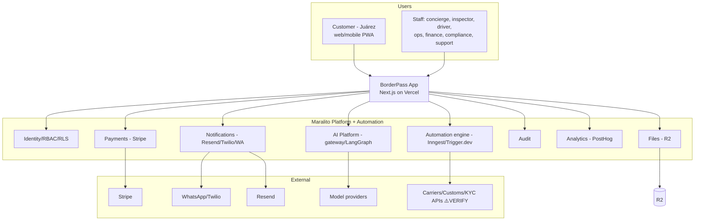
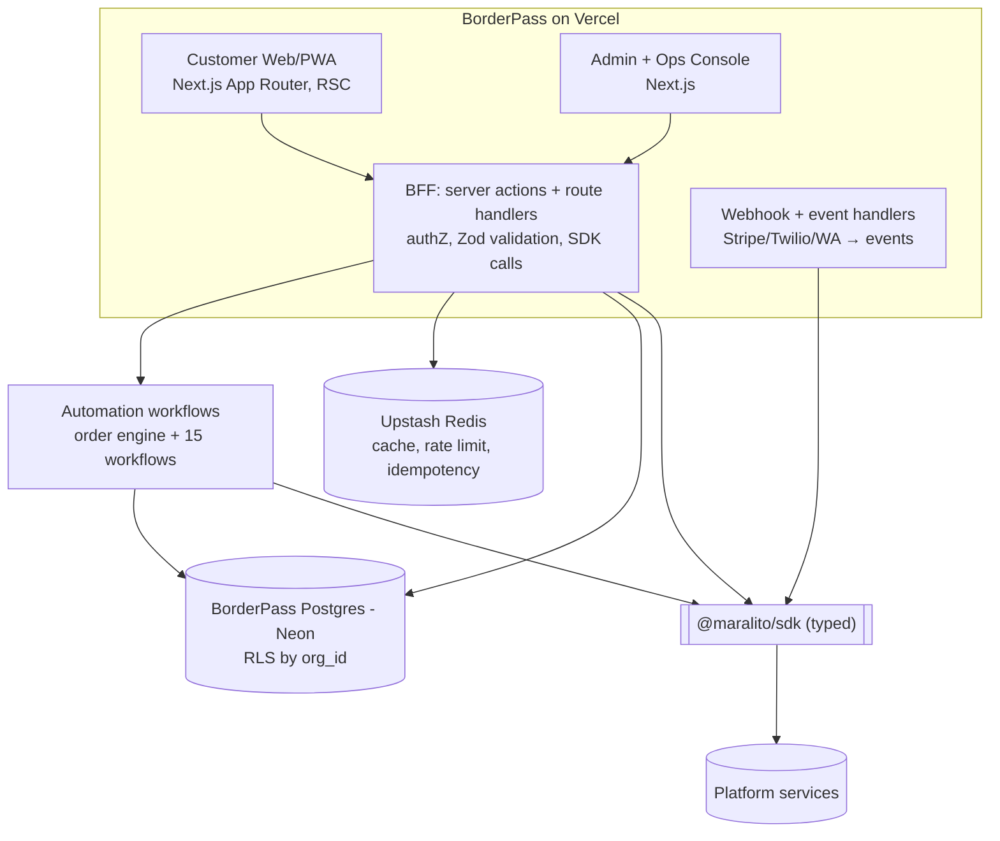

# 01 · System & Application Architecture

## 1.1 System context (C4 L1)



**Key point:** BorderPass talks to the outside world **through Maralito services** (payments via Payments→Stripe, messaging via Notifications→WhatsApp, AI via the gateway), never directly. External logistics/customs APIs are reached through the Automation **integration layer**.

## 1.1b End-to-end request chain (ASCII)

```
Customer App (Next.js, Stitch UI, EN/ES PWA)
  → Next.js Frontend (RSC + client)
    → Server Actions / API Routes (BFF)
      → Auth (Supabase Auth via @maralito/sdk auth.*)  ── session → org_id (tenant)
      → AuthZ (RBAC)  +  Postgres tenant context (RLS)
        → BorderPass Domain (orders, quotes, inspections)
          → Postgres (Neon, RLS by org_id)        [BorderPass-owned data]
          → Storage (signed URLs: receipts/photos)  [via Files S5]
          → Payments (Stripe)                        [via Payments S3]
          → Automation Platform (event bus + workflow engine)
              → Workflow steps:
                  • functions (deterministic)
                  • LangGraph Agents (via AI gateway)  ── recommend; HUMAN-APPROVAL on risk
                  • Approvals (HITL)  • Tasks (queues)
              → Notifications (Email/WhatsApp/SMS/in-app)
              → Audit (immutable)  + Analytics (PostHog)
        → Admin Dashboard (same app, (admin) route group, RBAC)
            → Automation dashboard (runs, approvals, tasks, DLQ, replay)
```

This is the canonical happy-path chain; the Mermaid views below add structure (containers, components).

## 1.2 Container view (C4 L2)



**Containers**
- **Customer Web/PWA** — Next.js App Router, React Server Components, the Stitch design system; installable PWA for field-capable experiences and reliable mobile use.
- **Admin + Ops Console** — same Next.js app (separate route group + RBAC) or a sibling app; reuses the Maralito admin + Automation dashboard, themed.
- **BFF (Backend-for-Frontend)** — Next.js server actions + route handlers: the only place app code calls `@maralito/sdk`, sets tenant context, validates input (Zod), and triggers workflows.
- **Webhook/event handlers** — ingest Stripe/Twilio/WhatsApp via the integration layer; normalize to events.
- **BorderPass DB (Neon)** + **Upstash Redis** for caching/rate-limit/idempotency.
- **Automation workflows** — the durable order engine + 15 workflows (§02).

## 1.3 Application architecture (Next.js)

```
borderpass app (in the Maralito monorepo: apps/borderpass)
├─ app/                      # App Router
│  ├─ (customer)/            # customer route group — Home, New Request, Orders, Journey, Quote, Pay, Concierge, Profile
│  ├─ (admin)/               # admin/ops route group — RBAC-gated dashboards
│  ├─ api/                   # route handlers: webhooks, SDK-backed endpoints
│  └─ actions/               # server actions (mutations) — the write path
├─ src/
│  ├─ domain/                # BorderPass domain logic (orders, quotes, inspections) — pure + service fns
│  ├─ workflows/             # workflow + step definitions (authored on the engine)
│  ├─ agents/                # agent definitions (configs/prompts/tools refs) — run via AI gateway
│  ├─ db/                    # Drizzle schema + queries (BorderPass DB) — see contracts
│  ├─ sdk/                   # thin wrappers over @maralito/sdk for BorderPass use
│  ├─ events/                # event producers/consumers + Zod schemas
│  └─ ui/                    # screens composed from @maralito/ui + BorderPass design tokens
├─ messages/                 # i18n EN/ES message catalogs
└─ tests/                    # unit, integration (RLS), e2e (Playwright), workflow/chaos
```

**Rendering & data flow**
- **Reads:** React Server Components fetch via the BFF/SDK (server-side, tenant-scoped). Customer journey/order views are server-rendered for speed + SEO-irrelevant but fast first paint; skeleton loaders per Stitch.
- **Writes:** Server Actions → validate (Zod) → call SDK / start workflow → return typed result. No direct DB writes from the client.
- **Real-time:** order/journey status updates via subscriptions/polling; admin queues live-update.

## 1.4 Frontend architecture
- **Design system:** Stitch tokens (Sunset Orange/Deep Navy/Emerald, Warm White/Soft Sand, Literata + DM Sans, 24px radii) implemented as the BorderPass theme over `@maralito/ui`. The signature components (Bridge progress bar, vertical Border Journey, Trust Cards, Concierge card) are BorderPass-specific components.
- **i18n:** EN/ES via the platform Localization runtime; ICU messages; layouts allow ~20–25% longer Spanish; language from CustomerProfile.
- **State:** server state via RSC/SDK; minimal client state (forms, UI). Forms validated with the same Zod schemas as the API (shared from contracts).
- **PWA/offline:** installable; field roles (inspector/driver) get resilient capture (queue + retry) for photos/proof where connectivity is poor `⚠️ VERIFY` offline scope.
- **Accessibility:** WCAG-minded; bilingual; large touch targets; the warm, calm UX is a trust feature (esp. no-visa persona).

## 1.5 BFF responsibilities (the seam)
The BFF is where cross-cutting concerns live so screens stay simple:
- AuthN (session token) + AuthZ (RBAC) + tenant-context set for RLS.
- **Zod validation** of every input.
- Calls to `@maralito/sdk` (Identity/Payments/Notifications/Files/AI/Audit) and to the **Automation engine** to start/advance workflows.
- **Idempotency keys** on mutations; **tracing** headers; **audit** auto-emit on sensitive ops.
- Webhook verification + normalization to events.

## 1.6 Why this shape
- **Thin app, fat platform** (TA1): fastest path to a trustworthy product; ops/security inherited.
- **One stack** (TA2): TypeScript + Next.js for customer/admin/ops reduces context-switching and shares types/Zod end-to-end.
- **Durable order engine** (TA3): the order lifecycle is too important to live in request handlers; it lives in the workflow engine (§02).
