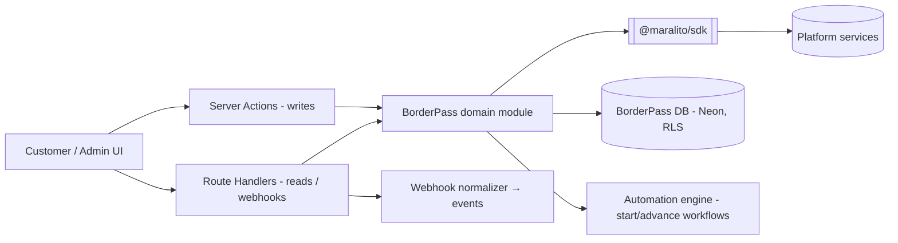
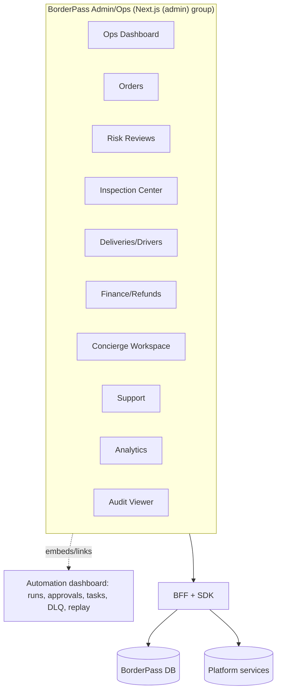

# 02 · Backend / API & Admin Architecture

Covers deliverables **6 (Backend/API architecture)**, **7 (Admin dashboard architecture)**, and the **API surface design** (architecture-level — endpoint inventory, not code).

---

## 6 · Backend / API architecture

### 6.1 Shape — BFF over the platform, not a separate microservice
BorderPass has **no standalone backend service** in MVP. Its "backend" is the **Next.js BFF** (server actions + route handlers) plus the **BorderPass domain module** and **automation workflows**. The BFF is the single seam between UI and everything else.



### 6.2 Request pipeline (every call)
```
Request
 → Edge (Cloudflare WAF/rate limit)
 → Next.js middleware (session, locale)
 → BFF handler/action
     → AuthN (session token) + AuthZ (RBAC)
     → Set tenant context (org_id) for RLS
     → Zod validate input
     → Idempotency key (mutations)
     → Domain logic / SDK calls / start workflow
     → Audit emit (sensitive ops) + tracing
 → Typed response (or typed error)
```

### 6.3 API styles
- **Internal (app↔platform):** typed calls via `@maralito/sdk` (the only sanctioned path). Not hand-rolled HTTP.
- **App API (UI↔BFF):** server actions for mutations (RPC-like, typed); route handlers for reads, webhooks, and any REST needed by the admin/ops or future partners.
- **Public/partner API (future):** versioned REST via the platform API gateway (OAuth client-credentials); out of MVP scope.

### 6.4 Cross-cutting API rules
- **Validation:** Zod at every boundary; reject invalid before any side effect.
- **Idempotency:** `Idempotency-Key` on mutations; results cached (Upstash + DB) so retries are safe.
- **Errors:** typed shape `{ code, message, details?, request_id, trace_id }`; consistent HTTP mapping; no internal leakage.
- **Pagination:** cursor-based, stable ordering.
- **Versioning:** app API evolves additively; any public API uses URL-major versioning (platform convention).
- **Tenancy:** `org_id` derived from the session, never a client-supplied parameter.
- **AuthZ:** RBAC checked in the BFF; RLS re-asserts in the DB (defense in depth).

### 6.5 API surface (design-level inventory — contracts/code deferred)
Grouped by consumer. (Methods indicative; final OpenAPI + Zod live in [contracts/](../../contracts/README.md) after sign-off.)

**Customer**
| Area | Operations |
|------|-----------|
| Auth/Profile | start/verify phone OTP; get/update profile; manage addresses; manage payment methods; set notification prefs + language |
| Requests/Orders | create request (draft); submit; list my orders; get order detail; get border journey; cancel order; reorder |
| Quotes | get quote; accept/decline quote |
| Payments | create payment intent (via Payments); pay duties; get receipts |
| Files | get upload URL (receipts/docs); get signed view URL (own files/inspection photos) |
| Concierge | list/get conversations; send message; (webhook-driven inbound) |
| Notifications | list in-app notifications; mark read |

**Admin / Ops** (RBAC-gated)
| Area | Operations |
|------|-----------|
| Orders | list/filter orders; get detail; advance/hold (gated); add note |
| Risk reviews | list queue; get review (AI band+rationale); approve/reject/hold `HUMAN-APPROVAL` |
| Quotes | list pending; approve/override + send `HUMAN-APPROVAL` |
| Payments/Refunds | list; reconcile; create refund `HUMAN-APPROVAL` |
| Inspections | list queue; submit inspection (photos/serial/seal/checklist); pass/flag |
| Deliveries/Drivers | list tasks; assign; capture proof; report failure; manage drivers |
| Crossing/Customs | update crossing state; approve border docs `HUMAN-APPROVAL`; record holds |
| Concierge/Support | conversations; tickets; escalate |
| Config | business rules, templates, flags, roles (super_admin) |
| Audit/Analytics | query audit; view dashboards |

**System / webhooks**
| Endpoint | Purpose |
|----------|---------|
| `POST /api/webhooks/stripe` | payment/refund/dispute → events |
| `POST /api/webhooks/twilio` `/whatsapp` | delivery status + inbound messages → events/concierge |
| `POST /api/webhooks/resend` | email delivery/bounce → events |
| `POST /api/events` (internal) | workflow/domain event ingress |

### 6.6 Why BFF-first (no microservice yet)
- Right-sized for pilot; fewer moving parts; one deploy.
- Domain module has clean boundaries so a future extraction (e.g., a BorderPass domain service) is mechanical, not a rewrite (platform principle P5).

---

## 7 · Admin dashboard architecture

### 7.1 Approach — reuse the Maralito admin + Automation dashboard, themed
The admin/ops surfaces are **not a separate product build**. They are: (a) the **Automation platform dashboard** (runs, approvals, tasks, DLQ, replay) + (b) **BorderPass-specific admin screens** (orders, risk, inspections, deliveries, finance, concierge) built in the same Next.js app under an `(admin)` route group with RBAC.



### 7.2 Key characteristics
- **RBAC + RLS:** every screen/action gated by role (PRD 11); PII access logged; powerful actions need elevation + audit.
- **Real-time:** queues/orders/conversations live-update (subscriptions/polling).
- **Automation-native:** approvals and tasks surface from the automation platform; risky decisions are `HUMAN-APPROVAL` gates rendered as approval cards with full context (AI band + rationale + documents).
- **Deep-linkable + auditable:** every order/run/approval/ticket has a stable URL; dashboard actions are themselves audited.
- **Operational dashboards** (8 surfaces) per PRD 16: Ops, Concierge, Inspection, Driver, Finance, Compliance/Risk, Support, Analytics.
- **Field views** (inspector/driver) are mobile-first within the same app (responsive + PWA), with resilient capture.

### 7.3 Build sequencing
MVP admin = Orders + Risk-review/approval queue + Inspection Center + Deliveries + basic Finance + Concierge + Audit viewer (the minimum to run operations). Finance/Compliance/Support/Analytics dashboards deepen in V1 (PRD 16/19).
