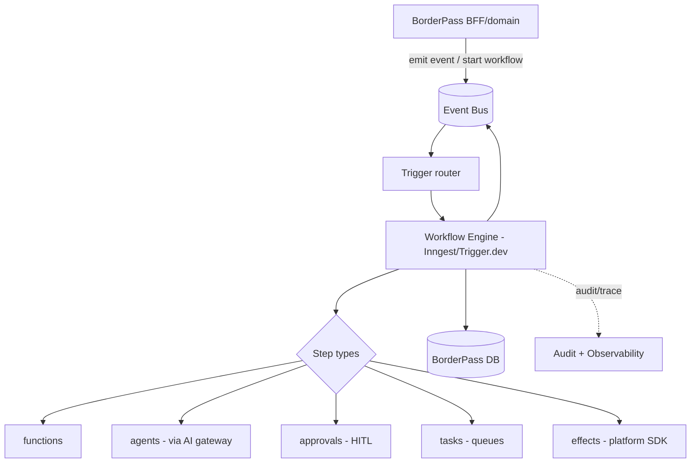
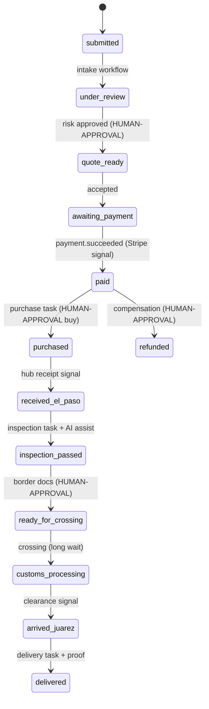
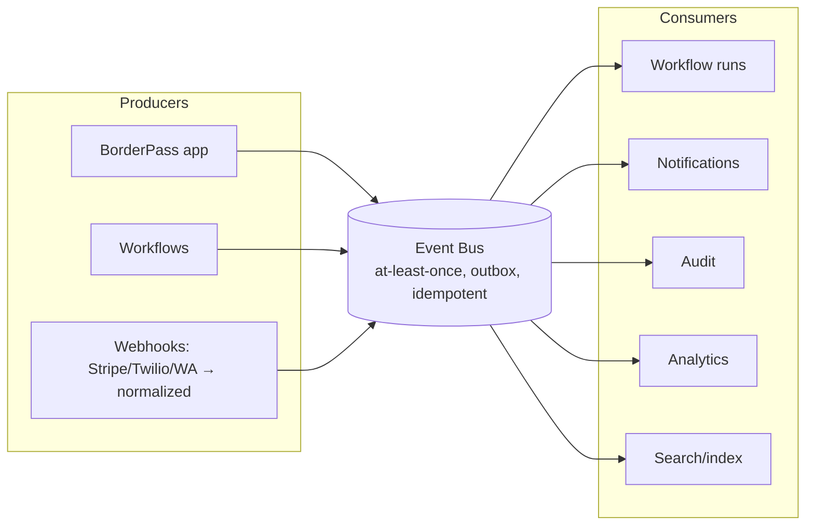

# 03 · Automation, Workflow & Event Architecture

Covers deliverables **10 (Automation Platform integration)**, **17 (Workflow orchestration)**, **18 (Event-driven architecture)**.

---

## 10 · Automation Platform integration model

BorderPass uses the Maralito Automation Platform as its **operational backbone**. It does not run its own queues or schedulers; it **authors workflows, emits/consumes events, raises approvals, and creates tasks** on the shared engine.

**What BorderPass consumes from automation:**
- **Event bus** — standard envelope; `borderpass.*` + platform events.
- **Workflow engine** — durable order lifecycle + 15 workflows (PRD 13).
- **Human approvals** — risk, quote, purchase, border docs, inspection-fail, refund (`HUMAN-APPROVAL`).
- **Task queues** — inspector/driver/finance/support/buyer queues (PRD 10/16).
- **Rules engine** — accepted/prohibited categories, risk bands, pricing/duty, thresholds (PRD 08).
- **Workflow observability** — run timelines, DLQ, replay.

## 17 · Workflow orchestration architecture

### 17.1 The order lifecycle is a workflow
The 24-status state machine (PRD 09) is realized as **durable workflow steps**, not app code. Each status transition is a checkpointed step; long waits (awaiting payment, awaiting package, awaiting clearance) are durable `sleep`/`waitForSignal`; human gates are `approval` steps; field work is `task` steps.

### 17.2 Orchestration properties (inherited from the engine)
- **Durable + idempotent:** survives restarts; every effect keyed so retries never double-charge/notify.
- **Retries + timeouts:** per-step backoff; `on_timeout` → escalate/compensate.
- **Compensation (saga):** partial failures roll back in reverse (e.g., refund → cancel ops task → void quote) — money never left inconsistent.
- **Human-in-the-loop:** approval steps pause the run durably and resume on decision.
- **Versioning:** in-flight orders pin their workflow version; new versions don't break running orders.
- **Replay:** any run inspectable + replayable (read-only/effectful) for debugging/recovery.

### 17.3 The 15 BorderPass workflows
Authored on the engine (PRD 13): intake, missing-info, risk review, quote, quote-expiry reminder, payment confirmation, purchase assignment, package received, inspection completed, border crossing, delay notification, delivery confirmation, failed delivery, refund, support escalation. Each is durable, idempotent, compensable, and emits events + audit.

### 17.4 Mapping: domain action → workflow → status
| Domain trigger | Workflow | Status effect |
|----------------|----------|---------------|
| Customer submits request | W1 intake → W3 risk | submitted→under_review→quote_ready/rejected |
| Customer accepts quote | W6 payment | awaiting_payment→paid |
| Stripe webhook | W6 (signal) | paid |
| Hub scans package | W8 received | received_el_paso |
| Inspector completes | W9 inspection | inspection_passed/failed |
| Compliance approves docs | W10 crossing | border_documentation_ready→…→arrived_juarez |
| Driver delivers | W12 delivery | out_for_delivery→delivered |
| Refund requested | W14 refund | refunded |

## 18 · Event-driven architecture

### 18.1 Events are the integration seam
BorderPass and platform services interact via **events on the shared bus**, not synchronous chains. App actions and status changes emit events; workflows and consumers react.

### 18.2 Event model (architecture-level; Zod schemas deferred)
- **Standard envelope** (platform): `id, type, version, source, org_id, app_id, subject{type,id}, actor{type,id}, data, metadata{trace_id, correlation_id, causation_id, idempotency_key, sequence}, occurred_at`.
- **Naming:** `borderpass.<entity>.<pastTenseVerb>`; platform events reuse `payment.*`, `notification.*`, `workflow.*`, `approval.*`, `task.*`.
- **Delivery:** at-least-once + **outbox pattern** (state change + event in one transaction) + idempotent consumers (dedupe by `event.id`) + DLQ + replay.
- **Correlation:** every event for an order shares `correlation_id = order_id`, so the whole journey is queryable/replayable.

### 18.3 BorderPass event catalog (design-level)
| Event | Emitted when | Key consumers |
|-------|--------------|---------------|
| `borderpass.order.submitted` | request submitted | intake workflow, audit, analytics |
| `borderpass.order.missing_info` | validation gap | notifications, customer |
| `borderpass.order.risk_assessed` | risk band set | quote workflow, audit |
| `borderpass.order.rejected` | compliance reject | notifications, audit |
| `borderpass.quote.ready` | quote approved | notifications, customer |
| `borderpass.quote.expiring` / `.expired` | expiry window/elapsed | reminder workflow |
| `payment.succeeded` / `.failed` *(platform)* | Stripe webhook | payment workflow, fulfilment |
| `borderpass.order.purchased` | item bought | journey, notifications |
| `borderpass.package.received` | Hub receipt | inspection workflow |
| `borderpass.inspection.completed` | inspection done | crossing workflow, notifications |
| `borderpass.inspection.failed` | issue found | resolution/refund, support |
| `borderpass.crossing.started` | crossing begun | journey, notifications |
| `borderpass.customs.delayed` | hold/delay | delay-notification workflow |
| `borderpass.order.arrived_juarez` | arrival | delivery workflow |
| `borderpass.delivery.out` / `.completed` / `.failed` | last-mile states | notifications, failed-delivery workflow |
| `borderpass.refund.requested` / `refund.issued` *(platform refund)* | refund flow | finance, notifications, ledger |
| `borderpass.support.escalated` | exception/SLA/message | support workflow |
| `approval.requested/granted/rejected` *(platform)* | HITL gates | workflows, audit |
| `task.created/assigned/completed/sla_breached` *(platform)* | queue work | ops, escalation |

### 18.4 Consumed platform events
`payment.*`, `notification.*` (delivery status), `file.uploaded` (inspection photos/receipts), `approval.*`, `task.*`, `user.created` (profile init), `agent.*` (agent runs/cost/guardrails).

### 18.5 Why event-driven
- Decouples side effects (notify, charge, audit, analyze, index) from the request path.
- Absorbs spikes; safe retries; full replay for recovery + forensics.
- Lets future apps reuse the same patterns (PRD/automation reusability).
