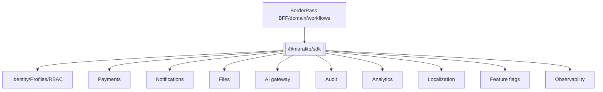
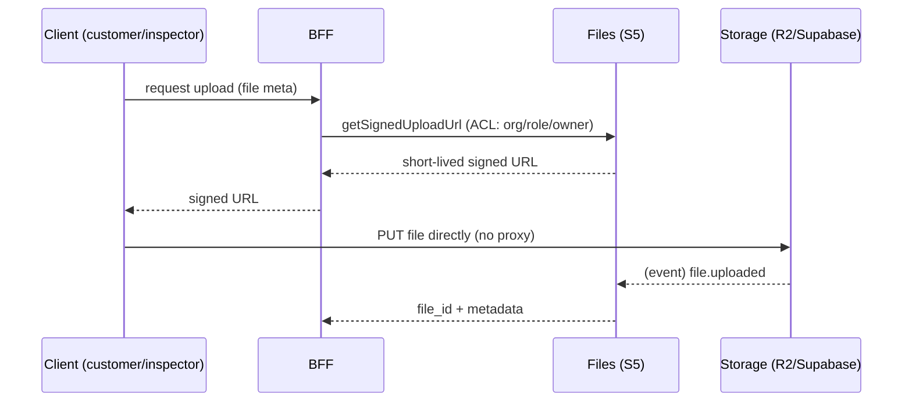
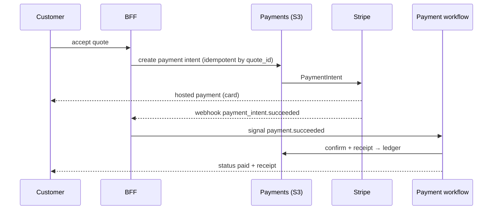
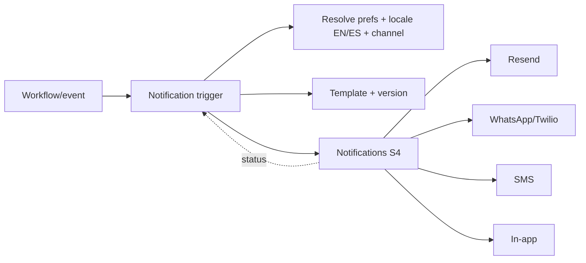
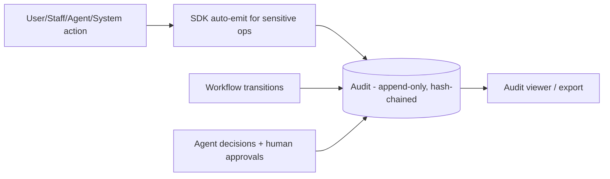
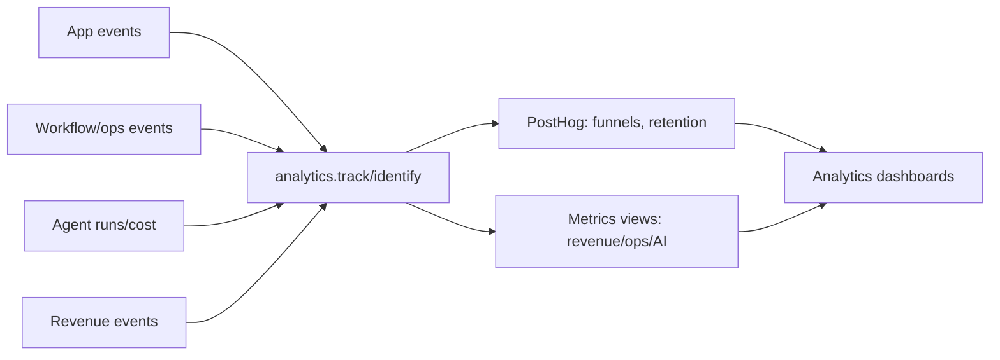

# 04 · Platform Integration (Shared Services)

Covers deliverables **9 (Shared Maralito Platform integration model)**, **14 (File/storage)**, **15 (Payments)**, **16 (Notifications)**, **19 (Audit logging)**, **20 (Analytics)**.

---

## 9 · Shared platform integration model

BorderPass consumes every shared capability **through `@maralito/sdk`** from the BFF/domain layer — one sanctioned client that injects auth, tenant context, idempotency, tracing, and audit. The app never calls a provider (Stripe/Twilio/model) directly.

**Integration principles**
- **Contract-only:** consume services via SDK/events; never reach into platform tables.
- **Reference, don't copy:** store platform ids (user_id, payment_id, file_id); resolve via SDK.
- **Inherited cross-cutting:** auth, RLS context, idempotency, tracing, audit auto-emission come from the SDK.
- **Fail-soft:** platform/provider outages degrade gracefully (queue + retry via workflows), never hard-fail the customer path silently.

Below: the BorderPass-specific integration model per service.

---

## 14 · File upload & storage architecture

**Use cases:** customer receipts/invoices, BorderPass purchase proofs, customs documents, **inspection photos**, delivery proof, serial/seal evidence.

**Design**
- **Direct-to-storage** via short-lived signed URLs (no large uploads through the app).
- **Metadata in Files (S5)**; blobs in **R2 or Supabase Storage** `⚠️ VERIFY` (pick one), encrypted at rest.
- **Access control:** object-level ACL (org/role/owner) + permission-checked, time-limited **signed view URLs**; inspection photos shown to the owning customer only.
- **Classification + lifecycle:** receipts/docs = Confidential/Restricted; retention per legal/customs (§22); expiration sweeps; legal-hold override.
- **Scanning + processing:** malware scan hook on upload `⚠️ VERIFY`; image handling for inspection photos; OCR (serial/receipt) via AI (V1).
- **Events:** `file.uploaded` feeds inspection + RAG ingestion (V1).

---

## 15 · Payment architecture

**Via platform Payments (S3) → Stripe.** BorderPass never touches raw card data (Stripe-hosted elements; stores refs only).

**Design**
- **Flows:** one-time charge (service fee + item value), **duties payment** ("Approve & Pay Duties"), refunds; subscriptions/Connect = future.
- **Idempotency:** payment intents keyed by `quote_id`; Stripe webhooks deduped by event id; refunds idempotent (never double-refund).
- **Financial source of truth:** platform ledger (append-only); BorderPass references payment ids.
- **Webhooks:** verified signatures → normalized to `payment.*` events → payment workflow.
- **Human gates:** non-standard pricing/overrides + refunds = `HUMAN-APPROVAL` (finance), separation of duties.
- **Fraud:** Stripe Radar + rules + holds (§21).
- **Money representation:** integer minor units + currency.

---

## 16 · Notification architecture

**Via platform Notifications (S4):** Email (Resend), SMS + **WhatsApp** (Twilio/WhatsApp Business), in-app, push (V1). WhatsApp is the corridor's primary channel + the 2-way concierge thread.

**Design**
- **Triggered by** workflow steps + event subscriptions (status changes) + schedules (reminders) — PRD 14.
- **Bilingual EN/ES** from CustomerProfile language; templates versioned + localized (WhatsApp templates pre-approved `⚠️ VERIFY`).
- **Channel preference + fallback** (WhatsApp→SMS→email); transactional bypass quiet hours; non-urgent respect them.
- **Delivery tracking + retry + idempotency** (no double-send); failures can raise an ops task ("couldn't reach customer").
- **Concierge continuity:** inbound WhatsApp routes to the concierge workspace; AI drafts, human sends sensitive replies.

---

## 19 · Audit logging architecture

**Via platform Audit (S7):** immutable, queryable history of who/what did what.

**Design**
- **What's audited:** every order status transition, risk/quote/refund/border-doc decision, inspection outcome, agent recommendation + the human decision, PII/sensitive-data access, admin actions, payments (mirrored to ledger).
- **How:** the SDK auto-emits audit for sensitive operations so app code can't forget; workflows audit each transition.
- **Properties:** append-only, tamper-evident (hash-chaining), partitioned, queryable by actor/order/correlation/trace; long retention for compliance `⚠️ VERIFY`.
- **Explainability:** agent decisions record inputs, rationale, matched rules, confidence, and final human decision — critical for customs/dispute defense.

---

## 20 · Analytics architecture

**Via platform Analytics (S8) + PostHog.**

**Design**
- **Event taxonomy** for the funnel: signup→activation→request→quote→payment→delivery→repeat (PRD 17 KPIs).
- **Sources:** product events (PostHog) + financial (ledger) + ops (workflow/task data) + AI (agent runs + cost ledger).
- **Dashboards:** product, revenue, operations, AI (override rate, error rate, cost/order) — surfaced in the admin Analytics dashboard (V1).
- **Privacy:** analytics events minimize PII; identify via stable ids, not sensitive data.
- **Guardrail alerts:** conversion drop, refund spike, delay frequency, AI override/cost anomalies.
