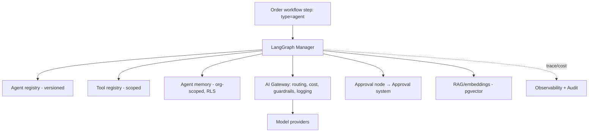
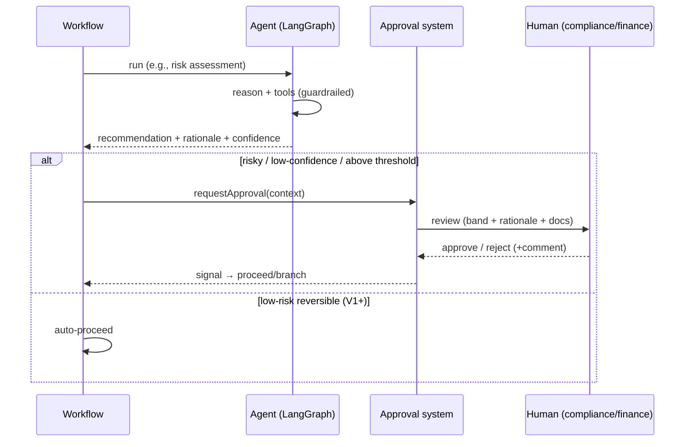

# 05 · AI / LangGraph Integration Model

Covers deliverable **11**. BorderPass's 10 agents (PRD 12) run through the platform **AI gateway** and **LangGraph** orchestration as **governed workflow steps**. Core rule: **agents recommend; risky/compliance/financial decisions require `HUMAN-APPROVAL`.**

---

## 11.1 Integration shape

**Key points**
- **Single entry:** every model call goes through the AI gateway — cost metering, routing, guardrails, and logging are inherited; no agent holds provider keys.
- **Agents as steps:** an agent runs as a workflow step; long-running/awaiting-approval agents are durable via the engine checkpointer `⚠️ VERIFY` LangGraph↔engine integration.
- **Recommend-only by default:** agents start at **suggest** autonomy; promotion needs evals + review; irreversible/financial/compliance actions always gate on a human.

## 11.2 BorderPass agents (PRD 12) → technical wiring
| Agent | Phase | Tools (scoped) | Data access | Human gate |
|-------|-------|----------------|-------------|------------|
| Intake | MVP | schema validate, profile lookup | order, profile | routes risky → review |
| Risk & Compliance | MVP | rules engine, prohibited/sanctions lists, classifier | order, customer compliance | **HIGH/BLOCK → HUMAN** |
| Quote | MVP→V1 | pricing rules, duty estimation | order, pricing rules | **non-standard → HUMAN** |
| Shopping | V1 | product retrieval (allowlisted), price parser | order item, external APIs | **purchase → HUMAN** |
| Inspection Assistant | V1 | vision, OCR, comparison | inspection, receipt | **fail → HUMAN** |
| Border Journey | V1 | ETA model, copy gen | journey data | customs msg → ops confirm |
| Support | V1 | ticket, KB, reply gen | tickets, order (PII logged) | sensitive → HUMAN |
| Finance | V1 | payments, ledger, refund rules | financial | **refund → HUMAN** |
| Ops Coordinator | V1 | tasks, scheduling | ops state | non-standard → ops |
| Manager | V2 | analytics, alerting | aggregate | recommend only |

## 11.3 Agent governance (inherited from platform AI tier)
- **Tool registry + permissions:** an agent calls only granted tools within its delegated, time-boxed scope (≤ the human it assists). High-risk tools (charge/refund/border-submit) require approval.
- **Memory:** org-scoped, RLS-isolated; cross-tenant retrieval impossible (tested); retention/expiry enforced.
- **RAG (V1):** ACL-filtered retrieval over receipts/docs (pgvector) — results filtered to the caller's org/permissions before reaching the model.
- **Guardrails:** input (prompt-injection/PII/jailbreak), output (schema/toxicity/leakage), action (approval thresholds). Untrusted content (customer messages, product pages, documents) treated as **data, not instructions**.
- **Cost:** every call metered to the AI cost ledger, attributed per order/agent/feature; per-org budgets + alerts.
- **Evaluation:** each agent has eval + red-team suites gating changes; online quality + **human-override rate** tracked (key trust metric, PRD 17).
- **Audit + explainability:** recommendation inputs, rationale, matched rules, confidence, and final human decision recorded.

## 11.4 Human-in-the-loop pattern

## 11.5 MVP vs V1 AI posture
- **MVP:** Intake + Risk (recommend) + Quote (draft) only; everything human-reviewed; minimal autonomy. Keeps cost + risk low while proving value.
- **V1:** add Shopping, Inspection Assistant, Border Journey, Support, Finance, Ops Coordinator; raise automation rate for **low-risk reversible** cases; keep human gates on risky/financial/compliance.
- **Low-confidence rule:** any risky recommendation below threshold escalates to a human — never auto-act.
