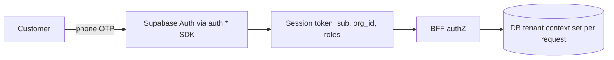
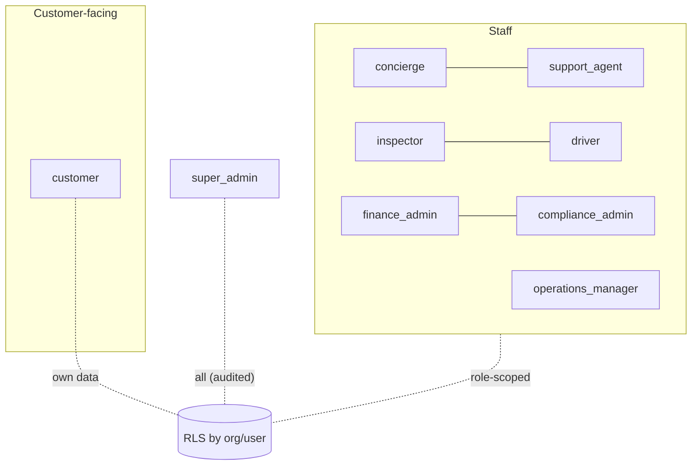
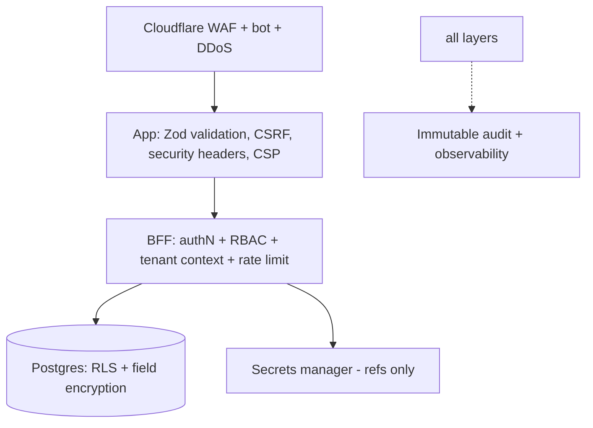

# 06 · Auth, RBAC, Security & Privacy

Covers deliverables **12 (Authentication & authorization)**, **13 (RBAC)**, **21 (Security architecture)**, **22 (Data privacy & retention)**. Built on the platform Identity + Security model.

---

## 12 · Authentication & authorization architecture

### 12.1 Authentication
- **Customer:** phone-based (OTP) via **Supabase Auth** behind the platform `auth.*` SDK abstraction (so identity is re-hostable later without touching app code). Magic link / social optional; **MFA-ready** data model.
- **Staff:** stronger auth; **enforced MFA for admin/compliance/finance** roles (V1).
- **Sessions:** short-lived access token (carries `sub`, `org_id`, `app_id`, roles) + rotating refresh token with reuse detection; session registry (list/revoke, "log out everywhere").
- **Machine/agents:** AI agents act under **delegated, time-boxed `agent` tokens** ≤ the human they assist.

### 12.2 Authorization — two layers
1. **RBAC (application):** the BFF checks `can(role, action, ctx)` before any operation (PRD 11 roles).
2. **RLS (database):** Postgres row-level security enforces `org_id` isolation unconditionally — even an app bug can't cross tenants. The BFF sets tenant context per request from the validated token (only place it's set).

### 12.3 Elevation for powerful actions
Refunds, order rejection, border-doc approval, data export, manual status overrides require **role + condition (fresh MFA / explicit confirm / human approval) + mandatory audit**. Expressed as policy, evaluated centrally.

---

## 13 · Role-based access control model

Nine roles (PRD 11): customer, concierge, inspector, driver, operations_manager, finance_admin, compliance_admin, support_agent, super_admin.

**Model**
- **System + app-scoped roles:** platform-defined roles plus BorderPass-specific (inspector, driver, concierge…). Roles map to fine-grained permissions (`order.approve`, `refund.create`, `inspection.submit`, `borderdocs.approve`).
- **Least privilege + separation of duties:** requester ≠ approver; finance vs compliance authorities distinct; PII access by staff logged.
- **Agent principal:** distinct `agent` type, delegated scope, never final authority on risky calls.
- Full permission matrix in PRD 11; enforced in BFF (RBAC) + DB (RLS).

---

## 21 · Security architecture

Defense in depth, inheriting the platform security model.

**Controls**
- **Edge:** Cloudflare WAF/bot/DDoS; per-org + per-route rate limits (Upstash), tighter on auth/payments/AI.
- **App:** Zod validation everywhere; CSP + security headers; parameterized queries (Drizzle); SSRF/egress allowlists for AI tools + webhooks.
- **Data:** RLS tenant isolation; **field-level encryption** for Restricted data (RFC, KYC, financial, sensitive PII) via KMS; TLS in transit; encryption at rest.
- **Secrets:** in a secrets manager (refs only in DB/config); short-lived, rotated; OIDC for CI cloud auth; never in client bundles or workflow definitions.
- **AuthZ:** RBAC + RLS + elevation on powerful actions; agents delegated/scoped.
- **Abuse/fraud:** rate limits, anomaly detection, Stripe Radar + fraud rules + holds + human review; duplicate-order + velocity checks.
- **Audit:** every sensitive action immutably logged with actor + justification.
- **Supply chain:** SAST/SCA/secret/IaC scanning in CI (blocking); pinned deps; protected main.
- **Threat model:** STRIDE review per surface; special attention to cross-tenant leakage (RLS + isolation tests) and AI agent overreach (HITL + scoped tools).

---

## 22 · Data privacy & retention approach

### 22.1 Data classification
| Class | Examples | Handling |
|-------|----------|----------|
| Public | help content | none |
| Internal | order metadata, ops state | RLS |
| Confidential | order details, messages, quotes, inspection records | RLS + access controls |
| **Restricted** | PII (name/phone/address), **RFC/KYC**, financial, receipts/customs docs | RLS + **field encryption** + access logged |

### 22.2 Privacy principles
- **Minimization:** capture only what's needed; no raw card data (Stripe refs); KYC metadata not raw documents where avoidable.
- **Purpose limitation + consent:** ToS/consent at onboarding; cross-app data sharing is opt-in + audited (default isolated).
- **Access logging:** staff/agent reads of Restricted data are audited.
- **Bilingual transparency:** privacy/ToS available EN/ES.
- **Right to access/delete:** support export + deletion (honoring legal/tax/customs retention that may override).
- **Data residency:** per-app DB + region controls enable future residency requirements `⚠️ VERIFY`.

### 22.3 Retention (indicative — `⚠️ VERIFY` with counsel/tax/customs)
| Data | Indicative retention |
|------|----------------------|
| Account/profile | life of account + legal minimum; deletable on request |
| Orders/quotes | order life + financial/tax minimum |
| Payments/receipts/invoices | financial/tax retention (longer) |
| Customs documents | customs retention requirement |
| Inspection photos/records | order life + dispute window |
| Audit logs | long (compliance) |
| Messages/tickets | medium-term |
| AI agent runs | medium (eval/audit) |

> **Gating note:** all retention periods + the lawful basis for processing must be confirmed in the **Compliance & Customs Operating Model** before production. Treat the above as placeholders.
