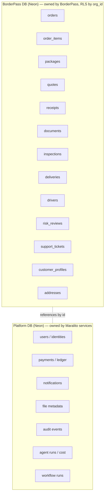
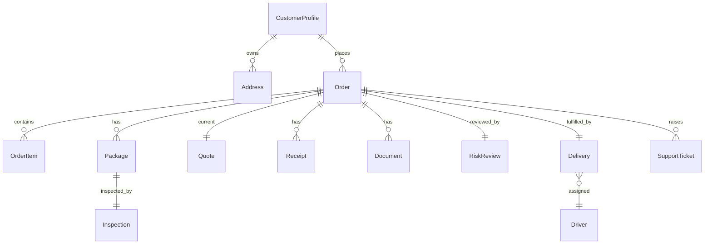

# 07 · Data Architecture

Design-level data model (entities, relationships, ownership, RLS, retention) — **no SQL/DDL** (deferred to [contracts/](../../contracts/README.md) after sign-off). This is the architecture that the future Drizzle schema will implement, derived from PRD 15.

---

## 7.1 Database topology (two-tier, platform model)

**Decisions**
- **BorderPass owns its own Neon Postgres DB**; references platform-owned entities (User, Payment, Notification, File, Audit, AgentRun, WorkflowRun) **by id** — no duplication, no cross-DB foreign keys.
- **RLS on every BorderPass table** keyed by `org_id` (+ `app_id`), set per-request by the BFF from a validated token.
- **Integrity across DBs** via reference-by-id + events (eventual consistency) + idempotent reconciliation jobs.
- **Branch-per-PR** previews via Neon branching.

## 7.2 Entity overview (BorderPass-owned)

(Full field-level entity definitions, sensitivity, and retention are in PRD 15; the contract-level schema is deferred.)

## 7.3 Core entities (design summary)
| Entity | Owner | Key relationships | Sensitivity | Notes |
|--------|-------|-------------------|-------------|-------|
| CustomerProfile | BP | 1–1 User(platform); 1–N Address/Order | Restricted (PII/RFC/KYC) | language, prefs, loyalty(future) |
| Address | BP | N–1 CustomerProfile | Restricted | Juárez delivery + El Paso Hub types |
| Order | BP | hub of the model | Confidential(+PII) | status (24), service_type, correlation_id |
| OrderItem | BP | N–1 Order | Internal/Confidential | URL, qty, value, category, restriction flags |
| Package | BP | N–1 Order; 1–1 Inspection | Internal | weight/dims/photos/seal/location |
| Quote | BP | N–1 Order | Confidential (financial) | service_fee, item_value, est_duties, total, version, expiry |
| Receipt | BP | N–1 Order | Confidential | upload/proof/issued; file ref |
| Document | BP | N–1 Order | Restricted (compliance) | commercial invoice/customs/manifest |
| Inspection | BP | 1–1 Package | Confidential | photos, serial, serial_match, seal, checklist, ai_score, outcome |
| Delivery | BP | N–1 Order; N–1 Driver | Confidential | mode, attempts, proof, window |
| Driver | BP | 1–N Delivery | Restricted (staff PII) | zones, availability |
| RiskReview | BP | 1–1 Order | Restricted (compliance) | band, matched_rules, ai_rationale, decision |
| SupportTicket | BP | N–1 Order/Customer | Confidential | category, severity, messages, resolution |
| *(referenced)* User/Payment/File/Audit/AgentRun/WorkflowRun | Platform | by id | varies | not stored in BP DB |

## 7.4 Order status as data
- The 24 statuses (PRD 09) are a **typed enum**; the current status lives on `Order`; transition history lives in workflow run history + audit (not a separate status table required, though a status-history projection may be added for fast timelines).
- Customer **Border Journey** (12 stages) is a **view/projection** over status — not stored separately.

## 7.5 Indexing & access patterns (design intent)
- Lookups: order by `id`/`BP-####`, by `customer_id`, by `correlation_id`, by `status` (+ `org_id`).
- Queues: orders by `status`+priority; inspections by status; deliveries by zone/status; risk reviews by band.
- Time-series/append: inspection photos, status/audit history — partition-friendly.
- All queries are **org-scoped (RLS)**; staff queues filter by role-permitted scope.

## 7.6 Data lifecycle
- **Creation:** order created on submit; child entities created by workflow steps.
- **Mutation:** status changes only via workflow transitions (not ad-hoc); writes go through the domain layer.
- **Projections:** Border Journey, search index, analytics rollups built from events (rebuildable).
- **Retention/deletion:** per §22 (TAD 06) — `⚠️ VERIFY` with counsel; export/delete supported subject to legal holds.

> Physical schema, exact columns, constraints, indexes, and RLS policy SQL are produced as **Drizzle migrations** in the contracts phase, after this architecture is approved.
