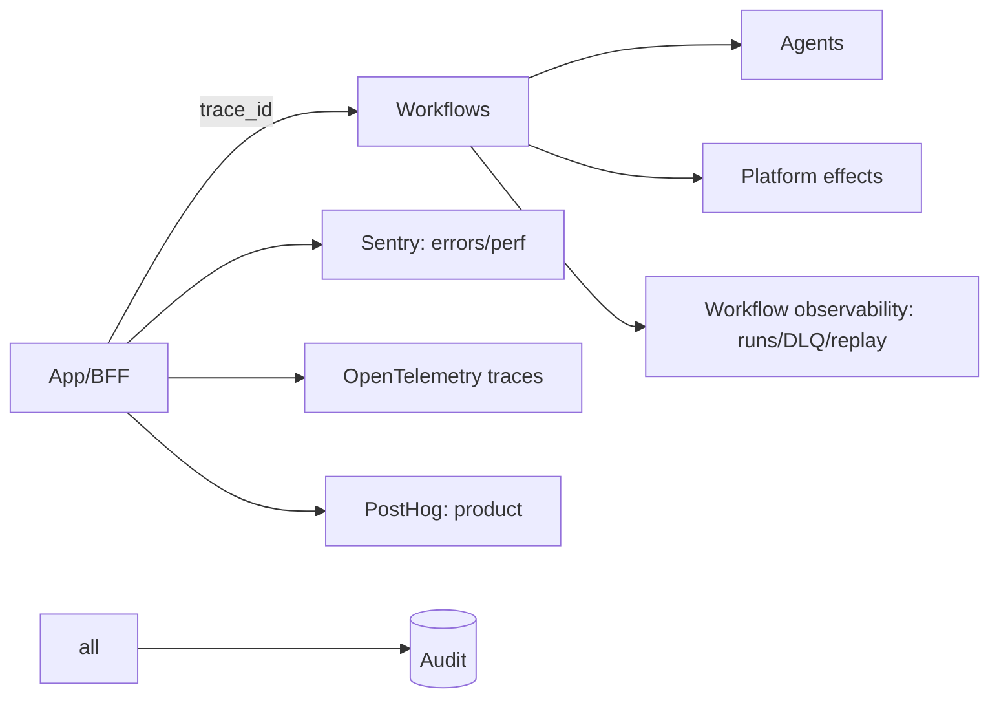
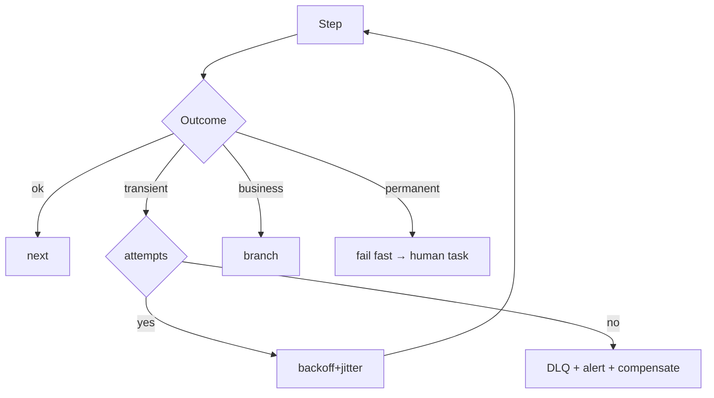

# 08 · Observability, Reliability & Scale

Covers deliverables **25 (Observability & monitoring)**, **26 (Error handling & retry)**, **27 (Backup & recovery)**, **28 (Scalability)**.

---

## 25 · Observability & monitoring plan

**Pillars**
- **Tracing (OpenTelemetry):** one `trace_id` spans UI→BFF→SDK→workflow→agent→tool→model→events; `correlation_id = order_id` ties an order's whole journey. Essential because automation is async.
- **Errors/perf (Sentry):** auto-capture via SDK with order/run/trace context; Core Web Vitals; performance budgets.
- **Logs:** structured JSON, tenancy + trace fields, **PII/secret redaction**; sensitive reads go to audit not logs.
- **Workflow observability:** run timelines, step status, retries, DLQ depth, stuck-run detection (from the automation engine).
- **AI observability:** tokens/cost/latency/quality/guardrail outcomes per agent run; **human-override rate**.
- **Product (PostHog):** funnels, retention, feature adoption.

**SLOs (ratify with pilot data — PRD 17)**
| Area | SLI | Target |
|------|-----|--------|
| App | p95 page/action latency | < 500 ms server actions |
| Auth | OTP success latency | < 500 ms; 99.9% avail |
| Payments | webhook→paid processing | < 1 min p95 |
| Workflows | success/terminal rate | ≥ 99% (excl. business rejects) |
| Notifications | delivery success | ≥ 99% |
| Delivery | on-time | ≥ 90% |
| AI | error rate / cost per order | within budget |

**Alerting:** actionable, runbook-linked — stuck runs, DLQ growth, compensation failure (P0), payment failures, SLA breaches, agent-cost spikes, conversion/refund anomalies. Incident process: detect→triage→mitigate→resolve→blameless postmortem.

---

## 26 · Error handling & retry strategy

**Failure taxonomy → response**
| Class | Example | Response |
|-------|---------|----------|
| Transient | provider 503, network blip | retry w/ exponential backoff + jitter |
| Timeout | step over budget | `on_timeout` → escalate/compensate |
| Business/expected | payment declined, risk reject | **branch** (not an error) |
| Permanent | bad input, unauthorized | fail fast → DLQ / human task |
| Partial | some effects done, later step fails | **compensation (saga)** |
| Poison | repeated identical failure | cap attempts → DLQ + alert |

**Principles**
- **Idempotency is the precondition** for retries — every effect keyed (order+step+key); external calls pass idempotency keys (no double charge/notify/refund).
- **Compensation, not corruption:** multi-effect failures roll back in reverse; a failed compensation raises a **P0 manual-remediation task** — never silently inconsistent.
- **DLQ + replay:** failed events/steps → DLQ with context; alert + inspect + replay (effectful replay respects idempotency).
- **Graceful degradation:** provider outage (Stripe/Twilio/model/Neon) → circuit-break + durable queue + retry; customer sees "we'll update you," not a hard error.
- **User-facing errors:** typed, friendly, bilingual; never expose internals; always offer concierge.

---

## 27 · Backup & recovery plan

- **Databases:** automated backups + **point-in-time recovery** for BorderPass DB (and platform DBs); **tested restore drills** (a backup isn't real until a restore is verified).
- **Files/storage:** versioning/replication for receipts/photos/docs `⚠️ VERIFY` retention + PITR window.
- **Targets (proposed, ratify):** RPO ≤ 5 min (PITR), RTO ≤ 1 hr for critical paths (auth, orders, payments).
- **DR strategy:** infrastructure-as-code (reproducible envs); runbooks for region/provider failover; dependency-outage playbooks (Stripe/Twilio/model down → degrade + queue + retry).
- **Immutable audit** retained per compliance schedule; optionally WORM to object storage.
- **Workflow recovery:** durable engine resumes in-flight runs after restart; replay for recovery.
- **Data export/delete:** supports customer requests subject to legal holds.

---

## 28 · Scalability plan

**Posture:** pilot-scale first, scale on evidence (platform principle P5). The architecture scales without rewrite.

| Dimension | Approach |
|-----------|----------|
| **App tier** | Vercel serverless scales automatically; stateless BFF; cache reads (Upstash) |
| **Database** | Neon serverless scaling; read patterns indexed; partition append-heavy tables (inspection/audit/event history); connection pooling for serverless `⚠️ VERIFY` |
| **Workflows** | engine concurrency/throttle controls; **per-org limits** prevent noisy-neighbor; long waits hold no compute |
| **AI** | per-org budgets + caps; cheap-model routing; caching; cost attribution |
| **Notifications** | provider rate limits; batching/digests for non-urgent |
| **Operations (physical)** | the real bottleneck at scale = Hub throughput + drivers; pilot caps demand (waitlist); capacity planning + SLA monitoring; staffing scales with volume |
| **Multi-corridor (future)** | per-corridor config + zones; reuse platform/automation; possible service extraction |

**Bottleneck note:** unlike pure-software products, BorderPass's scaling limit is **operational (Hub + customs + last-mile)**, not compute. Software scales cheaply; the roadmap (PRD 19) deliberately gates demand to match operational capacity.

**Service extraction triggers:** extract the BorderPass domain or AI into its own deployable only when measured scaling/blast-radius/ownership constraints justify it — not preemptively.
