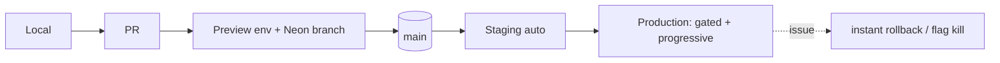
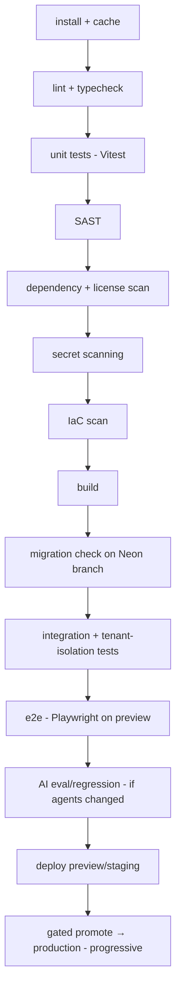

# 09 · Environments, CI/CD & Repo

Covers deliverables **23 (Environment strategy)**, **24 (CI/CD)**, **31 (Monorepo/repo structure)**. Reuses the platform DevSecOps model.

---

## 23 · Environment strategy

| Env | Purpose | Data | Lifetime | Deploy trigger |
|-----|---------|------|----------|----------------|
| **Local** | Dev on laptop | seeded/synthetic | per dev | manual |
| **Preview** | Per-PR validation, review, e2e | Neon branch (synthetic) | per PR (ephemeral) | on PR |
| **Staging** | Pre-prod integration, smoke/e2e, demos, UAT | prod-like synthetic (no prod PII) | persistent | merge to main |
| **Production** | Real customers | real | persistent | gated promotion + progressive |



**Principles**
- **Hard isolation** between envs: separate DBs, secrets, and **separate provider accounts/keys** (Stripe/Twilio/model test vs live) — no shared credentials `⚠️ VERIFY`.
- **Local:** one command (`pnpm dev`) brings up app + automation dev server + Postgres branch + Upstash dev; providers in **test/sandbox** behind the SDK (Stripe test, WhatsApp sandbox, test models / recorded fixtures).
- **Preview:** Vercel preview + **Neon DB branch** per PR; migrations + seed run; Playwright e2e against the preview; torn down on merge.
- **Staging:** mirrors prod topology (Terraform variables); synthetic data only; full smoke/e2e + (if AI changed) eval suites; gate before prod.
- **Production:** promotion gated (checks + approval) and **progressive** (canary → % → full) via feature flags; instant rollback (flag or redeploy).
- **Config as variables, not drift;** secrets from the manager; flags (platform S12) decouple deploy from release.

---

## 24 · CI/CD architecture (GitHub Actions, security-gated)



**Security gates (blocking):** SAST, dependency/SCA, secret scanning, IaC scan, **tenant-isolation tests**, container scan (if images). A red gate blocks merge; waivers are time-boxed + approved.

**Other CI properties**
- **OIDC short-lived cloud credentials** (no static keys in CI).
- **DB migrations:** forward-only, expand→migrate→contract (zero-downtime); validated on a fresh Neon branch; isolation tests on changed tables.
- **Progressive delivery + instant rollback** via flags.
- **Testing pyramid:** unit → integration (with RLS) → tenant-isolation (blocking) → contract → e2e → AI eval → periodic load/DR drills (PRD/platform).
- **Supply chain:** pinned deps + actions (by SHA), protected main, SBOM on release `⚠️ VERIFY`.

---

## 31 · Monorepo / repo structure recommendation

`DECISION:` BorderPass lives **inside the Maralito monorepo** (pnpm + Turborepo) as `apps/borderpass`, so it shares the SDK, UI kit, schemas, and tooling and can make atomic cross-cutting changes with the platform.

```
maralito/ (monorepo)
├─ apps/
│  ├─ borderpass/            # this app (customer + admin/ops route groups)
│  └─ admin/                 # (or BorderPass admin as a route group within borderpass)
├─ platform/                 # Maralito platform services (S1–S14)
│  └─ automation/            # workflow engine, events, agents
├─ packages/
│  ├─ sdk/                   # @maralito/sdk
│  ├─ ui/                    # @maralito/ui (BorderPass themes Stitch tokens over this)
│  ├─ schemas/               # @maralito/schemas (Zod) — BorderPass adds its domain schemas
│  ├─ automation/            # workflow authoring SDK
│  └─ config/                # tsconfig/eslint/tailwind presets
├─ infra/                    # Terraform (envs, modules, policies)
└─ .github/workflows/        # CI/CD
```

**Rules**
- `apps/borderpass` depends on `packages/*` (sdk, ui, schemas) — **never** on platform service internals (contract-only; import-boundary lint enforces).
- BorderPass domain logic, workflows, agents, and DB schema live under `apps/borderpass/src`.
- **Alternative considered — separate BorderPass repo:** more isolation but loses shared-code atomicity + forces published-package coordination; rejected for this stage (can split later).
