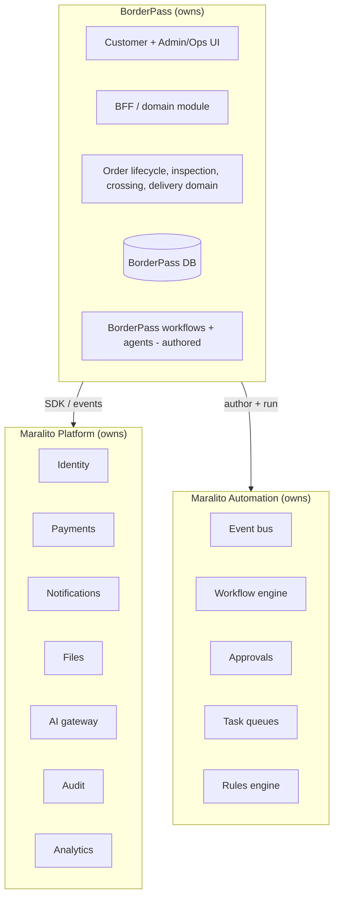

# 10 · Boundaries, Scope, Sequence & Risks

Covers deliverables **32 (Service boundaries)**, **33 (MVP technical scope)**, **34 (V1 technical scope)**, **35 (Technical risks & mitigations)**, **36 (Open questions)**, **37 (Implementation sequence)**.

---

## 32 · Service boundaries



**Ownership boundaries**
| Concern | Owner | BorderPass role |
|---------|-------|-----------------|
| Identity, auth, RBAC, profiles | Platform | consumes via SDK |
| Payments, ledger | Platform | consumes; references payment ids |
| Notifications, templates | Platform | triggers + provides BorderPass templates |
| Files/storage | Platform | uses signed URLs; owns file references on orders |
| AI gateway, LangGraph runtime, registries | Platform | **authors** BorderPass agents/prompts/tools |
| Audit, analytics | Platform | emits events; consumes dashboards |
| Event bus, workflow engine, approvals, tasks, rules | Automation | **authors** BorderPass workflows + rules |
| **Order lifecycle + domain data** | **BorderPass** | owns fully |
| **Cross-border ops (Hub/inspection/crossing/delivery)** | **BorderPass** | owns fully |
| Customer/admin/ops UI | BorderPass | owns fully |

**Rule:** BorderPass interacts with platform/automation **only via SDK + events + authored workflows/agents/rules** — never reaching into their internals (platform principle P2). This keeps BorderPass swappable-on-top and the platform reusable beneath.

---

## 33 · MVP technical scope

**Build (technical):**
- Next.js app: customer flows (onboarding, New Request [Buy-for-Me + Package Reception], Orders, Border Journey, Quote, Pay, Concierge, Profile) + minimal admin (Orders, Risk-review/approval, Inspection Center, Deliveries, basic Finance, Concierge, Audit viewer).
- BFF (server actions + route handlers) + Stitch design system over `@maralito/ui` + EN/ES i18n + PWA shell.
- BorderPass DB (Neon) + RLS + core entities (orders/items/packages/quotes/receipts/inspections/deliveries/risk_reviews/profiles/addresses).
- Order lifecycle as durable workflows + core workflows: intake, missing-info, risk review, quote, payment confirmation, package received, inspection, (manual) crossing/delivery, refund, support escalation.
- Platform integration: Auth (Supabase via SDK), Payments (Stripe), Notifications (email + WhatsApp/SMS + in-app), Files (signed URLs + inspection photos), Audit, basic Analytics.
- AI: Intake + Risk (recommend) + Quote (draft) via gateway; **all human-reviewed**.
- Webhooks: Stripe (+ Twilio/WhatsApp basic). Observability: Sentry + tracing + workflow runs + DLQ.
- CI/CD with security gates; preview envs; staging; gated prod.

**Manual (ops) in MVP:** risk/compliance decisions, quote finalization, purchasing, border docs/customs, crossing/delivery status updates, duty estimation (human-confirmed), refunds.

**Out of MVP (→ V1):** Shopping/Inspection/Journey/Support/Finance/Ops/Manager agents, automated duty calc, reorder, saved cards, RFC invoices, push, ticket system, analytics dashboards, full Business/freight + Local Pickup, carrier/customs API integrations.

---

## 34 · V1 technical scope

- **Agent depth:** Shopping (URL resolve), automated **duty estimation** (human-confirmed), Inspection Assistant (vision/OCR), Border Journey (ETA/narration/delay), Support (triage/draft), Finance (reconcile/refund eligibility), Ops Coordinator — all eval-gated, recommend-first.
- **Self-serve:** reorder, saved payment methods, BorderPass RFC invoices, notification preferences, push, deeper help center.
- **Workflows:** quote-expiry reminders, delay notifications, failed-delivery handling, richer refund + support escalation/tickets; raise automation rate for **low-risk reversible** cases (keep human gates on risky/financial/compliance).
- **Services:** full Business/freight flow; Local Pickup self-serve.
- **Admin/analytics:** Finance, Compliance/Risk, Support, Analytics dashboards; rules-engine config UI; RAG over docs.
- **Integrations:** carrier/customs/KYC APIs (live tracking, KYC) `⚠️ VERIFY`.
- **Hardening:** field-level encryption rollout, fraud rules, DR drills, SLO/error-budget governance, load testing.

---

## 35 · Technical risks & mitigations
| # | Risk | Sev | Mitigation |
|---|------|-----|------------|
| TR1 | **Workflow engine limits** (max step/run duration, concurrency) break long flows (multi-day crossing) | High | `⚠️ VERIFY` limits; spike W6/W10; durable sleeps not held compute; pick engine on evidence |
| TR2 | **LangGraph ↔ engine checkpoint integration** fails for long-waiting agents | Med | spike early (riskiest seam); fallback to engine-native waits around agent calls |
| TR3 | **Cross-tenant data leakage** | High | RLS on all tables + tenant-isolation tests (blocking CI gate); gateway-set context |
| TR4 | **Duplicate/dropped side effects** (double charge/refund/notify) | High | idempotency keys everywhere; outbox; dedupe webhooks; chaos tests |
| TR5 | **PII/financial/compliance exposure** | High | field encryption, RLS, access logging, signed URLs, secret manager |
| TR6 | **AI cost/quality/overreach** | Med | gateway budgets + caps; evals + red-team; HITL on risky; override-rate monitoring |
| TR7 | **Provider outage** (Stripe/Twilio/model/Neon) | Med | circuit breakers; durable queue+retry; graceful degradation; runbooks |
| TR8 | **Auth coupling to Supabase** | Med | abstract behind `auth.*` SDK; re-hostable; ADR |
| TR9 | **Storage/DB choice limits** (Neon/Supabase/R2) | Med | `⚠️ VERIFY` limits/pricing/branching before depending; pick one storage |
| TR10 | **Operational capacity** (Hub/drivers) can't meet demand | Med | pilot-scale + waitlist; capacity planning; SLAs |
| TR11 | **Compliance/customs design wrong** (gating) | High | **Compliance & Customs Operating Model** with counsel before live orders; human gate on every order |
| TR12 | **Scope creep into V1 during MVP** | Med | strict MVP gate; suggest-only AI; defer list |

(Engineering/security risks complement the product risks in PRD 20.)

---

## 36 · Open questions
| # | Question | Owner | Default |
|---|----------|-------|---------|
| TOQ1 | **Inngest vs Trigger.dev** — final engine? | Architect | spike both on W1/W6/W10; pick on durability + long-wait + cost |
| TOQ2 | **Neon vs Supabase Postgres** as BorderPass DB host? | Architect | Neon (branching previews); Supabase for Auth/Storage only |
| TOQ3 | **R2 vs Supabase Storage** for blobs? | Architect | one of them `⚠️ VERIFY` cost/signed-URL fit |
| TOQ4 | **Drizzle vs Prisma**? | Architect | Drizzle (type-safe SQL, lightweight, branch-friendly) |
| TOQ5 | **Admin: route group vs separate app**? | Architect | route group in `apps/borderpass` for MVP; split later if needed |
| TOQ6 | **Duty estimation method** (AI vs flat vs broker)? | Compliance/Eng | MVP human-confirmed estimate; labeled "estimated" |
| TOQ7 | **Importer-of-record / customs broker model**? | Legal | `⚠️ VERIFY` — gating |
| TOQ8 | **PWA vs native** for field roles (inspector/driver)? | Product/Eng | PWA for MVP; revisit if capture/offline needs exceed it |
| TOQ9 | **Offline capture scope** for Hub/field? | Eng | minimal queue+retry MVP |
| TOQ10 | **MFA enforcement timing** for staff? | Security | V1 enforce for admin/finance/compliance |

---

## 37 · Implementation sequence

```mermaid
graph LR
  P0[Phase 0: foundations + engine spike + legal] --> P1[Phase 1: auth + app shell + DB + design system]
  P1 --> P2[Phase 2: New Request + Order engine + statuses + Border Journey]
  P2 --> P3[Phase 3: Risk review + Quote + Stripe payment + admin approval]
  P3 --> P4[Phase 4: Hub receive + Inspection + photos + notifications + concierge]
  P4 --> P5[Phase 5: Crossing/Delivery (manual) + audit + delivery proof + refund]
  P5 --> P6[MVP hardening: observability, security gates, e2e, pilot readiness]
  P6 --> V1[V1: agent depth + self-serve + dashboards + integrations]
```

**Sequenced milestones**
1. **Phase 0 — Foundations:** confirm platform/automation MVP availability; **spike the workflow engine** (TOQ1) + LangGraph↔engine (TR2); engage **customs counsel** (TR11); resolve TOQ2–4; monorepo app scaffold + CI security gates + preview envs.
2. **Phase 1 — Shell:** Supabase Auth (via SDK) + onboarding (EN/ES) + app shell + Stitch design system + BorderPass DB + RLS + core entities.
3. **Phase 2 — Order core:** New Request flow (Buy-for-Me + Package Reception) + order lifecycle workflow + 24 statuses + Border Journey view.
4. **Phase 3 — Money path:** risk-review workflow (recommend + human approval) + quote (AI draft + human send) + Stripe payment + receipts + admin approval queue.
5. **Phase 4 — Hub + trust:** package receiving + inspection (checklist/photos/serial/seal) + customer inspection view + notifications (email/WhatsApp/SMS/in-app) + concierge (WhatsApp).
6. **Phase 5 — Fulfilment:** (manual) crossing/customs status + delivery + proof of delivery + refund/cancel + full audit.
7. **Phase 6 — Hardening:** observability/SLOs, security gates green, e2e + chaos tests, DR drill, pilot readiness.
8. **V1:** agent depth, self-serve features, admin dashboards, external integrations (per §34 + PRD 19).

**Gating dependencies:** platform/automation MVP services; engine choice; **Compliance & Customs Operating Model** (blocks live orders); El Paso Hub + driver operations; WhatsApp template approval.

> This TAD is ready for review by Engineering, Security, AI, Platform, and Operations leads. Recommended immediate next steps: **(1)** run the engine + LangGraph spikes, **(2)** stand up the Compliance & Customs Operating Model with counsel, **(3)** on sign-off, generate the code-level **Data Model + API + Event Contracts** (Drizzle/Zod/OpenAPI) in [contracts/](../../contracts/README.md).
