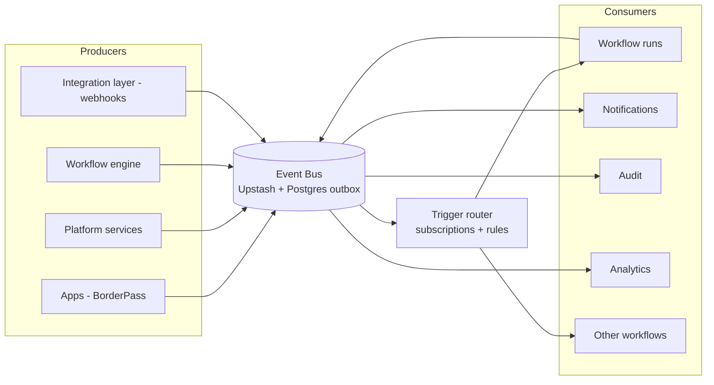

# 03 · Event Bus & Standard Event Schema

Covers required outputs **(4)** event-driven architecture and **(5)** standard event schema. Builds on the platform event architecture ([../docs/06](../docs/06-api-and-events.md)).

---

## 4 · Event-driven architecture

### 4.1 Role of events in automation

Events are the **nervous system** of the automation platform: producers emit facts; the trigger router maps facts to workflow runs; workflows emit new facts as they progress; consumers (notifications, audit, analytics, other workflows) react. This decouples *what happened* from *what should happen next*, which is exactly what makes automation composable and reusable.



### 4.2 Producers & consumers

| Producer | Examples |
|----------|----------|
| **Apps** | `borderpass.order.submitted`, `borderpass.package.received`, `borderpass.inspection.completed` |
| **Platform services** | `payment.succeeded`, `notification.delivered`, `file.uploaded`, `kyc.status_changed` |
| **Workflow engine** | `workflow.run.started`, `workflow.step.completed`, `workflow.run.failed`, `approval.requested` |
| **Integration layer** | normalized external webhooks (Stripe, Twilio/WhatsApp, Resend) re-emitted as platform events |

| Consumer | Reacts by |
|----------|-----------|
| **Trigger router → workflows** | Starting/advancing workflow runs |
| **Notifications** | Sending templated messages |
| **Audit** | Recording immutable history |
| **Analytics** | Updating metrics/funnels |
| **Other workflows** | Awaiting a signal/event (e.g., delivery waits for `payment.succeeded`) |

### 4.3 App-specific vs platform-wide events

- **Platform-wide events** use reserved namespaces (`payment.*`, `notification.*`, `workflow.*`, `approval.*`, `file.*`, `user.*`) — shared semantics across all apps.
- **App-specific events** are namespaced by app (`borderpass.*`, `<futureapp>.*`) — owned and versioned by that app, but carried on the same bus with the same envelope.
- The trigger router lets a workflow subscribe to either; app workflows mostly subscribe to their own app events + platform events.

### 4.4 Delivery semantics (carried from platform §13)

- **At-least-once** delivery; **idempotent** consumers keyed by `event.id`.
- **Outbox pattern**: producers write state change + event in one transaction; a relay publishes to the bus — no lost or phantom events.
- **Ordering**: no global order assumed; per-subject sequencing (`sequence` per `subject_id`) where order matters (e.g., order lifecycle).
- **Retry + DLQ**: failed deliveries retried with backoff; exhausted events land in a DLQ with alerting + replay tooling.

### 4.5 Retry logic, DLQ, idempotency, history (capability 1 details)

| Concern | Design |
|---------|--------|
| **Retry logic** | Exponential backoff with jitter; per-consumer max attempts; poison-message detection. Engine-native for workflow steps; router-level for trigger delivery. |
| **Dead-letter queue** | Per-consumer DLQ table + Upstash stream; alert on depth; one-click/CLI replay after fix; reason captured. |
| **Idempotency** | Every event has a unique `id`; consumers store processed ids (Upstash + `processed_events`); re-delivery is a no-op. Effects also keyed by `idempotency_key`. |
| **Event history** | All events persisted append-only in `events` (Postgres), partitioned by month, queryable by `subject_id`, `type`, `org`, `trace_id`; feeds replay + audit. Retention per policy; cold-store to R2 long-term. |

---

## 5 · Standard event schema

### 5.1 Envelope (every event, all apps)

```jsonc
{
  "id": "evt_01HXYZ...",              // ULID/UUID, unique — idempotency key
  "type": "borderpass.order.submitted",
  "version": 1,                        // schema version of this event type
  "source": "borderpass",             // producing app or service
  "org_id": "org_123",                // tenant (REQUIRED for tenant data)
  "app_id": "borderpass",
  "subject": {                         // the entity this event is about
    "type": "order",
    "id": "ord_456"
  },
  "actor": {                           // who/what caused it
    "type": "user | staff | admin | agent | system | external",
    "id": "usr_789"
  },
  "data": { /* typed payload, validated by per-type Zod schema */ },
  "metadata": {
    "trace_id": "trc_...",            // distributed tracing
    "correlation_id": "ord_456",      // ties related events together
    "causation_id": "evt_prev",       // the event that caused this one
    "idempotency_key": "...",
    "sequence": 3                      // per-subject ordering when needed
  },
  "occurred_at": "2026-06-29T12:00:00Z",
  "received_at": "2026-06-29T12:00:00.120Z"
}
```

### 5.2 Field rules
- **`type`** = `domain.entity.pastTenseVerb` (e.g., `payment.succeeded`, `borderpass.inspection.completed`). Past tense — events are facts.
- **`version`** is per event-type; consumers pin to versions; additive changes don't bump, breaking changes do (new version).
- **`org_id` is mandatory** for any event touching tenant data; the router and consumers enforce tenant isolation from it.
- **`correlation_id`/`causation_id`** enable the full causal graph of a business process (e.g., everything tied to `ord_456`) — essential for replay and debugging.
- **`data`** is validated by a registered **Zod schema** per `type`+`version`; unknown/invalid payloads are rejected to DLQ.

### 5.3 Event catalog (governance)
- Every event type is registered in an **event catalog** (name, version, owner, Zod schema, producers, known consumers, description) published in developer docs.
- Adding/changing an event is a reviewed change (schema + catalog entry). This is the contract that keeps apps decoupled (Principle A3).

### 5.4 Representative event taxonomy

| Namespace | Examples |
|-----------|----------|
| `workflow.*` | `workflow.run.started`, `workflow.run.completed`, `workflow.run.failed`, `workflow.step.completed`, `workflow.compensation.started` |
| `approval.*` | `approval.requested`, `approval.granted`, `approval.rejected`, `approval.escalated`, `approval.expired` |
| `task.*` | `task.created`, `task.assigned`, `task.completed`, `task.sla_breached`, `task.escalated` |
| `agent.*` | `agent.run.started`, `agent.run.completed`, `agent.handoff`, `agent.guardrail.triggered`, `agent.cost.recorded` |
| `payment.*` | `payment.succeeded`, `payment.failed`, `refund.issued` |
| `notification.*` | `notification.sent`, `notification.delivered`, `notification.failed` |
| `borderpass.*` | `borderpass.order.submitted`, `borderpass.package.received`, `borderpass.inspection.completed`, `borderpass.crossing.cleared`, `borderpass.delivery.completed` |

### 5.5 Acceptance criteria (events)
`ACCEPTANCE:`
- Every event validates against a registered Zod schema for its `type`+`version`.
- Every consumer is idempotent by `event.id`; redelivery causes no duplicate effect.
- State change + emission are transactional (outbox), proven by failure-injection test.
- Every event is persisted to history and traceable by `correlation_id` and `trace_id`.
- Invalid/poison events route to DLQ with a captured reason and a replay path.
