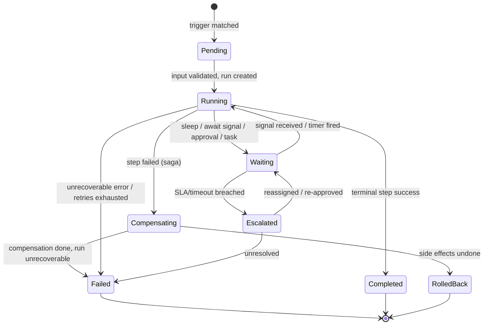

# 04 · Workflow Lifecycle & Versioning

Covers required output **(6)**. Realizes capability 2 (Workflow Engine): long-running, human steps, schedules, branching, retries, timeouts, escalations, compensation, rollbacks, versioning.

---

## 6.1 Run lifecycle states



| State | Meaning |
|-------|---------|
| **Pending** | Trigger matched; input being validated; run record created. |
| **Running** | Actively executing steps. |
| **Waiting** | Suspended on a timer (sleep/SLA) or a signal (approval, webhook, customer action). Holds no compute. |
| **Escalated** | An SLA/timeout breached; escalation rules engaged. |
| **Compensating** | A failure triggered defined undo steps (saga). |
| **Completed / Failed / RolledBack** | Terminal outcomes. |

## 6.2 Step model

Each step declares how it behaves under success and failure:

```text
Step {
  id: "risk_review"
  type: function | agent | approval | task | wait | signal | effect | subworkflow
  input: <from prior steps / run input>
  retry: { maxAttempts, backoff, jitter }      // see §11
  timeout: "PT30M"                              // ISO-8601 duration
  on_timeout: escalate | fail | compensate | default_branch
  on_success: <next step id | branch rule>
  on_failure: retry | compensate | escalate | dlq | branch
  compensation: <step id to undo this step's effects>
  idempotency_key: <derived>                    // safe re-execution
  permissions: { tools, data_scopes }           // least privilege (§13)
}
```

### Step types
- **function** — deterministic platform/app logic (validate, compute, transform).
- **agent** — an AI agent run via the AI gateway (§05).
- **approval** — a human gate (§06).
- **task** — human work placed on a queue (§08); the workflow waits for completion.
- **wait/sleep** — delay or scheduled resume (§10).
- **signal/await-event** — pause until a specific event/signal arrives (e.g., `payment.succeeded`).
- **effect** — call a platform service (send notification, create payment intent, store file), idempotent.
- **subworkflow** — start and optionally await a child workflow.

## 6.3 Long-running workflows
- Runs can live for **days/weeks** (e.g., a border crossing or buy-for-me purchase), spending most time in **Waiting** — no compute held, state persisted.
- Resumption is exact: on signal/timer the engine reloads checkpointed state and continues from the next step.
- Subjects (e.g., an order) typically have **one active run per workflow key**, enforced by a uniqueness guard to prevent duplicate processing.

## 6.4 Human approval steps
An **approval** step emits `approval.requested`, creates an approval record (§06), and puts the run in **Waiting**. On `approval.granted/rejected` (a signal), the run resumes down the corresponding branch. Approval steps carry their own timeout → escalation (e.g., auto-escalate to a senior approver after 4h).

## 6.5 Scheduled & delayed steps
- **sleep("PT24H")** for delays; **sleepUntil(timestamp)** for SLA deadlines and follow-ups.
- Recurring/cron-triggered workflows for batch operations (§10).

## 6.6 Conditional branching
- Transitions can be conditional on step output and **rules engine** decisions (§07): `if risk_score >= HIGH → approval_step else → quote_step`.
- Branches are part of the definition (data), so they're visualizable and testable.

## 6.7 Retries & timeouts
- Per-step retry policy (max attempts, exponential backoff + jitter); idempotency makes retries safe.
- Per-step timeout with a defined `on_timeout` action (escalate/fail/compensate/default branch). Detail in [§11](./11-retry-failure-recovery.md).

## 6.8 Escalations
- SLA/timeout breaches trigger escalation rules: reassign a task, notify a supervisor, bump priority, or route to a fallback approver. Escalation policies are configurable per workflow/step and per org.

## 6.9 Compensation & rollback (saga pattern)
- Multi-step processes that cause external side effects use the **saga** pattern: each effect step declares a **compensation** that undoes it.
- On failure, the engine runs compensations **in reverse order** for completed steps (e.g., refund a charge, cancel an ops task, void a quote, notify the customer).

```mermaid
sequenceDiagram
  participant E as Engine
  participant Pay as Payment effect
  participant Ops as Ops task effect
  participant Insp as Inspection assign
  E->>Pay: charge (compensation: refund)
  E->>Ops: create task (compensation: cancel)
  E->>Insp: assign inspection -- FAILS
  Note over E: trigger compensation in reverse
  E->>Ops: cancel task
  E->>Pay: refund charge
  E->>E: state = RolledBack; emit workflow.run.rolled_back + audit
```

- **Rollback** = the workflow-level outcome when all relevant compensations succeed. If a compensation itself fails, the run goes to **Failed** with a high-priority alert + manual-remediation task (never silently inconsistent — Principle A9).

## 6.10 Workflow versioning
`DECISION:` **Immutable, pinned versions.**
- Publishing a workflow creates an immutable `version`. **In-flight runs keep running on the version they started with**; new triggers use the latest published version.
- Definitions are stored in a `workflow_definitions` registry (key + version + spec hash + status: draft/published/deprecated/retired).
- **Migration policy:** we do not hot-swap logic under running instances. For urgent fixes, options are: let in-flight runs finish on the old version, or provide an explicit, audited **migration step** to move a run to a new version when safe.
- **Backward compatibility** (Principle A8): event/input schema changes follow additive-by-default rules; breaking changes get a new workflow version and possibly a new event version.
- **Rollout**: new versions can be released progressively via feature flags / percentage of triggers, and instantly reverted by re-pointing the trigger to the prior version.

## 6.11 Acceptance criteria (lifecycle)
`ACCEPTANCE:`
- A run survives an engine restart and resumes from its last checkpoint without re-running completed side effects.
- An approval step can hold a run in Waiting for ≥ 7 days and resume correctly on decision.
- A failing multi-effect workflow runs compensations in reverse and ends RolledBack (verified by a chaos test).
- In-flight runs are unaffected by publishing a new workflow version.
- Every state transition emits a `workflow.*` event + audit record.
