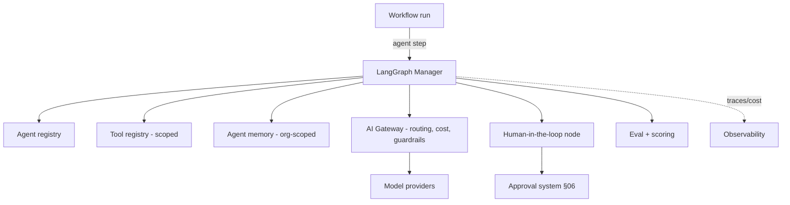
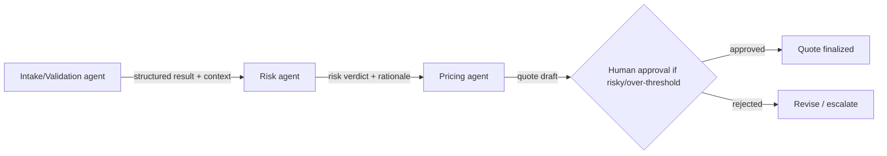

# 05 · AI Agent Orchestration

Covers required output **(7)**. Realizes capability 3. Builds on the platform AI tier ([../docs/07](../docs/07-ai-platform.md)) — agents here are **steps in workflows** that call the AI gateway; this document defines how they're managed, sequenced, and supervised.

---

## 7.1 Where agents fit

An **agent** is an AI actor invoked as a workflow **step**. Agents never run outside the AI gateway, never hold provider keys, and never act on the world beyond their granted tools and permissions. The automation platform's job is to **orchestrate** agents: register them, sequence them, hand off between them, supervise them with humans, and observe/evaluate them.



## 7.2 LangGraph manager

`DECISION:` Use **LangGraph** as the agent execution model, driven by the durable workflow engine for persistence.
- Agents are **stateful graphs** (nodes = reasoning/tool/decision/approval; edges = transitions). The graph encodes the agent's allowed moves.
- **Durable checkpoints**: graph state persists via the workflow engine/Postgres checkpointer, so an agent run can pause (e.g., for human approval) for hours and resume. `⚠️ VERIFY` LangGraph ↔ Inngest/Trigger.dev checkpoint integration and Postgres checkpointer support.
- The **manager** wraps LangGraph with platform concerns: permission injection, tool scoping, memory binding, cost metering, guardrails, and observability — so individual agents stay simple.

## 7.3 Agent registry
Every agent is a **registered, versioned** definition (not ad-hoc code):

```text
Agent {
  key: "borderpass.risk_agent"
  version: 3
  description, owner
  model_policy: { task_type, cost_tier, fallback }   // resolved by gateway
  prompt_refs: [prompt keys/versions]                // from platform prompt library
  tools: [tool keys]                                  // must be in tool registry + permitted
  memory_scope: org | user | workflow | none
  permissions: { data_scopes, max_risk_action }
  autonomy_tier: suggest | act_with_approval | act_autonomously(bounded)
  eval_set: [eval ids]                                // regression gate
  guardrails: [policy refs]
}
```
- Registry enables discovery, reuse across apps, version pinning, and governance (no unreviewed agent reaches production).

## 7.4 Tool registry & agent permissions
- **Tool registry** (shared with platform AI tier): each tool declares input/output Zod schema, **required permissions**, side-effect class (read/write/expensive), and whether it requires **human approval**.
- An agent may call **only** tools granted in its definition **and** within its **delegated permission scope** (Principle A5/A4). E.g., a `create_refund` tool inherits refund elevation + approval rules from the approval system.
- **Data access limits**: agents receive least-privilege, org-scoped data; RAG retrieval is ACL-filtered before reaching the model (no cross-tenant leakage).

## 7.5 Agent memory
- **Short-term**: graph state within a run (checkpointed).
- **Long-term**: org-scoped `agent_memory`, RLS-isolated; what may persist is policy-gated; retention/expiration enforced; clearable per org (supports deletion requests).
- Memory is rebuildable and never authoritative for business state — business facts live in app/platform tables, not agent memory.

## 7.6 Agent handoffs
Workflows often chain specialized agents. Handoffs are **explicit, typed, and audited**:


- A handoff passes a **typed context object** (not raw chat) so the receiving agent gets validated, scoped inputs.
- Each handoff emits `agent.handoff` + audit; the orchestrator (not the agents themselves) controls routing, preventing uncontrolled agent-to-agent loops.
- **Loop/turn limits** and budgets bound multi-agent runs (cost + safety).

## 7.7 Autonomy tiers (graduated trust)
| Tier | Agent may… | Example |
|------|------------|---------|
| **suggest** | Produce recommendations only; a human/step decides | Risk agent flags risk; human approves |
| **act_with_approval** | Take an action after human approval | Pricing agent proposes a quote; finance approves |
| **act_autonomously (bounded)** | Act within strict, low-risk, reversible bounds | Auto-categorize a package; send a status update |

`DECISION:` New agents start at **suggest**; promotion to higher autonomy requires passing evals + a review + bounded, reversible scope (Principle A6). Irreversible/high-value actions (payments, refunds, border/compliance decisions) **always** require human approval.

## 7.8 Agent evaluation
- **Offline evals**: curated datasets per agent; regression gate in CI on agent/prompt changes (no promotion if quality regresses).
- **Red-team suite**: prompt injection, data exfiltration, tool misuse, PII leakage — run on a schedule and on changes.
- **Online scoring**: sample production runs scored (heuristics + model-graded + human spot-checks); quality regressions alert.
- **A/B** of agents/prompts/models behind flags, comparing quality **and** cost.

## 7.9 Agent observability
- Every agent run/step is traced (shared `trace_id` with the parent workflow), with: model, tokens, **cost**, latency, tool calls, guardrail outcomes, memory reads/writes, approval waits, and final verdict.
- Surfaced in the admin dashboard (§19) and analytics (§12). Cost attributed per workflow/app/org (Principle A11).

## 7.10 Safety guardrails
- **Input**: prompt-injection/jailbreak detection, PII redaction, max-context enforcement; untrusted content (customer messages, documents, web) treated as **data, not instructions**.
- **Output**: schema validation (especially tool arguments), toxicity/leakage filters, RAG grounding/citation checks.
- **Action guardrails**: tools above a risk threshold require approval; agent authority is bounded by delegated scope; turn/cost limits prevent runaway loops.
- Guardrail hits emit `agent.guardrail.triggered` + audit and can block/downgrade a response or force escalation.

## 7.11 Acceptance criteria (orchestration)
`ACCEPTANCE:`
- No agent reaches a model except via the AI gateway; no agent calls an ungranted tool (enforced + tested).
- Multi-agent runs are orchestrator-controlled with turn/cost limits; no uncontrolled agent loops.
- High-risk/irreversible agent actions require human approval.
- Every agent run is traced, cost-metered, and audited; memory is org-isolated (cross-tenant test passes).
- Agent/prompt changes pass eval + red-team gates before promotion.
