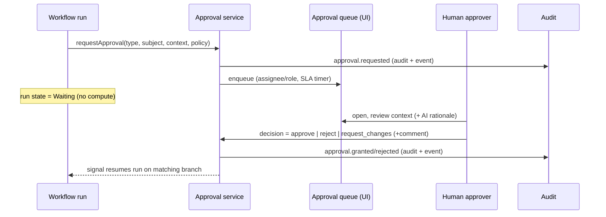
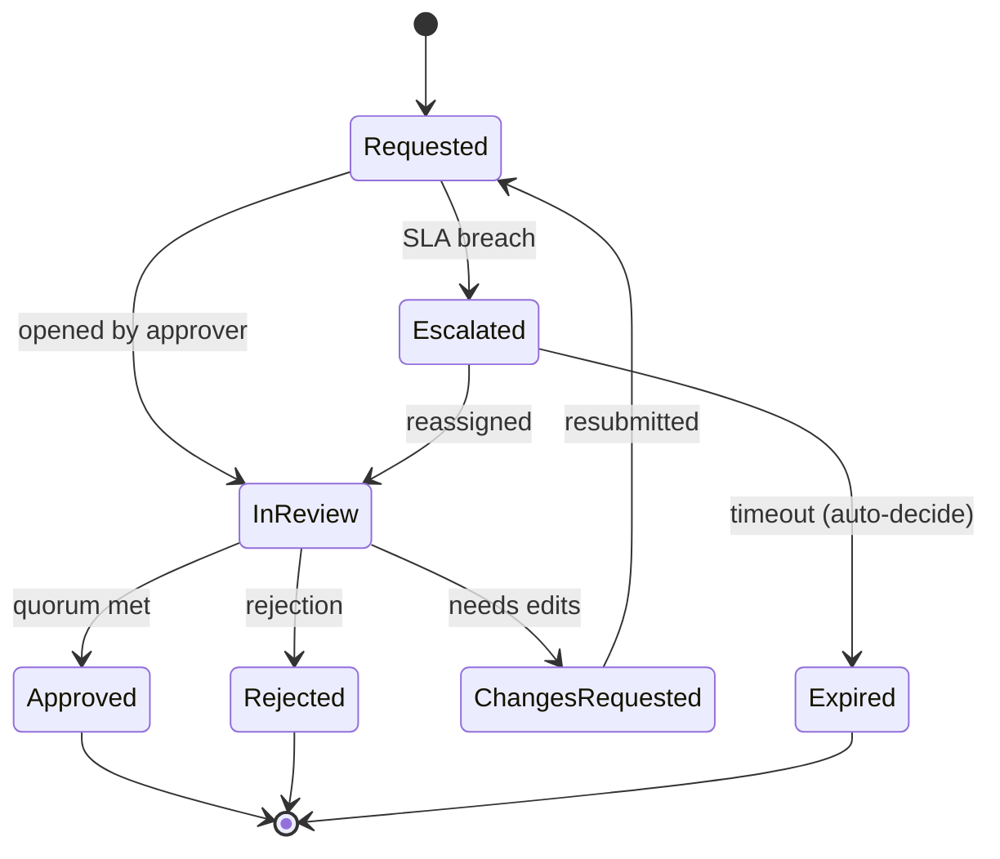

# 06 · Human-in-the-Loop & Approval System

Covers required outputs **(8)** human-in-the-loop model and **(12)** approval workflow design. Realizes capability 6.

---

## 8 · Human-in-the-loop (HITL) model

### 8.1 Why HITL is first-class
Automation that touches money, compliance, border/regulatory decisions, or customer trust must let a human decide at the right moments. In this platform, **a human decision is a durable workflow step** — the run waits (no compute held) until a person acts, then resumes deterministically. Humans are pulled in for **judgment and irreversibility** (Principle A6), not to babysit every case.

### 8.2 HITL interaction patterns
| Pattern | Description | Example |
|---------|-------------|---------|
| **Approve / reject gate** | Run pauses; human approves or rejects; branch resumes | High-risk order requires compliance approval before quoting |
| **Review & edit** | Human reviews an AI draft and may modify before it proceeds | Edit an AI-generated quote before sending |
| **Exception handling** | Only abnormal cases route to a human; normal cases auto-proceed | Data validation fails → human resolves |
| **Escalation** | Unactioned/contested decision rises to a higher authority | Approval not actioned in SLA → senior approver |
| **Spot-check / audit** | Sampled completed runs reviewed for quality (offline) | QA samples auto-approved low-risk orders |

### 8.3 HITL as a workflow step


### 8.4 What a human sees (decision context)
Every approval presents enough to decide without leaving the queue: the subject (order/quote/refund), the **AI rationale + risk factors**, relevant documents (Files), prior approvals, customer history, the specific decision + allowed actions, SLA countdown, and a comment box. Poor context is the top cause of slow/incorrect approvals — so context assembly is part of the approval step definition.

### 8.5 SLA, escalation, timeouts
- Each approval has an **SLA timer**; on breach → escalation rule (reassign, notify supervisor, raise priority, route to fallback approver).
- A configurable **timeout** can auto-decide (e.g., auto-reject + compensate, or auto-escalate) — never silently hang.

---

## 12 · Approval workflow design

### 12.1 Approval types
| Type | Trigger | Typical approver role |
|------|---------|------------------------|
| **Manual review** | Ambiguous/AI-uncertain case | Staff / ops |
| **Admin approval** | Sensitive config/operation | Maralito admin |
| **Compliance approval** | Risk/compliance flag (e.g., restricted goods) | Compliance officer |
| **Finance approval** | Spend, payout, pricing override | Finance |
| **Refund approval** | Refund above threshold | Finance / support lead |
| **High-risk workflow approval** | Risk score ≥ threshold, irreversible action | Senior / compliance |

### 12.2 Approval policy model
Approvals are **policy-driven**, not hard-coded per workflow:

```text
ApprovalPolicy {
  key: "borderpass.refund.over_threshold"
  applies_when: rule (e.g., amount > 500 OR risk >= HIGH)   // rules engine §07
  required_approvals: [
    { role: "finance", count: 1 },
    { role: "compliance", count: 1, when: risk >= HIGH }   // conditional/multi
  ]
  quorum: all | any | N_of_M
  sla: "PT4H"
  on_timeout: escalate | auto_reject
  escalation: [ { after: "PT4H", to: "finance_lead" } ]
  allow_delegate: true
}
```
- Supports **single, multi-party, conditional, and quorum** (N-of-M) approvals.
- **Separation of duties**: the requester/actor cannot self-approve; enforced.
- Policies are org- and app-scoped and can be feature-flagged.

### 12.3 Approval data & history
- `approvals` (request, type, policy, subject, status, requested_by, context snapshot, SLA, created/decided times) and `approval_decisions` (per approver: decision, comment, timestamp, on-behalf-of).
- **Approval history** is immutable and audited — who approved what, when, why, with what comment — satisfying compliance/forensics.
- **Comments/threads** on each approval for reviewer collaboration.

### 12.4 Approval lifecycle


### 12.5 Reusability across apps
The approval system is **generic**: any workflow in any app calls `requestApproval(policyKey, subject, context)`. BorderPass refunds, a future fintech payout, and a marketplace dispute all reuse the same engine, queues, history, and escalation — only the **policies** differ.

### 12.6 Integration with agents
HITL approval is also the safety valve for autonomous agents (§05/§07): an agent action above its autonomy/risk threshold automatically inserts an approval step before the action executes. This unifies "AI wants to do X" and "a workflow needs sign-off" into one approval surface.

### 12.7 Acceptance criteria (approvals/HITL)
`ACCEPTANCE:`
- A workflow can pause on an approval for ≥ 7 days and resume on decision.
- Policies support single/multi/conditional/quorum approvals with separation of duties enforced (no self-approval).
- Every approval decision is audited with actor, comment, and timestamp.
- SLA breach triggers escalation; timeout auto-decides per policy (never hangs silently).
- Agent actions above risk threshold are gated by an approval before executing.
