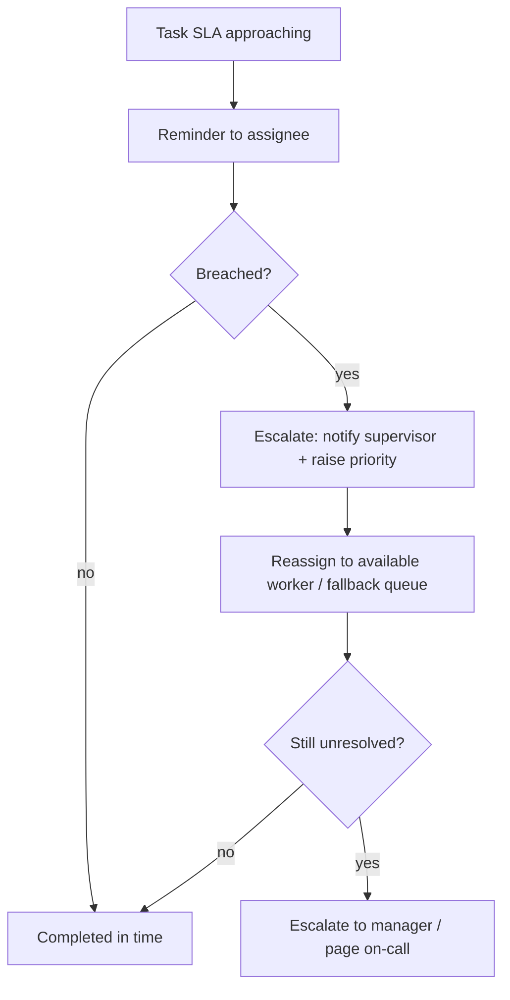

# 08 · Task Queues & Management

Covers required output **(10)**. Realizes capability 4.

---

## 10.1 Purpose
When a workflow needs **human work done** (not just a yes/no approval), it creates a **task** on a queue: inspect a package, drive a delivery, reconcile a payment, resolve a support case. The workflow waits on task completion as a durable step. Tasks are the human-execution counterpart to approvals (human-decision).

## 10.2 Task model
```text
Task {
  id, org_id, app_id
  type: "inspection" | "delivery" | "finance_review" | "support" | ...
  queue: "inspectors" | "drivers" | "finance" | "support" | ...
  subject: { type, id }                 // e.g., package pkg_123
  workflow_run_id                        // the run waiting on this task (if any)
  priority: P0..P3
  status: open | assigned | in_progress | blocked | completed | cancelled | escalated
  assignee_id?, assigned_at?
  sla: { respond_by, complete_by }
  data: { instructions, checklist, attachments }
  result: { outcome, notes, files }      // captured on completion
  created_at, updated_at
}
```

## 10.3 Queues by role
| Queue | Owner role | Typical tasks |
|-------|------------|---------------|
| **Staff / ops** | Staff user | Manual reviews, exceptions, data fixes |
| **Inspectors** | Inspector | Package inspection, evidence capture |
| **Drivers** | Driver | Pickups, deliveries, proof-of-delivery |
| **Finance** | Finance | Payment reconciliation, payout review, refund processing |
| **Support** | Support | Customer escalations, follow-ups |

Queues are **org- and app-scoped**; a future app gets its own queues (or reuses generic ones) without new infrastructure.

## 10.4 Assignment logic
`DECISION:` Pluggable assignment **strategies** per queue:
| Strategy | Use |
|----------|-----|
| **Manual pull** | Workers self-assign from a filtered queue |
| **Round-robin / load-balanced** | Even distribution across available workers |
| **Skill/zone-based** | Match task attributes (region, language, certification) to worker capabilities |
| **Auto-assign + accept** | System assigns; worker accepts/declines within a window |
- Assignment respects **availability/capacity** (a worker's WIP limit) and **eligibility** (RBAC + skills). Strategy is config per queue and can use the rules engine.

## 10.5 Priority handling
- Priorities P0–P3 (or numeric) drive ordering; SLA proximity and risk can dynamically boost priority.
- The queue view sorts by effective priority (base priority + SLA urgency + escalation state).

## 10.6 SLA timers
- Each task carries **respond-by** and **complete-by** SLAs (from workflow/queue policy).
- Timers are durable (engine `sleepUntil`); on approach → reminder; on breach → escalation + `task.sla_breached` event.

## 10.7 Escalation rules

- Escalation policies are per queue/task-type and per org; every escalation emits an event + audit.

## 10.8 Task ↔ workflow integration
- A workflow **task step** creates the task, sets the run to **Waiting**, and resumes on `task.completed` (capturing the task result into workflow state) or branches on `task.cancelled`/`task.sla_breached`.
- Tasks can also exist **standalone** (not tied to a run) for ad-hoc ops work, still tracked, prioritized, and SLA'd.

## 10.9 Worker experience (surfaced in admin/ops app — §19)
- A focused **queue inbox**: filter, sort by priority/SLA, claim, work, complete with structured result (checklist, notes, file/photo upload via Files service).
- Mobile-friendly for inspectors/drivers (field work): offline-tolerant capture where feasible `⚠️ VERIFY` (PWA/native scope is an app concern).
- Real-time updates as tasks are assigned/escalated.

## 10.10 Reusability
The task system is generic: BorderPass inspector/driver tasks, a marketplace dispute task, and a fintech KYC-review task all reuse the same model, queues, assignment, SLA, and escalation — only `type`/`queue`/`data` differ.

## 10.11 Acceptance criteria (tasks)
`ACCEPTANCE:`
- A workflow task step creates a task, waits, and resumes on completion with the result captured.
- Tasks are assignable by manual/round-robin/skill strategies respecting RBAC + WIP limits.
- SLA timers fire reminders and escalations; breaches emit events + audit.
- Queues are org/app-scoped; a new app can add a queue via config, not new infra.
- Workers can complete a task with structured results + attachments.
