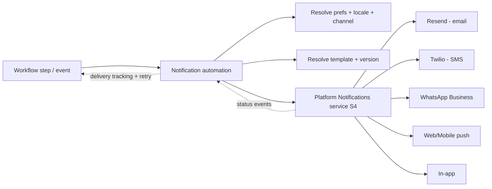

# 09 · Notification Automation

Covers required output **(11)**. Realizes capability 5. **Reuses** the platform Notifications service (S4) — this document defines how workflows *trigger* and *track* notifications, not a second messaging stack.

---

## 11.1 Model
Notifications are **effect steps** in workflows (or direct event-subscriptions). A workflow says *"notify the customer that their quote is ready"*; the automation layer resolves the template, channel, locale, and preferences, calls the Notifications service, and tracks delivery — retrying or escalating channels as needed.

## 11.2 Channels
Email, **WhatsApp**, SMS, in-app, push — all via the platform Notifications service. Channel selection is by **user preference + message category + availability**, with fallback (e.g., WhatsApp → SMS → email) configurable per notification type. `⚠️ VERIFY` WhatsApp Business template approval rules + opt-in requirements before designing WA-first flows.

## 11.3 Template management
- **Versioned, localized templates** (EN/ES) owned in the Notifications service; referenced by `templateKey`+`version` from workflows.
- Variables are typed (Zod) and validated at send time; missing variables fail fast, not silently.
- Approval/branding governance for customer-facing templates (esp. WhatsApp).

## 11.4 Triggered notifications
| Trigger source | Example |
|----------------|---------|
| **Workflow step** | "Quote ready" after quote-generation step |
| **Event subscription** | `payment.succeeded` → receipt; `task.sla_breached` → supervisor alert |
| **Scheduled** | SLA reminder, follow-up after N days (§10 scheduling) |
| **Approval system** | `approval.requested` → notify approver |

A **notification policy** maps trigger → audience → template → channel(s) → fallback, so adding/altering a notification is config, not code.

## 11.5 Delivery tracking
- Each send produces a delivery record with status (`queued → sent → delivered → opened/clicked` or `failed/bounced`) streamed back via `notification.*` events.
- Workflows that *depend* on delivery (e.g., must reach the customer before proceeding) can **await** delivery confirmation or branch on failure.
- Suppression/unsubscribe and bounce handling honored before send (compliance).

## 11.6 Retry policy
- Transient failures retried with backoff (engine-native).
- **Channel fallback** on hard failure: if the primary channel fails/bounces, escalate to the next channel per policy.
- Exhausted notifications emit `notification.failed` → can create an ops task ("could not reach customer") rather than failing silently.
- **Idempotency**: each notification keyed (run + step + recipient) so retries/redelivery never double-send.

## 11.7 Rate, batching & quiet hours
- Per-org rate limits (Upstash) prevent floods; digest/batching for high-volume low-urgency notifications.
- **Quiet hours** + frequency caps from user preferences respected for non-urgent messages; urgent/transactional (security, payment) bypass per policy.

## 11.8 Reusability
Generic across apps: BorderPass "package received" and a future app's "order shipped" reuse the same triggers, templates engine, channels, tracking, and retry — only template content + policy differ.

## 11.9 Acceptance criteria (notifications)
`ACCEPTANCE:`
- Workflows trigger notifications by templateKey with typed, validated variables.
- Channel selection respects preference + locale + availability with configurable fallback.
- Delivery status is tracked; dependent workflows can await or branch on it.
- Failed deliveries retry, fall back across channels, and surface an ops task on exhaustion.
- Sends are idempotent (no double-send on retry); quiet hours/suppression honored for non-urgent messages.
