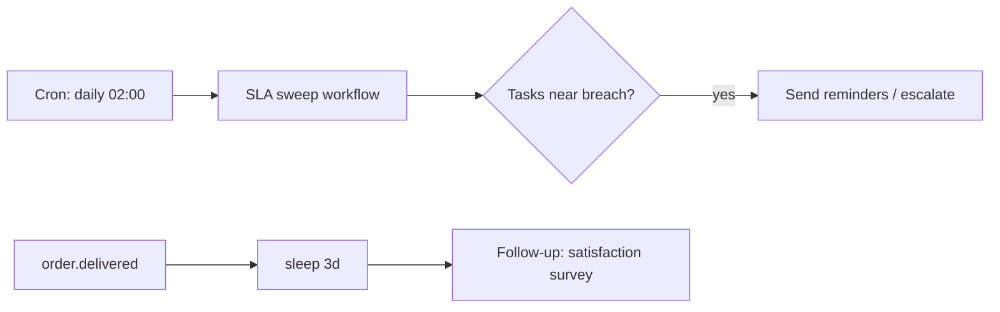
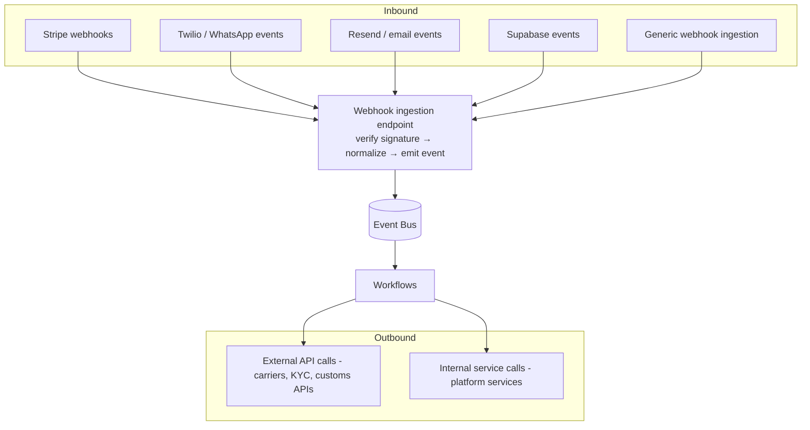

# 10 · Scheduling & Integration Layer

Covers core capabilities **8 (Scheduling)** and **9 (Integration Layer)**.

---

## Part A — Scheduling (capability 8)

### A.1 Capabilities
| Capability | Design |
|------------|--------|
| **Cron jobs** | Recurring schedules (e.g., nightly reconciliation, daily SLA sweep) defined as scheduled workflow triggers. |
| **Delayed jobs** | `sleep`/`sleepUntil` inside a run, or a delayed trigger (run X after delay). |
| **Reminder workflows** | A workflow that waits then notifies (e.g., "package not collected in 7 days"). |
| **SLA reminders** | Timers on tasks/approvals that fire reminders before breach (§08/§06). |
| **Follow-up tasks** | Scheduled creation of tasks/notifications after an event (e.g., post-delivery satisfaction follow-up). |
| **Recurring workflows** | Cron-triggered runs for batch/periodic operations. |

### A.2 Implementation
- Scheduling is **engine-native** (Inngest/Trigger.dev cron + durable `sleepUntil`), not a separate scheduler — so scheduled work inherits durability, retries, and observability. `⚠️ VERIFY` engine cron granularity, max delay duration, and timezone handling.
- Schedules are **tenant-aware** (per-org cadence where relevant) and respect **time zones/locales** (e.g., reminders during business hours).
- **Idempotency** for scheduled runs (a cron tick produces exactly one run per period per subject) via a period key.
- All scheduled triggers are visible/manageable in the dashboard (§19): next-run time, last-run status, pause/resume.

### A.3 Patterns

---

## Part B — Integration Layer (capability 9)

### B.1 Purpose
A single, governed boundary for **inbound** external signals (webhooks) and **outbound** external/internal calls — so workflows interact with the outside world safely, idempotently, and observably.

### B.2 Inbound webhook ingestion
- **Signature verification** per provider (Stripe signing secret, Twilio signature, etc.) before processing — reject unverified `⚠️ VERIFY` each provider's scheme.
- **Normalize → emit**: external payloads are translated into standard platform events (§03) so workflows never depend on raw provider formats. E.g., Stripe `payment_intent.succeeded` → `payment.succeeded`.
- **Idempotent**: provider event ids stored (`processed_events`) to dedupe redeliveries (providers retry).
- **Fast-ack pattern**: respond 2xx quickly, do work async on the bus (avoids provider timeouts/ret-storms).
- **Source-specific handling**: Stripe (payments/refunds/disputes), Twilio/WhatsApp (inbound messages, delivery status), Resend (delivery/bounce), Supabase (DB/auth events) — each a registered ingestion adapter.

### B.3 Outbound calls
- **External API calls** (carriers, customs/KYC providers, mapping) wrapped as **idempotent effect steps** with timeouts, retries, and circuit breakers; secrets pulled from the secrets manager (never in workflow definitions).
- **Internal service calls** go through the platform SDK (Identity/Payments/Notifications/Files/AI) — never direct DB access (Principle A3/A5).
- **Resilience**: per-integration circuit breaker + fallback; on provider outage, queue + retry (durable) and degrade gracefully rather than failing the whole workflow (§11).

### B.4 Integration registry
Each integration is registered: name, direction, auth/secret ref, event mappings, rate limits, retry/circuit-breaker policy, owner. This makes integrations discoverable, governed, and reusable across apps.

### B.5 Security
- Inbound: signature verification, IP allowlists where available, payload size limits, schema validation.
- Outbound: least-privilege credentials per integration, egress allowlists (SSRF defense), audit of external calls.

### B.6 Acceptance criteria (scheduling + integration)
`ACCEPTANCE:`
- Scheduled/recurring runs are durable, idempotent per period, tenant- and timezone-aware, and manageable in the dashboard.
- Inbound webhooks are signature-verified, deduped, normalized to standard events, and fast-acked.
- Outbound calls are idempotent with timeouts, retries, and circuit breakers; secrets never appear in definitions.
- Provider outages degrade gracefully (queue + retry), not cascade into workflow failures.
- Every integration is registered with its policies and is reusable by other apps.
