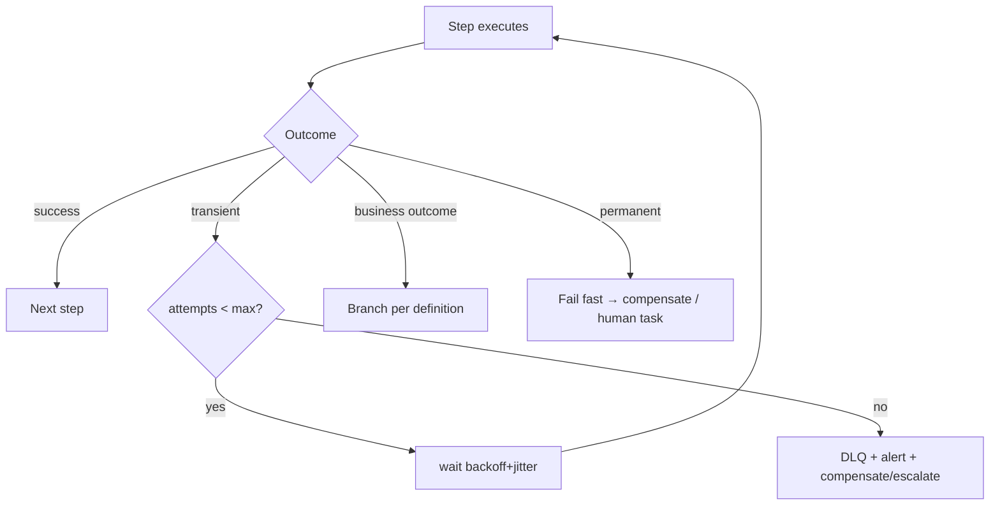

# 11 · Retry, Failure & Recovery Strategy

Covers required output **(13)**. Realizes Principles A1 (durability), A2 (idempotency), A9 (compensate, don't corrupt).

---

## 13.1 Failure taxonomy
| Class | Examples | Strategy |
|-------|----------|----------|
| **Transient** | Network blip, provider 503, lock contention, rate limit | Retry with backoff + jitter |
| **Timeout** | Step exceeds its time budget | Per-step `on_timeout` action |
| **Business/expected** | Payment declined, validation fail, risk reject | Branch to a defined path (not an "error") |
| **Permanent/non-retryable** | Bad input schema, unauthorized, 4xx | Fail fast → DLQ / compensate / human task |
| **Partial/inconsistent** | Some effects done, a later step failed | **Compensation** (saga) |
| **Poison** | Repeatedly fails the same way | Cap attempts → DLQ + alert |

`DECISION:` Distinguish **expected business outcomes** (modeled as branches, e.g., `payment.failed → retry_or_dunning`) from **technical failures** (retried/compensated). Conflating them causes either silent data loss or noisy false alerts.

## 13.2 Retry policy
- **Per-step config**: `maxAttempts`, base delay, multiplier, jitter, max delay cap; non-retryable error classes skip retry.
- **Exponential backoff + jitter** to avoid thundering herds.
- **Idempotency is the precondition** (A2): every retried step is keyed (run + step + attempt-invariant key) so re-execution causes no duplicate side effect (e.g., not charging twice). Effects that call external providers pass an `idempotency_key`.
- **Budgeted retries**: a run has an overall attempt/time budget so it can't retry forever; exhaustion → escalation/DLQ.

## 13.3 Timeouts
- Every step has a timeout; long human steps (approvals/tasks) have long SLA-aligned timeouts with `on_timeout` = escalate/auto-decide.
- Workflow-level max duration guards against runs that never terminate.

## 13.4 Dead-letter queues
- Failed events (ingestion) and failed steps (after budget) route to a **DLQ** with full context (payload, error, attempts, trace_id).
- **Alerting** on DLQ depth/rate; **replay tooling** to reprocess after a fix (idempotency makes replay safe).
- DLQ items are triable in the dashboard: inspect → fix → replay or discard (audited).

## 13.5 Compensation & rollback (saga)
- Each effect step declares a **compensation** (the inverse effect). On unrecoverable failure, the engine runs compensations for completed effect steps **in reverse order** (detailed in [§04 Lifecycle](./04-workflow-lifecycle.md)).
- Example (order intake fails after charge): cancel ops task → void quote → **refund charge** → notify customer → state `RolledBack`.
- **Compensation is itself retried/idempotent.** If a compensation cannot complete, the run goes to **Failed** and raises a **P0 manual-remediation task** — the platform never leaves money/inventory in a silently inconsistent state (A9).

## 11.6 Recovery operations
| Operation | Use |
|-----------|-----|
| **Resume** | Restart a stuck run from its last checkpoint (after transient infra issue) |
| **Retry step** | Re-run a specific failed step after a fix |
| **Replay** | Re-execute a run (or event) from history for debugging/recovery (read-safe vs. effectful modes) |
| **Skip/override** | Operator manually advances a run past a step (audited, permissioned) |
| **Cancel + compensate** | Abort a run and undo its effects |
| **Bulk replay** | Reprocess a batch of DLQ items after a provider recovers |

- **Replay safety**: replay distinguishes **read-only re-execution** (simulation/debug) from **effectful replay** (which respects idempotency keys to avoid re-charging/re-sending). Operator overrides are permissioned and audited.

## 13.7 Graceful degradation
- On **dependency outage** (Stripe/Twilio/model/Neon): circuit-break, queue work durably, and continue what's possible; resume when the dependency returns. Customer-facing steps degrade to "we'll update you" rather than hard-failing.
- **Backpressure**: per-org concurrency/throttle prevents one tenant's surge from starving others or overwhelming a provider.

## 13.8 Testing failure paths
- **Chaos/failure-injection tests**: kill the engine mid-run (resume), force step failures (compensation runs), simulate provider outages (degradation), redeliver events (idempotency holds).
- Failure paths are part of acceptance for every workflow, not an afterthought.

## 13.9 Acceptance criteria (recovery)
`ACCEPTANCE:`
- A step retried after a transient failure causes no duplicate side effect (idempotency proven by test).
- A run interrupted mid-flight resumes from its checkpoint.
- An unrecoverable failure runs compensations in reverse and ends RolledBack; a failed compensation raises a P0 remediation task.
- DLQ items are alertable, inspectable, and replayable; effectful replay respects idempotency.
- Provider outages degrade gracefully and auto-recover; chaos tests cover all of the above.
