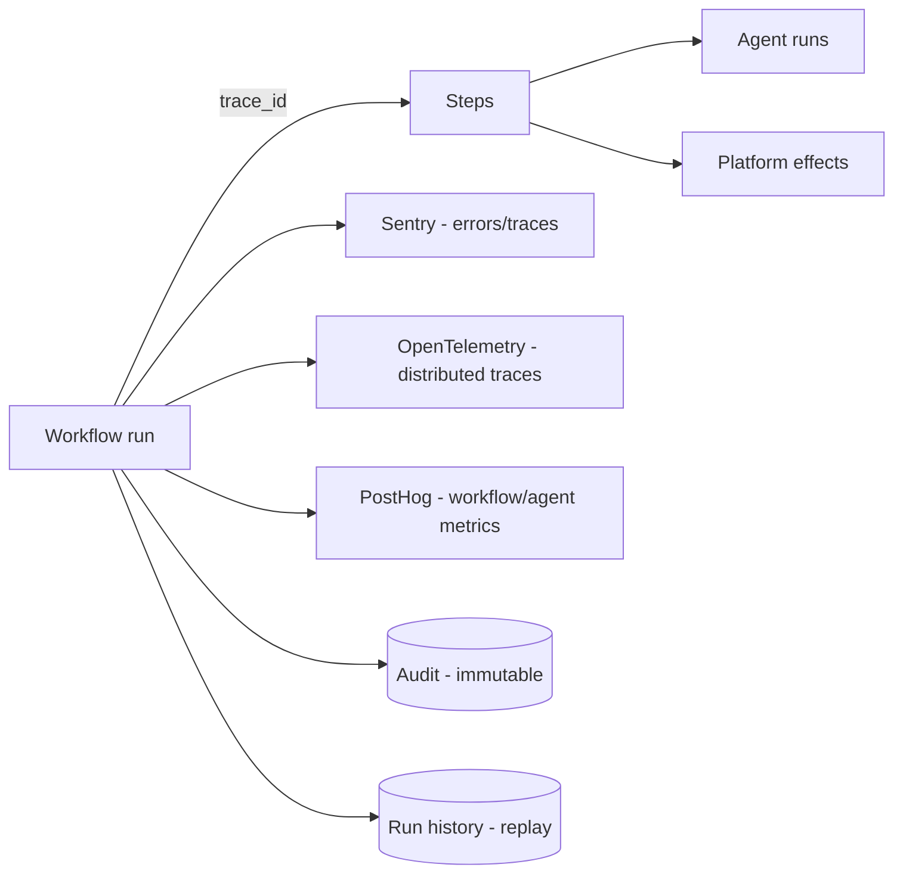

# 12 · Observability & Monitoring Strategy

Covers required output **(14)**. Realizes capability 10 (Audit & Observability) and Principle A7.

---

## 14.1 What we must see
Automation is mostly **asynchronous and long-running**, so the hardest questions are "where is this run?", "why did it stall?", "what did the agent decide and why?", and "what is all this costing?". The observability strategy answers each, end-to-end.

## 14.2 The pillars (automation-specific)
| Pillar | What it captures |
|--------|------------------|
| **Workflow logs** | Per-run, per-step: inputs (redacted), outputs, transitions, timings, retries, status |
| **Agent logs** | Per agent run/step: model, tokens, cost, latency, tool calls, guardrail outcomes, memory I/O, verdict |
| **Human approval logs** | Every request/decision/comment/escalation (immutable, in audit) |
| **Event logs** | All events with `correlation_id`/`causation_id` (the causal graph of a process) |
| **Error tracking** | Exceptions grouped, with run/step/trace context (Sentry) |
| **Workflow replay** | Re-execute a run from history (debug/recover) — see [§11](./11-retry-failure-recovery.md) |
| **Workflow metrics** | Throughput, duration, success/failure rate, stuck/Waiting counts, SLA adherence |
| **Agent performance** | Quality (eval/online scores), success rate, latency, cost per run/feature |
| **Cost tracking** | Step/agent/model/notification cost attributed per workflow/app/org |

## 14.3 Tracing (the backbone)
- A single **`trace_id`** spans trigger → run → each step → agent → tool → model → emitted events → downstream consumers. **`correlation_id`** ties all events for a business subject (e.g., `ord_456`).
- **OpenTelemetry** for vendor-neutral distributed traces; **Sentry** for error+performance correlation. `⚠️ VERIFY` OTel export path across Vercel serverless + workflow engine + browser, and Sentry's trace propagation.
- This makes "trace one order through every workflow, agent, approval, and notification" a single query.

## 14.4 Metrics, SLOs & alerts
Per-workflow and per-queue SLIs/SLOs (ratify targets):
| Signal | Example SLO |
|--------|-------------|
| Workflow success rate | ≥ 99% of runs reach a terminal success or defined business outcome (excl. legit rejects) |
| Run duration (per type) | p95 within type budget; alert on outliers |
| Stuck runs | 0 runs Waiting beyond max for their step type without escalation |
| Approval SLA adherence | ≥ 95% decided within SLA |
| Task SLA adherence | ≥ 95% completed within SLA |
| DLQ depth | Near-zero; alert on growth |
| Agent cost | Within per-workflow budget; alert on burn |

- **Alerting**: actionable alerts only, each linked to a runbook (stuck-run, DLQ-growth, compensation-failure(P0), agent-cost-spike, SLA-breach-storm).
- **Error budgets** gate risky workflow/agent releases.

## 14.5 Cost & agent performance dashboards
- **Cost**: total + breakdown by workflow, step type, agent, model, notification channel, per app/org (Principle A11). Anomaly detection for runaway loops.
- **Agent performance**: eval scores over time, online quality, success rate, latency, approval-override rate (how often humans reject agent suggestions — a key trust signal).
- Built on PostHog (product/agent metrics) + a metrics view over run/agent tables; surfaced in the admin dashboard (§19).

## 14.6 Audit integration
- Every workflow lifecycle transition, agent action, approval decision, task change, rule decision, and effect is recorded to the **immutable platform audit log** (S7) with actor, subject, before/after, trace_id.
- Audit + run history together give **full reconstructability** of any business process for compliance and forensics.

## 14.7 Run history & replay
- All runs/steps/events persisted (Postgres, partitioned; cold-store to R2 long-term).
- The dashboard renders a run's **timeline + state graph**; operators can inspect any step's I/O (redacted) and **replay** (read-only or effectful) for debugging/recovery.

## 14.8 Acceptance criteria (observability)
`ACCEPTANCE:`
- Any run is traceable end-to-end (trigger→steps→agents→tools→model→events) by `trace_id`, and all events for a subject by `correlation_id`.
- Stuck/failed runs, DLQ growth, compensation failures, and agent-cost spikes alert with runbooks.
- Cost is attributable per workflow/app/org; agent quality + override rate are dashboarded.
- Every lifecycle transition/approval/agent action is audited immutably.
- Any historical run can be inspected and replayed (effectful replay respects idempotency).
- No secrets/PII in logs (redaction enforced + tested).
