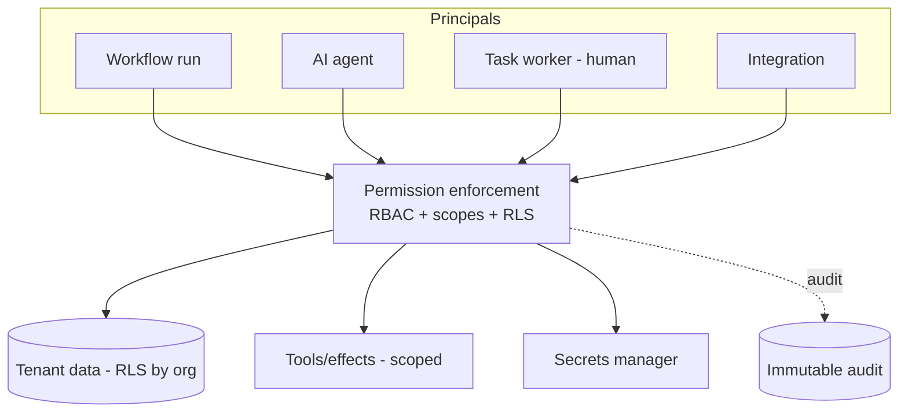

# 13 · Security & Permissions Model

Covers required output **(15)**. Realizes capability 11 and Principles A4/A5. Builds on the platform Security architecture ([../docs/08](../docs/08-security-architecture.md)).

---

## 15.1 Threat surface specific to automation
Automation adds powerful new actors and actions: workflows that move money and data, **AI agents that can call tools**, and integrations that talk to the outside world. The security model must ensure each runs with **least privilege**, can't exceed its mandate, and leaves an audit trail.

## 15.2 Workflow permissions
- Each **workflow definition** declares the permissions it needs: which effects/services it may call, which data scopes it may read/write, which queues/approvals it may use.
- A run executes under a **scoped execution identity** (a service principal bound to org + app + the workflow's declared scope) — not a broad admin credential.
- The engine refuses steps that exceed the workflow's declared permissions (deny by default).

## 15.3 Tool permissions
- Tools (callable by agents/effects) declare required permissions + side-effect class. The **tool registry** is the authority; a workflow/agent must be explicitly granted a tool to use it.
- High-risk tools (charge, refund, export, delete, external write) are flagged and require approval and/or elevated scope.

## 15.4 Agent permissions (delegated, bounded)
- An agent step runs under a **delegated, time-boxed token** that is **at most** the authority of the workflow/user it acts for, narrowed to the agent's granted tools + data scopes (Principle A5).
- Agents act as the `agent` principal type so their actions are distinct in audit from humans.
- **Autonomy tiers** (§05) bound what an agent may do without human approval; irreversible/high-value actions always gate on approval (A6).

## 15.5 Data access limits
- All tenant data access is **RLS-enforced by `org_id`** (platform §09); workflows/agents set tenant context only via the gateway from a validated execution identity — they can't widen it.
- **Minimum-necessary data**: steps/agents receive only the fields they need; sensitive fields (PII/KYC) are field-encrypted and access-logged.
- **RAG/agent retrieval is ACL-filtered** before reaching a model — no cross-tenant or unauthorized content.

## 15.6 Secrets management
- Integration/provider secrets live in the **secrets manager**, referenced by id from integration definitions — **never** embedded in workflow/agent definitions or logs.
- Short-lived, rotated credentials; per-integration least privilege; egress allowlists (SSRF defense) for outbound calls.

## 15.7 Audit trails
- Every workflow transition, agent action, tool call, approval, task change, rule decision, and external call is audited immutably (S7) with actor, subject, before/after, trace_id (Principle A7).
- Powerful/irreversible actions (refunds, exports, overrides, manual step-skips) carry mandatory justification + elevated approval.

## 15.8 Abuse prevention & rate limiting
- **Per-org rate limits/quotas** (Upstash) on workflow starts, agent runs, notifications, and external calls — prevents noisy-neighbor and runaway loops.
- **Agent/loop budgets**: turn limits + cost caps per agent run; circuit breakers on integrations.
- **Trigger abuse**: webhook ingestion is signature-verified + rate-limited; deduped to resist replay floods.
- **Anomaly detection**: spikes in run volume, cost, or failure rate alert and can auto-throttle.

## 15.9 Separation of duties
- Requesters can't approve their own approvals; the actor of an action can't be its sole approver (§06).
- Authoring/publishing a workflow vs. approving its production rollout are separable roles; risk/compliance/pricing rule changes require review.

## 15.10 Permission model summary
| Actor | Identity | Authority bounded by |
|-------|----------|----------------------|
| Workflow run | Scoped service principal (org+app+workflow scope) | Declared workflow permissions; RLS |
| AI agent | Delegated, time-boxed `agent` token | Workflow scope ∩ granted tools/data; autonomy tier; approvals |
| Task worker | Human user (RBAC) | Role + queue eligibility + RLS |
| Integration | Per-integration credential | Least-privilege provider scope; egress allowlist |
| Operator (dashboard) | Human admin/staff (RBAC) | Role; powerful ops (skip/override/replay) require elevation + audit |

## 15.11 Acceptance criteria (security)
`ACCEPTANCE:`
- Workflows/agents run under scoped identities and are denied actions beyond declared permissions (tested).
- Agents use only granted tools within delegated scope; high-risk actions require approval.
- All tenant access is RLS-enforced; agent retrieval is ACL-filtered (cross-tenant test passes).
- No secret appears in any definition or log; outbound calls use least-privilege creds + egress allowlists.
- Every powerful/irreversible action is audited with justification; separation of duties enforced.
- Per-org rate limits + agent/loop budgets prevent runaway cost/abuse (load/chaos tested).
