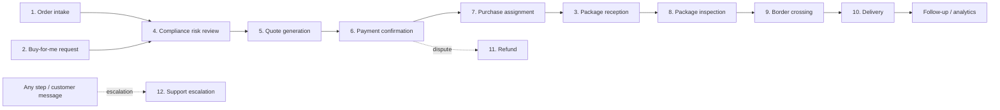

# 14 · BorderPass Workflows (Detailed)

Covers required output **(16)**. Twelve BorderPass operations modeled end-to-end on the automation platform. BorderPass is treated as a **logistics / cross-border buy-and-ship** operation (intake → risk/compliance → quote → pay → purchase/receive → inspect → cross border → deliver), which is the assumed domain; adjust specifics to BorderPass's actual product rules. The **patterns** (durable steps, agents, approvals, compensation, events) are the reusable part.

> Each workflow lists: **Trigger**, **Goal**, **Actors** (functions / agents / humans), **Steps**, **Key events**, **Approvals/HITL**, **SLA/timers**, **Failure & compensation**. Workflow keys follow `borderpass.<area>.<name>`.

---

## The BorderPass automation map

Common spine (reused by most): **validate → assess risk → (approve if risky) → act → notify → audit → analytics**.

---

## Workflow 1 — New order intake (`borderpass.order.intake`)

- **Trigger:** event `borderpass.order.submitted`.
- **Goal:** Validate a new shipping order, screen it, and route to quoting.
- **Actors:** *functions* (validate, normalize); *agents* (intake/validation agent, risk agent — handoff); *humans* (compliance approver if risky).
- **Steps:**
  1. `validate_input` (function) — schema + required fields (origin/destination, items, declared value). Invalid → branch to **support task** / customer fix request.
  2. `enrich` (function) — resolve customer profile, addresses, KYC status (platform Profile/Identity).
  3. `ai_validate` (agent, *suggest*) — AI checks item descriptions, completeness, plausibility; flags missing docs.
  4. `risk_review` (sub-workflow → W4) — run compliance/risk review; returns risk band.
  5. branch on risk: `LOW/MED` → start **W5 quote**; `HIGH` → **W4** forces human approval before W5.
  6. `notify_customer` (effect) — "order received, preparing your quote."
  7. `audit + analytics` (effect) — `borderpass.order.accepted`, funnel update.
- **Key events:** `order.submitted`→`order.validated`→`order.risk_assessed`→`order.accepted` (or `order.rejected`).
- **Approvals/HITL:** only if HIGH risk (delegated to W4).
- **SLA/timers:** acknowledge customer < 1 min; quote-ready target (e.g., < 30 min) tracked.
- **Failure & compensation:** validation/enrichment transient → retry; permanent invalid → reject + notify (no side effects to undo). Idempotent on `order_id` (one active intake run per order).

---

## Workflow 2 — Buy-for-me request (`borderpass.bfm.request`)

- **Trigger:** event `borderpass.bfm.submitted` (customer asks BorderPass to purchase an item on their behalf).
- **Goal:** Validate a purchase request, price it (item + service fee), get payment, then hand to purchasing.
- **Actors:** *functions* (parse product URL/details); *agents* (product-research agent — fetch price/availability via a permitted tool; risk agent); *humans* (finance approval for high-value purchases).
- **Steps:**
  1. `validate_request` (function) — product link/desc, qty, destination.
  2. `research_product` (agent, *act_with_approval* for purchase, *suggest* for pricing) — resolve current price, availability, restrictions via allowed external API tool (integration layer). Untrusted web content treated as data (guardrails).
  3. `risk_review` (→ W4) — restricted item / sanctioned destination / value checks.
  4. `price_quote` (→ W5) — item cost + service fee + shipping + duties hint (rules engine pricing).
  5. `approval_high_value` (approval) — if total > threshold → **finance approval**.
  6. `collect_payment` (→ W6).
  7. on payment success → `create_purchase_task` (→ W7 purchase assignment).
  8. `notify_customer` + `audit/analytics`.
- **Key events:** `bfm.submitted`→`bfm.priced`→`payment.succeeded`→`bfm.purchase_requested`.
- **Approvals/HITL:** finance approval for high-value; compliance if risky.
- **SLA/timers:** price availability may expire → re-quote step if stale (e.g., price valid 24h).
- **Failure & compensation:** if purchase can't be fulfilled after payment → **refund (W11)** + notify (compensation). Idempotent on `bfm_id`.

---

## Workflow 3 — Package reception (`borderpass.package.reception`)

- **Trigger:** event `borderpass.package.received` (warehouse scans an inbound package) or webhook from carrier.
- **Goal:** Register a received package, match it to an order/customer, and trigger inspection.
- **Actors:** *functions* (match package→order); *agents* (matching agent for ambiguous cases); *humans* (warehouse staff task for unmatched packages).
- **Steps:**
  1. `register_package` (function) — record weight, dims, photos (Files), tracking ref.
  2. `match_to_order` (function → agent fallback) — deterministic match by tracking/customer; ambiguous → `matching_agent` (*suggest*) → if still unmatched → **staff task** ("identify package owner").
  3. `update_order_state` (effect) — order = "received at facility."
  4. `start_inspection` (sub-workflow → W8).
  5. `notify_customer` ("we've received your package") + `audit/analytics`.
- **Key events:** `package.received`→`package.matched`→`package.inspection_started`.
- **Approvals/HITL:** none normally; staff task for unmatched.
- **SLA/timers:** match within X hours; unmatched → escalate to ops after SLA.
- **Failure & compensation:** mis-match correctable via staff override (audited); no monetary compensation. Idempotent on `package_id`.

---

## Workflow 4 — Compliance risk review (`borderpass.compliance.risk_review`)

- **Trigger:** sub-workflow call from W1/W2/W3/W8, or event with a subject needing screening.
- **Goal:** Produce a **risk band** (LOW/MED/HIGH/BLOCK) + rationale, and gate with human approval when required.
- **Actors:** *functions* (gather facts); *agents* (risk agent — *suggest*); *humans* (compliance officer).
- **Steps:**
  1. `gather_facts` (function) — item category, value, origin/destination, customer KYC/history, sanctions/restricted lists (via rules + integration).
  2. `evaluate_rules` (rules engine — `borderpass.risk.vN`) — weighted score → band; collects required-docs + required-approval outcomes.
  3. `risk_agent_review` (agent, *suggest*) — narrative assessment + flags the rules might miss (e.g., suspicious descriptions); **cannot decide alone**.
  4. branch: `LOW/MED` → return band; `HIGH` → `compliance_approval` (approval); `BLOCK` → reject + notify + audit.
  5. `record_decision` — band + matched rules + agent rationale + human decision → audit (explainable).
- **Key events:** `compliance.review_started`→`compliance.review_completed` (band) / `compliance.blocked`.
- **Approvals/HITL:** **compliance approval** for HIGH; separation of duties enforced.
- **SLA/timers:** compliance decision SLA (e.g., 4h) → escalate to compliance lead.
- **Failure & compensation:** non-decision → fail safe to **manual review** (never auto-approve on error). Deterministic + version-pinned rules for replay.

---

## Workflow 5 — Quote generation (`borderpass.quote.generate`)

- **Trigger:** sub-workflow from W1/W2, or event `borderpass.quote.requested`.
- **Goal:** Compute a priced, itemized quote and present it to the customer.
- **Actors:** *functions* (compute); *agents* (pricing agent — *suggest*, optional); *humans* (finance approval for overrides/edge pricing).
- **Steps:**
  1. `gather_pricing_facts` (function) — weight/dims, route, declared value, service type, duties hints.
  2. `apply_pricing_rules` (rules engine — `borderpass.pricing.vN`) — base + multipliers + platform fee + taxes/duties estimate.
  3. `pricing_agent_adjust` (agent, optional, *suggest*) — explains/refines edge cases; any non-standard price → `finance_approval`.
  4. `build_quote` (function) — itemized quote object; generate **quote PDF** (Files).
  5. `present_quote` (effect) — notify customer (quote link), set quote expiry timer.
  6. `await_decision` (signal) — customer accepts/declines (or expires).
  7. branch: accepted → **W6 payment**; declined/expired → close + follow-up workflow.
- **Key events:** `quote.generated`→`quote.presented`→`quote.accepted`/`quote.expired`.
- **Approvals/HITL:** finance approval only for non-standard pricing.
- **SLA/timers:** quote valid N days (`sleepUntil` expiry → auto-expire + optional re-quote).
- **Failure & compensation:** pricing fact errors → retry/branch; no side effects until quote presented. Idempotent on `quote_id`.

---

## Workflow 6 — Payment confirmation (`borderpass.payment.confirm`)

- **Trigger:** customer accepts quote (signal) → create payment; resumes on Stripe webhook event.
- **Goal:** Collect payment reliably and confirm before fulfillment.
- **Actors:** *functions* (create intent); *integration* (Stripe webhooks); *humans* (finance review on disputes only).
- **Steps:**
  1. `create_payment_intent` (effect → Payments service) — idempotent by `quote_id`.
  2. `notify_customer` — payment link / prompt.
  3. `await_payment` (signal) — wait for `payment.succeeded` / `payment.failed` (from Stripe webhook via integration layer), with timeout.
  4. branch:
     - `succeeded` → `store_receipt` (Files) → emit `order.paid` → start **W7** (or W3 for inbound flow) → notify.
     - `failed` → dunning/retry branch (retry N times w/ reminders) → if exhausted → cancel order + notify.
     - `timeout` → reminder, then expire.
  5. `audit/analytics` — revenue event.
- **Key events:** `payment.intent.created`→`payment.succeeded`/`failed`→`order.paid`.
- **Approvals/HITL:** finance only for disputes/chargebacks (separate path).
- **SLA/timers:** payment window (e.g., 24–72h) with reminders.
- **Failure & compensation:** if downstream fulfillment fails after payment → **refund (W11)** as compensation. Idempotent on `payment_intent` + Stripe event id (dedupe redeliveries).

---

## Workflow 7 — Purchase assignment (`borderpass.purchase.assign`)

- **Trigger:** event `order.paid` (buy-for-me) → assign the actual purchase to a buyer/operator.
- **Goal:** Get the item purchased on the customer's behalf and tracked to the facility.
- **Actors:** *functions* (build purchase task); *humans* (buyer/purchasing staff — task queue); *agents* (optional purchase-research agent).
- **Steps:**
  1. `create_purchase_task` (task → "buyers" queue) — item, budget, destination, deadline; assignment by skill/load.
  2. `await_purchase` (signal) — buyer marks purchased (with proof/receipt → Files) or **blocked** (out of stock / price changed).
  3. branch:
     - purchased → record cost; if actual cost > approved budget → `finance_approval` for variance → else proceed.
     - blocked → notify customer with options (alternative / refund → W11).
  4. `update_order` — "purchased, inbound to facility"; set expected-arrival timer.
  5. `notify_customer` + `audit/analytics`.
- **Key events:** `purchase.assigned`→`purchase.completed`/`purchase.blocked`.
- **Approvals/HITL:** finance approval on budget variance; buyer task.
- **SLA/timers:** purchase-by deadline → escalate; arrival timer → chase if late.
- **Failure & compensation:** unfulfillable → refund (W11) + notify. Idempotent on `order_id`.

---

## Workflow 8 — Package inspection (`borderpass.package.inspection`)

- **Trigger:** sub-workflow from W3 (reception), or event `borderpass.inspection.requested`.
- **Goal:** Physically inspect the package, capture evidence, verify contents vs. declaration, and clear or flag it.
- **Actors:** *functions*; *agents* (vision/inspection-assist agent — *suggest*, analyze photos vs. declared items); *humans* (inspector — task).
- **Steps:**
  1. `create_inspection_task` (task → "inspectors" queue, skill/zone-based) — checklist + declared contents.
  2. `await_inspection` (signal) — inspector uploads photos + checklist results (Files).
  3. `ai_inspection_assist` (agent, *suggest*) — compare photos/description to declaration; flag discrepancies, prohibited items, damage. ACL-scoped to this org's data.
  4. branch: clean → mark `inspection_passed`; discrepancy/prohibited → **compliance review (W4)** / **support (W12)** / hold.
  5. `update_order` — inspection outcome; attach evidence.
  6. `notify_customer` (if action needed) + `audit/analytics`.
  7. on pass → start **W9 border crossing**.
- **Key events:** `inspection.requested`→`inspection.completed` (pass/flag).
- **Approvals/HITL:** inspector task; compliance approval if flagged.
- **SLA/timers:** inspection SLA → escalate to ops lead.
- **Failure & compensation:** re-inspection on dispute; holds are reversible; evidence immutable in Files/audit. Idempotent on `package_id`.

---

## Workflow 9 — Border crossing (`borderpass.crossing.process`)

- **Trigger:** event `inspection.passed` → begin customs/border processing. **Long-running** (hours–days).
- **Goal:** Prepare documentation, submit to customs/border, track status to cleared/held.
- **Actors:** *functions* (assemble docs); *agents* (docs-prep agent — *suggest*, assemble customs paperwork); *integration* (customs/broker API if available); *humans* (compliance/broker for holds).
- **Steps:**
  1. `prepare_customs_docs` (agent, *suggest* → function finalize) — generate declaration/manifest from order + inspection (PDF → Files); compliance rules determine required docs.
  2. `compliance_final_check` (rules + optional approval) — ensure all required docs/approvals present before submission.
  3. `submit_to_customs` (effect/integration) — submit or hand to broker; idempotent.
  4. `await_clearance` (signal, long wait) — poll/await `crossing.cleared` / `crossing.held` (webhook or scheduled poll). `sleepUntil`/recurring check.
  5. branch: cleared → start **W10 delivery**; held → **compliance task / support (W12)** to resolve (extra docs/fees) → resubmit.
  6. `notify_customer` at each milestone + `audit/analytics`.
- **Key events:** `crossing.started`→`crossing.submitted`→`crossing.cleared`/`crossing.held`.
- **Approvals/HITL:** compliance/broker on holds; possible extra-fee approval (finance) + customer consent.
- **SLA/timers:** clearance expected-by → proactive customer updates; long-wait safe (durable).
- **Failure & compensation:** held shipments handled, not failed; if ultimately undeliverable → return/refund path (W11) with audit. Idempotent on `shipment_id`.

---

## Workflow 10 — Delivery (`borderpass.delivery.process`)

- **Trigger:** event `crossing.cleared`.
- **Goal:** Get the package to the customer with assignment, tracking, and proof of delivery.
- **Actors:** *functions*; *humans* (driver — task) or *integration* (3rd-party carrier); *agents* (route/ETA assist — optional).
- **Steps:**
  1. `choose_delivery_mode` (rules) — own driver vs. carrier by zone/cost.
  2. own driver → `create_delivery_task` (task → "drivers" queue, zone-based); carrier → `book_carrier` (integration) + track.
  3. `await_delivery` (signal) — driver/carrier marks delivered with **proof of delivery** (photo/signature → Files) or failed-attempt.
  4. branch: delivered → `order.completed`; failed attempt → reschedule (delayed job) / escalate after N attempts.
  5. `notify_customer` (out-for-delivery, delivered) + `audit/analytics`.
  6. `schedule_followup` (delayed) — satisfaction survey / support offer.
- **Key events:** `delivery.started`→`out_for_delivery`→`delivery.completed`/`delivery.failed`.
- **Approvals/HITL:** none normally; ops task on repeated failures.
- **SLA/timers:** delivery-by SLA; reattempt schedule; final escalation → support (W12).
- **Failure & compensation:** undeliverable after attempts → return-to-facility + customer contact → possible refund (W11). Idempotent on `delivery_id`.

---

## Workflow 11 — Refund (`borderpass.refund.process`)

- **Trigger:** event `borderpass.refund.requested` (customer/support/compensation from another workflow).
- **Goal:** Evaluate and process a refund safely with the right approvals and ledger integrity.
- **Actors:** *functions* (compute eligibility/amount); *rules* (refund policy); *humans* (finance/compliance approval); *integration* (Stripe refund).
- **Steps:**
  1. `assess_refund` (rules — `borderpass.refund.vN`) — eligibility + amount (full/partial), reason code, fees.
  2. `approval` — policy-driven: amount ≤ threshold + low risk → auto/single support approval; above threshold or disputed → **finance approval** (+ **compliance** if risk-related). Separation of duties (requester ≠ approver).
  3. `execute_refund` (effect → Payments/Stripe) — idempotent by `payment_intent`+reason; write to financial ledger.
  4. `reverse_related` (compensation) — cancel/return related ops tasks, update order state.
  5. `notify_customer` (refund issued + timeline) + `audit/analytics` (financial audit trail).
- **Key events:** `refund.requested`→`refund.approved`/`refund.rejected`→`refund.issued`.
- **Approvals/HITL:** finance (+compliance) per policy/threshold.
- **SLA/timers:** refund decision SLA; escalate if unactioned.
- **Failure & compensation:** refund execution retried (idempotent — never double-refund); execution failure → P0 finance remediation task. This workflow is itself the **compensation** invoked by W2/W6/W7/W9/W10.

---

## Workflow 12 — Customer support escalation (`borderpass.support.escalation`)

- **Trigger:** event `borderpass.support.escalated` (from any workflow exception, SLA breach, or inbound customer message classified as needing help).
- **Goal:** Route customer/operational issues to the right human fast, with full context, and resolve.
- **Actors:** *functions* (assemble context); *agents* (triage agent — *suggest*, classify + draft response + suggest resolution); *humans* (support agent — task; specialist queues).
- **Steps:**
  1. `assemble_context` (function) — order/run history, prior approvals, payments, messages, related workflow state (via `correlation_id`).
  2. `triage` (agent, *suggest*) — classify severity/category, propose resolution + draft reply; **never auto-sends** sensitive actions.
  3. `route` (rules) — to support / finance / compliance / ops queue by category; set priority + SLA.
  4. `support_task` (task) — agent works case; may trigger sub-actions (refund W11, re-delivery W10) — each gated by its own approval.
  5. `respond_customer` (effect, human-approved if sensitive) + update case.
  6. `resolve` — close case; `audit/analytics`; feed unresolved patterns back to product.
- **Key events:** `support.escalated`→`support.assigned`→`support.resolved`.
- **Approvals/HITL:** human-in-loop on all customer-facing/sensitive actions; specialist approvals for refunds/compliance.
- **SLA/timers:** first-response + resolution SLAs by severity; escalation ladder (agent → lead → manager).
- **Failure & compensation:** no monetary side effects directly (delegates to W10/W11 which carry their own compensation). Links every action back to the originating run via `correlation_id`.

---

## Cross-cutting notes for all BorderPass workflows
- **Reused spine:** validate → risk (W4) → approval (if needed) → act → notify → audit → analytics appears in nearly every workflow — built once, parameterized.
- **Every run** carries `org_id`/`app_id=borderpass`, a `trace_id`, and a subject `correlation_id` so the whole journey of an order is queryable and replayable.
- **Every irreversible/financial action** (charge, refund, customs submit, delete) is idempotent, approval-gated where risky, and compensable.
- **Every agent** runs *suggest* unless explicitly promoted; nothing autonomous touches money, compliance, or borders.
