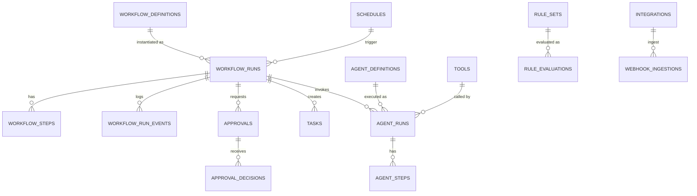

# 17 · Database Tables Needed

Covers required output **(19)**. Tables for the automation platform (Neon Postgres, schema `automation`). Every tenant-data table carries `org_id` (+`app_id`) and is **RLS-isolated** (platform §09). IDs are prefixed UUIDs/ULIDs. This is a logical model — confirm types/indexes during implementation.

> Note: events, notifications, payments, files, audit, and identity tables live in their **owning platform services** ([../docs/03](../docs/03-service-catalog.md)); automation references them by id and does not duplicate them. The `events`/outbox tables are shown here as the shared substrate the automation platform relies on.

---

## 17.1 Entity overview

---

## 17.2 Workflow engine tables

### `workflow_definitions`
The versioned registry of workflow specs.
| Column | Type | Notes |
|--------|------|-------|
| id | uuid PK | |
| key | text | stable identifier (`borderpass.order.intake`) |
| version | int | immutable once published |
| app_id | text | owning app |
| status | enum | draft / published / deprecated / retired |
| spec | jsonb | declarative definition (steps, branches, timeouts, compensation) |
| spec_hash | text | integrity / change detection |
| input_schema | jsonb | Zod schema ref |
| permissions | jsonb | declared scopes/tools |
| created_by, created_at | | |
| Unique | (key, version) | |

### `workflow_runs`
One execution instance.
| Column | Type | Notes |
|--------|------|-------|
| id | uuid PK | |
| org_id, app_id | | RLS |
| definition_key, definition_version | | pinned version (A8) |
| subject_type, subject_id | | e.g., order/ord_456 |
| correlation_id | text | business-process correlation |
| trace_id | text | tracing |
| status | enum | pending/running/waiting/escalated/compensating/completed/failed/rolled_back |
| current_step | text | |
| input | jsonb | validated input |
| state | jsonb | checkpointed run state |
| started_at, updated_at, ended_at | | |
| error | jsonb | last error (if any) |
| Index | (org_id, status), (subject_type, subject_id), correlation_id | |
| Guard | unique active run per (definition_key, subject_id) where status in active | prevents duplicates |

### `workflow_steps`
Per-step execution log (also supports replay/inspection).
| Column | Type | Notes |
|--------|------|-------|
| id | uuid PK | |
| run_id | uuid FK | |
| org_id | | RLS |
| step_id | text | from definition |
| type | enum | function/agent/approval/task/wait/signal/effect/subworkflow |
| status | enum | pending/running/waiting/succeeded/failed/compensated/skipped |
| attempt | int | retry count |
| idempotency_key | text | safe re-exec |
| input, output | jsonb | redacted as needed |
| started_at, ended_at | | |
| error | jsonb | |
| compensation_of | text | if this is a compensation step |
| Index | (run_id, step_id) | |

### `workflow_run_events`
Lifecycle/event log per run (timeline + replay source).
| Column | Type | Notes |
|--------|------|-------|
| id, run_id, org_id | | |
| event_type | text | `workflow.step.completed`, etc. |
| payload | jsonb | |
| trace_id | text | |
| occurred_at | timestamptz | |

---

## 17.3 Event substrate (shared with platform)

### `events` (event history)
| Column | Type | Notes |
|--------|------|-------|
| id | ulid PK | idempotency key |
| type, version | | |
| source, org_id, app_id | | |
| subject_type, subject_id | | |
| actor_type, actor_id | | |
| data | jsonb | typed payload |
| correlation_id, causation_id, trace_id | | causal graph |
| sequence | bigint | per-subject ordering |
| occurred_at, received_at | | |
| Partition | by month | retention + cold-store to R2 |

### `event_outbox`
| Column | Type | Notes |
|--------|------|-------|
| id, aggregate_id | | written in same tx as state change |
| event | jsonb | |
| published_at | nullable | relay marks published |
| status | enum | pending/published/failed |

### `processed_events` (idempotency / dedupe)
| Column | Type | Notes |
|--------|------|-------|
| consumer | text | which consumer |
| event_id | ulid | |
| processed_at | | |
| Unique | (consumer, event_id) | |

### `dead_letter_queue`
| Column | Type | Notes |
|--------|------|-------|
| id, org_id | | |
| source | enum | event / step |
| ref_id | text | event_id or step id |
| payload, error | jsonb | |
| attempts | int | |
| status | enum | open / replayed / discarded |
| created_at, resolved_at | | |

---

## 17.4 Agent orchestration tables

### `agent_definitions`
| Column | Type | Notes |
|--------|------|-------|
| id, key, version | | versioned registry |
| app_id | | |
| spec | jsonb | model policy, prompt refs, tools, memory scope, autonomy tier, eval set |
| status | enum | draft/published/deprecated |
| Unique | (key, version) | |

### `tools`
| Column | Type | Notes |
|--------|------|-------|
| id, key, version | | tool registry |
| input_schema, output_schema | jsonb | |
| required_permissions | jsonb | |
| side_effect_class | enum | read/write/expensive |
| requires_approval | bool | |

### `agent_runs`
| Column | Type | Notes |
|--------|------|-------|
| id, org_id, app_id | | RLS |
| agent_key, agent_version | | |
| run_id (workflow), step_id | | parent linkage |
| trace_id, correlation_id | | |
| status | enum | running/completed/failed/awaiting_approval |
| input, output, verdict | jsonb | |
| tokens_in, tokens_out, cost_usd | numeric | cost attribution (A11) |
| latency_ms | int | |
| started_at, ended_at | | |

### `agent_steps`
| Column | Type | Notes |
|--------|------|-------|
| id, agent_run_id, org_id | | |
| node | text | LangGraph node |
| type | enum | reason/tool/decision/approval |
| tool_key | text | if tool call |
| input, output | jsonb | redacted |
| guardrail_outcome | jsonb | |
| cost_usd, tokens, latency_ms | | |

### `agent_memory`
| Column | Type | Notes |
|--------|------|-------|
| id, org_id | | RLS-isolated |
| agent_key | | |
| scope | enum | org/user/workflow |
| key, value | jsonb | |
| expires_at | | retention |

*(Embeddings/vectors live in the platform AI tier `pgvector` store, referenced here.)*

---

## 17.5 Approvals & HITL tables

### `approval_policies`
| Column | Type | Notes |
|--------|------|-------|
| id, key, version | | |
| app_id, org_id (nullable) | | tenant override |
| applies_when | jsonb | rule reference |
| required_approvals | jsonb | roles, counts, conditions, quorum |
| sla, on_timeout, escalation | jsonb | |

### `approvals`
| Column | Type | Notes |
|--------|------|-------|
| id, org_id, app_id | | RLS |
| policy_key | | |
| run_id, step_id | | originating workflow |
| type | enum | manual/admin/compliance/finance/refund/high_risk |
| subject_type, subject_id | | |
| context | jsonb | snapshot shown to approver |
| status | enum | requested/in_review/approved/rejected/changes_requested/escalated/expired |
| requested_by | | requester (≠ approver) |
| sla_due_at | | |
| created_at, decided_at | | |

### `approval_decisions`
| Column | Type | Notes |
|--------|------|-------|
| id, approval_id, org_id | | |
| approver_id, on_behalf_of | | |
| decision | enum | approve/reject/request_changes |
| comment | text | |
| decided_at | | |

---

## 17.6 Task management tables

### `task_queues`
| Column | Type | Notes |
|--------|------|-------|
| id, key, org_id, app_id | | e.g., inspectors/drivers/finance |
| assignment_strategy | enum | manual/round_robin/skill/auto |
| config | jsonb | WIP limits, skills, zones |

### `tasks`
| Column | Type | Notes |
|--------|------|-------|
| id, org_id, app_id | | RLS |
| queue_key, type | | |
| subject_type, subject_id | | |
| run_id, step_id | nullable | waiting workflow |
| priority | enum/int | |
| status | enum | open/assigned/in_progress/blocked/completed/cancelled/escalated |
| assignee_id, assigned_at | | |
| respond_by, complete_by | timestamptz | SLA |
| data | jsonb | instructions/checklist/attachment refs |
| result | jsonb | outcome/notes/file refs |
| created_at, updated_at | | |
| Index | (queue_key, status, priority), (assignee_id, status) | |

### `task_events`
Audit/timeline of task state changes (assign/escalate/complete).

---

## 17.7 Rules engine tables

### `rule_sets`
| Column | Type | Notes |
|--------|------|-------|
| id, key, version | | immutable when published |
| app_id, org_id (nullable) | | tenant override |
| scope, strategy | | first_match/all_match/weighted |
| fact_schema | jsonb | |
| rules | jsonb | conditions→outcomes |
| default_outcome | jsonb | |
| status | enum | draft/published/deprecated |

### `rule_evaluations`
| Column | Type | Notes |
|--------|------|-------|
| id, org_id, run_id, step_id | | |
| rule_set_key, rule_set_version | | pinned for replay |
| facts | jsonb | inputs (redacted) |
| outcome | jsonb | decision |
| matched_rules | jsonb | rationale/explainability |
| evaluated_at | | |

---

## 17.8 Scheduling & integration tables

### `schedules`
| Column | Type | Notes |
|--------|------|-------|
| id, key, org_id, app_id | | |
| type | enum | cron/delayed/recurring |
| cron_expr / run_at | | |
| target_workflow_key | | what it triggers |
| timezone | | |
| status | enum | active/paused |
| last_run_at, next_run_at | | |

### `integrations`
| Column | Type | Notes |
|--------|------|-------|
| id, key, org_id (nullable) | | |
| direction | enum | inbound/outbound |
| provider | text | stripe/twilio/whatsapp/resend/custom |
| secret_ref | text | reference, never the secret |
| event_mappings | jsonb | external→standard event |
| rate_limit, retry_policy, circuit_breaker | jsonb | |

### `webhook_ingestions`
| Column | Type | Notes |
|--------|------|-------|
| id, integration_key, org_id | | |
| provider_event_id | text | dedupe |
| signature_verified | bool | |
| raw_payload | jsonb | |
| normalized_event_id | ulid | emitted event |
| status | enum | received/processed/rejected |
| received_at | | |
| Unique | (provider, provider_event_id) | idempotency |

---

## 17.9 Cross-cutting
- **RLS** on every table with `org_id`; service-role for cross-tenant ops jobs only (restricted, audited).
- **Partitioning** for high-volume append tables (`events`, `workflow_run_events`, `agent_steps`, `task_events`) by month; cold-store to R2 per retention.
- **Audit** records are written to the **platform audit service** (S7), not duplicated here.
- **Indexes** prioritize: run lookup by subject/correlation, queue views by status/priority, approval queues by role/SLA, event history by correlation/trace.

## 17.10 Acceptance criteria (data model)
`ACCEPTANCE:`
- Every tenant table has `org_id` + RLS + an isolation test.
- Workflow/agent/approval/task/rule/integration state is fully reconstructable for replay + audit.
- Idempotency tables (`processed_events`, `webhook_ingestions`, step `idempotency_key`) prevent duplicate effects.
- Version pinning (definitions, agents, rule sets) supports deterministic replay.
