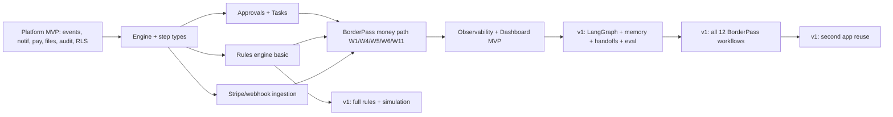

# 21 · Automation Roadmap (MVP + v1)

Covers required outputs **(23)** MVP and **(24)** v1. Phases sized in relative effort; ratify dates against capacity. Sequencing rule: build the **thinnest durable spine** that runs a real BorderPass process end-to-end, then add agents, rules, and breadth. Depends on the parent platform's MVP (identity/RLS, events, notifications, payments, files, audit) being available.

---

## 23 · MVP automation roadmap

**Theme:** A durable workflow engine running real BorderPass workflows with human approvals, tasks, notifications, retries, and full audit/observability — *minimal AI* (gateway-only, suggest tier).

### In scope
| Area | MVP scope |
|------|-----------|
| **Event bus** | Standard envelope + Zod-validated events, outbox, idempotent consumers, DLQ + replay, event history |
| **Workflow engine** | One durable engine (Inngest/Trigger.dev) wired; function/effect/wait/signal/**approval**/**task** steps; retries, timeouts, branching, **compensation**, versioning (pinned) |
| **Approvals** | Policy-driven approvals (single + threshold), queue UI, history, comments, SLA + escalation; separation of duties |
| **Tasks** | Queues (inspectors/drivers/finance/support), manual + round-robin assignment, SLA timers, escalation, complete-with-result |
| **Notifications** | Triggered notifications via platform Notifications (email + 1 channel), delivery tracking, retry, idempotent |
| **Rules engine (basic)** | Declarative rule sets for risk band + pricing + approval-required; versioned, testable |
| **Scheduling** | Cron + delayed jobs + SLA reminders (engine-native) |
| **Integration** | Stripe webhook ingestion (→ `payment.*`), generic webhook ingestion, signature verify + dedupe |
| **Observability** | Run/step/agent logs, tracing (trace_id/correlation_id), Sentry, DLQ alerts, basic cost + throughput dashboards, audit integration |
| **Agents (minimal)** | AI gateway calls as **suggest-only** steps (e.g., intake validation assist); no autonomy, no multi-agent, no memory yet |
| **Dashboard (MVP)** | Runs console (list/detail/basic actions), approvals queue, task queues, DLQ console |
| **DX (MVP)** | TS authoring SDK, local simulation (mocked effects, time fast-forward), workflow + chaos tests, 2–3 templates, CLI scaffold/simulate/test |
| **BorderPass workflows** | **W1 intake, W4 risk review, W5 quote, W6 payment, W7/W8 task-based steps, W11 refund (basic)** — the core money path with approvals + compensation |

### Deferred from MVP
Full LangGraph multi-agent orchestration, agent memory/handoffs/eval, autonomy tiers beyond suggest, rule simulation UI, all 12 workflows, advanced cost anomaly, public automation API, authoring diff UI.

### MVP exit criteria
`ACCEPTANCE:`
- A BorderPass order runs end-to-end through defined workflows: intake → risk → (approval if risky) → quote → payment → ops task → notify → audit — with retries + compensation, no bespoke glue.
- A run survives engine restart (resume) and a failing run compensates (RolledBack) — proven by chaos tests.
- Approvals pause runs durably and resume on decision; tasks drive human work with SLAs.
- Stripe webhooks ingest idempotently; DLQ + replay work.
- Every run/approval/task/agent step is traced, audited, and visible in the dashboard.
- A developer can author + simulate + test a workflow locally.

---

## 24 · v1 automation roadmap

**Theme:** Full agent orchestration, complete rules engine, all 12 BorderPass workflows, richer dashboard + authoring, and "second app ready."

| Area | v1 scope |
|------|----------|
| **Agent orchestration** | **LangGraph** manager, agent + tool registries, **agent memory** (org-scoped), **handoffs**, **autonomy tiers** (suggest→act_with_approval→bounded), **eval + red-team** suites in CI, agent observability + cost dashboards |
| **HITL/Approvals** | Multi-party/conditional/quorum approvals, delegation, agent-action approval gating, richer context assembly |
| **Rules engine (full)** | All categories (business/risk/pricing/compliance), tenant overrides, flag-gated rules, **simulation/impact analysis**, change control |
| **Workflow engine** | Sub-workflow composition at scale, advanced escalation, workflow version migration tooling, progressive rollout of versions via flags |
| **Notifications** | WhatsApp + push, channel fallback, quiet hours, localized templates |
| **Scheduling/Integration** | Recurring workflows, follow-ups, customs/carrier/KYC external integrations with circuit breakers, integration registry health |
| **Observability** | SLO/error-budget governance, agent quality + override-rate dashboards, cost anomaly detection, synthetic monitoring of critical workflows |
| **Dashboard** | Agent ops + quality, rule/policy simulation UI, authoring/diff + promotion workflow, cross-app leadership view, event causal-graph explorer |
| **DX** | Full template library, deterministic agent replay, eval runner, OpenAPI/event-catalog docs portal, `gen` scaffolding |
| **Security** | Per-org budgets + agent/loop caps, abuse/anomaly auto-throttle, full least-privilege execution identities, DR/runbooks for workflows |
| **BorderPass** | **All 12 workflows** live (W2 buy-for-me, W3 reception, W8 inspection, W9 border crossing, W10 delivery, W12 support) including long-running + agent-assisted steps |
| **Second app** | A pilot future app authors production workflows reusing engine/agents/approvals/tasks/rules with zero orchestration rebuild |

### v1 exit criteria
`ACCEPTANCE:`
- All 12 BorderPass workflows run in production with agents (suggest/approval tiers), compensation, and full observability.
- Multi-agent handoffs are orchestrator-controlled, eval-gated, cost-tracked, and approval-gated for risky actions.
- Rules (risk/pricing/compliance) are changeable without redeploys, simulated before publish, and audited.
- A second app ships a production workflow reusing the platform with no new orchestration infra (days, not weeks).
- Per-org budgets/limits + agent caps are enforced; cost is attributable per workflow/app/org.

---

## Roadmap dependency view

> Security (§13) and Observability (§12) are continuous across both phases, not a final step.
