# 23 · Implementation Backlog — Epics & User Stories

Covers required output **(26)**. Ready-to-import backlog. Conventions match the platform blueprint:

- **Epic** = deliverable automation capability. **Story** = *As a [role], I want [capability], so that [value]* + **AC**.
- Points: Fibonacci (1,2,3,5,8,13). **Phase:** `MVP`/`V1`/`FUT`. **Priority:** P0/P1/P2.
- Roles: **AppDev** app engineer, **AutoEng** automation engineer, **Ops** operator, **Approver** finance/compliance, **Worker** inspector/driver/finance/support, **AU** Maralito admin, **CU** customer.
- IDs (`AE#`, `A#.#`) are stable for tracker import + cross-reference to docs.

---

## Epic index
| Epic | Area | Phase | Pts |
|------|------|-------|-----|
| AE1 | Event Bus & Substrate | MVP | 34 |
| AE2 | Workflow Engine Core | MVP | 47 |
| AE3 | Approvals & HITL | MVP→V1 | 39 |
| AE4 | Task Management | MVP→V1 | 34 |
| AE5 | Notification Automation | MVP→V1 | 24 |
| AE6 | Rules Engine | MVP→V1 | 34 |
| AE7 | Scheduling | MVP | 18 |
| AE8 | Integration Layer | MVP→V1 | 29 |
| AE9 | AI Agent Orchestration | MVP→V1 | 76 |
| AE10 | Retry / Failure / Recovery | MVP | 29 |
| AE11 | Observability & Audit | MVP→V1 | 39 |
| AE12 | Security & Permissions | MVP→V1 | 34 |
| AE13 | Admin Dashboard | MVP→V1 | 42 |
| AE14 | Developer Experience & Authoring | MVP→V1 | 39 |
| AE15 | BorderPass Workflows | MVP→V1 | 76 |
| AE16 | Future-App Reuse Proof | V1 | 16 |

---

## AE1 · Event Bus & Substrate `MVP`
| ID | Story | Pts | Pri | AC |
|----|-------|-----|-----|----|
| A1.1 | As **AutoEng**, I want a standard event envelope + per-type Zod registry, so events are a real contract | 5 | P0 | Envelope (§03) enforced; invalid → DLQ |
| A1.2 | As **AutoEng**, I want the outbox pattern, so state changes and events are transactional | 8 | P0 | Same-tx write + relay; failure-injection test passes |
| A1.3 | As **AutoEng**, I want idempotent consumers via `processed_events`, so redelivery is safe | 5 | P0 | Dedupe by event id; no duplicate effect |
| A1.4 | As **Ops**, I want a DLQ with alerting + replay, so failed events recover | 5 | P0 | DLQ table + alert + replay tool (audited) |
| A1.5 | As **AutoEng**, I want append-only event history by correlation/subject/trace, so processes are reconstructable | 5 | P0 | Partitioned `events`; queryable; retention policy |
| A1.6 | As **AutoEng**, I want an event catalog published in docs, so producers/consumers stay decoupled | 3 | P1 | Catalog generated from schemas |
| A1.7 | As **AutoEng**, I want per-subject sequencing where order matters, so lifecycle events apply correctly | 3 | P1 | `sequence` per subject; consumers handle |

## AE2 · Workflow Engine Core `MVP`
| ID | Story | Pts | Pri | AC |
|----|-------|-----|-----|----|
| A2.1 | As **AutoEng**, I want one durable engine wired (Inngest/Trigger.dev) chosen via spike, so orchestration is reliable | 8 | P0 | ADR records choice; durability + long-wait verified `⚠️ VERIFY` |
| A2.2 | As **AutoEng**, I want a declarative workflow definition + versioned registry, so workflows are inspectable/diffable | 8 | P0 | `workflow_definitions`; immutable published versions |
| A2.3 | As **AutoEng**, I want function/effect/wait/signal step types, so workflows do deterministic work + pause | 8 | P0 | Steps checkpoint; resume exact; idempotent effects |
| A2.4 | As **AutoEng**, I want conditional branching driven by rules/step output, so workflows make decisions | 5 | P0 | Branch transitions; visualizable |
| A2.5 | As **AutoEng**, I want per-step retry + timeout + on_timeout, so steps are resilient | 5 | P0 | Backoff+jitter; timeout actions; tested |
| A2.6 | As **AutoEng**, I want compensation (saga) on failure, so partial processes undo cleanly | 8 | P0 | Reverse-order compensation; RolledBack state; chaos test |
| A2.7 | As **AutoEng**, I want version pinning for in-flight runs, so new versions don't break running instances | 3 | P0 | Runs pin definition_version; verified |
| A2.8 | As **AutoEng**, I want a uniqueness guard (one active run per subject), so duplicates don't process | 2 | P1 | Active-run guard enforced |

## AE3 · Approvals & HITL `MVP→V1`
| ID | Story | Pts | Pri | Phase | AC |
|----|-------|-----|-----|-------|----|
| A3.1 | As **AutoEng**, I want an approval step type that durably pauses a run, so humans gate decisions | 5 | P0 | MVP | Run Waiting ≥7d; resumes on decision |
| A3.2 | As **Approver**, I want an approval queue with context + decision + comment, so I can act quickly | 8 | P0 | MVP | Context panel; approve/reject/changes; audited |
| A3.3 | As **AutoEng**, I want policy-driven approvals (single + threshold), so rules decide when/who | 5 | P0 | MVP | `approval_policies`; applies_when via rules |
| A3.4 | As **DevSecOps**, I want separation of duties (no self-approval), so controls hold | 3 | P0 | MVP | Requester≠approver enforced |
| A3.5 | As **Approver**, I want SLA timers + escalation on approvals, so nothing stalls | 5 | P1 | MVP | Reminder + escalate + timeout auto-decide |
| A3.6 | As **AutoEng**, I want multi-party/conditional/quorum approvals + delegation, so complex sign-offs work | 8 | P1 | V1 | N-of-M + conditional; delegation audited |
| A3.7 | As **AI Lead**, I want agent actions above risk threshold to insert an approval, so AI stays supervised | 5 | P1 | V1 | High-risk agent action gated; tested |

## AE4 · Task Management `MVP→V1`
| ID | Story | Pts | Pri | Phase | AC |
|----|-------|-----|-----|-------|----|
| A4.1 | As **AutoEng**, I want a task step that creates a task and waits for completion, so workflows use human work | 5 | P0 | MVP | Task→Waiting→resume with result |
| A4.2 | As **Worker**, I want a queue inbox to claim/work/complete tasks with results+attachments, so I do field work | 8 | P0 | MVP | Complete with structured result + files |
| A4.3 | As **AutoEng**, I want queues with manual + round-robin assignment, so work distributes | 5 | P0 | MVP | `task_queues`; strategies; RBAC + WIP |
| A4.4 | As **Worker**, I want SLA timers + reminders + escalation, so tasks don't breach silently | 5 | P0 | MVP | Reminder + escalate + `task.sla_breached` |
| A4.5 | As **Ops**, I want skill/zone-based assignment, so the right worker gets the task | 5 | P1 | V1 | Skill/zone matching via rules |
| A4.6 | As **Ops**, I want a supervisor view (load, breaches, reassign), so I manage throughput | 3 | P1 | V1 | Per-worker load + reassignment |
| A4.7 | As **Worker**, I want mobile-friendly task completion, so inspectors/drivers work in the field | 3 | P1 | V1 | Responsive/PWA capture `⚠️ VERIFY` |

## AE5 · Notification Automation `MVP→V1`
| ID | Story | Pts | Pri | Phase | AC |
|----|-------|-----|-----|-------|----|
| A5.1 | As **AutoEng**, I want notification effect steps via the platform service, so workflows message users | 5 | P0 | MVP | templateKey + typed vars; email + 1 channel |
| A5.2 | As **AutoEng**, I want delivery tracking + idempotent sends, so workflows can depend on delivery | 5 | P0 | MVP | Status events; no double-send |
| A5.3 | As **AutoEng**, I want retry + channel fallback + ops-task on exhaustion, so contact failures don't vanish | 5 | P1 | MVP | Fallback policy; `notification.failed`→task |
| A5.4 | As **CU**, I want WhatsApp/push + quiet hours respected, so I'm reached appropriately | 5 | P1 | V1 | WA/push; prefs honored `⚠️ VERIFY` |
| A5.5 | As **AutoEng**, I want notification policies (trigger→audience→template→channel), so adding messages is config | 4 | P1 | V1 | Policy-driven; localized templates |

## AE6 · Rules Engine `MVP→V1`
| ID | Story | Pts | Pri | Phase | AC |
|----|-------|-----|-----|-------|----|
| A6.1 | As **AutoEng**, I want declarative versioned rule sets with typed facts, so decisions are externalized | 8 | P0 | MVP | `rule_sets`; pure/deterministic eval |
| A6.2 | As **AutoEng**, I want risk + pricing + approval-required rules for BorderPass, so the spine has decisions | 5 | P0 | MVP | Band/price/approval outcomes; rationale returned |
| A6.3 | As **AutoEng**, I want rule evals recorded (matched rules + rationale), so decisions are explainable/replayable | 3 | P0 | MVP | `rule_evaluations`; version pinned |
| A6.4 | As **AutoEng**, I want rule test cases in CI, so rule changes don't silently break | 3 | P0 | MVP | fact→expected cases gate |
| A6.5 | As **Ops**, I want tenant overrides + flag-gated rules with precedence, so orgs can be tuned | 5 | P1 | V1 | tenant>app>default; logged |
| A6.6 | As **Ops**, I want rule simulation/impact analysis before publish, so changes are safe | 5 | P1 | V1 | Dry-run vs historical facts; diff |
| A6.7 | As **DevSecOps**, I want change control + audit on risk/pricing/compliance rules, so money/legal risk is governed | 5 | P1 | V1 | Review + audit required |

## AE7 · Scheduling `MVP`
| ID | Story | Pts | Pri | AC |
|----|-------|-----|-----|----|
| A7.1 | As **AutoEng**, I want cron + delayed + recurring triggers (engine-native), so periodic work is durable | 5 | P0 | Schedules trigger runs; idempotent per period |
| A7.2 | As **AutoEng**, I want SLA reminders + follow-up scheduling, so timers drive reminders/follow-ups | 5 | P0 | `sleepUntil`; reminders fire |
| A7.3 | As **Ops**, I want schedule management (pause/resume/run-now, next/last run), so I control schedules | 3 | P1 | Dashboard controls |
| A7.4 | As **AutoEng**, I want timezone/tenant-aware scheduling, so reminders hit at sensible local times | 5 | P1 | TZ-aware; per-org cadence `⚠️ VERIFY` engine TZ |

## AE8 · Integration Layer `MVP→V1`
| ID | Story | Pts | Pri | Phase | AC |
|----|-------|-----|-----|-------|----|
| A8.1 | As **AutoEng**, I want signature-verified, deduped webhook ingestion normalized to events, so external signals are safe | 8 | P0 | MVP | Stripe + generic; verify+dedupe+fast-ack |
| A8.2 | As **AutoEng**, I want Stripe payment/refund/dispute events on the bus, so payment workflows react | 3 | P0 | MVP | `payment.*` emitted from webhooks |
| A8.3 | As **AutoEng**, I want idempotent outbound calls with timeout/retry/circuit-breaker, so external APIs are resilient | 8 | P1 | V1 | Effect wrapper; breaker; secrets via manager |
| A8.4 | As **AutoEng**, I want an integration registry (mappings/policies/secret refs), so integrations are governed + reusable | 5 | P1 | V1 | `integrations`; discoverable |
| A8.5 | As **Ops**, I want integration health (inbound success, breaker state), so I see external problems | 5 | P1 | V1 | Dashboard panel + alerts |

## AE9 · AI Agent Orchestration `MVP→V1`
| ID | Story | Pts | Pri | Phase | AC |
|----|-------|-----|-----|-------|----|
| A9.1 | As **AutoEng**, I want an agent step type calling the AI gateway (suggest-only), so workflows use AI safely | 5 | P0 | MVP | Via gateway; cost-metered; traced; no autonomy |
| A9.2 | As **AI Lead**, I want a versioned agent registry + tool registry with permissions, so agents are governed | 8 | P1 | V1 | `agent_definitions`/`tools`; least privilege |
| A9.3 | As **AI Lead**, I want LangGraph orchestration with durable checkpoints, so multi-step agents survive long waits | 8 | P1 | V1 | Checkpointer↔engine proven `⚠️ VERIFY` |
| A9.4 | As **AI Lead**, I want org-scoped agent memory, so agents remember without leakage | 5 | P1 | V1 | RLS-isolated; clearable; cross-tenant test |
| A9.5 | As **AI Lead**, I want orchestrator-controlled handoffs with turn/cost limits, so multi-agent runs are bounded | 8 | P1 | V1 | Typed handoffs; no uncontrolled loops; `agent.handoff` |
| A9.6 | As **AI Lead**, I want autonomy tiers (suggest→act_with_approval→bounded), so trust is graduated | 5 | P1 | V1 | Tier enforced; promotion needs eval+review |
| A9.7 | As **AI Lead**, I want guardrails (injection/PII/schema/grounding), so agents are safe by default | 8 | P1 | V1 | In/out guardrails; events+audit; can block |
| A9.8 | As **AI Lead**, I want eval + red-team suites gating agent changes, so quality/safety don't regress | 8 | P1 | V1 | CI gate on agent/prompt changes |
| A9.9 | As **AI Lead**, I want agent observability + cost + override-rate dashboards, so AI is transparent | 5 | P1 | V1 | Per-run metrics; override-rate tracked |
| A9.10 | As **AI Lead**, I want per-org agent budgets + loop caps, so runaway cost is prevented | 5 | P1 | V1 | Caps + alerts; tested |

## AE10 · Retry / Failure / Recovery `MVP`
| ID | Story | Pts | Pri | AC |
|----|-------|-----|-----|----|
| A10.1 | As **AutoEng**, I want idempotency keys on every effect, so retries never duplicate effects | 5 | P0 | Keyed effects + provider idempotency; test |
| A10.2 | As **AutoEng**, I want business-outcome vs technical-failure separation, so we don't alert/lose-data wrongly | 3 | P0 | Branches vs retries distinguished |
| A10.3 | As **Ops**, I want resume/retry-step/replay/cancel+compensate operations, so I can recover runs | 8 | P0 | Operator actions; permissioned + audited |
| A10.4 | As **AutoEng**, I want failed-compensation → P0 remediation task, so we never stay silently inconsistent | 3 | P0 | Failed comp raises P0 task + alert |
| A10.5 | As **AutoEng**, I want graceful degradation on provider outage (queue+retry+breaker), so outages don't cascade | 5 | P1 | Degrade + auto-recover; chaos test |
| A10.6 | As **AutoEng**, I want chaos/failure-injection tests in CI, so failure paths are proven | 5 | P1 | Restart/resume, comp, redelivery covered |

## AE11 · Observability & Audit `MVP→V1`
| ID | Story | Pts | Pri | Phase | AC |
|----|-------|-----|-----|-------|----|
| A11.1 | As **AutoEng**, I want trace_id/correlation_id across run→agent→tool→model→events, so async is debuggable | 8 | P0 | MVP | End-to-end trace; OTel/Sentry `⚠️ VERIFY` |
| A11.2 | As **AutoEng**, I want run/step/agent logs (redacted) + run history, so I can inspect/replay | 5 | P0 | MVP | Timeline + I/O; no PII in logs |
| A11.3 | As **DevSecOps**, I want all transitions/approvals/agent actions audited immutably, so we have forensics | 5 | P0 | MVP | Written to platform audit (S7) |
| A11.4 | As **Ops**, I want stuck-run/DLQ/compensation-failure/cost-spike alerts, so problems surface | 5 | P0 | MVP | Runbook-linked alerts |
| A11.5 | As **Lead**, I want workflow throughput/SLA + cost dashboards per app/org, so I run the business | 8 | P1 | V1 | Metrics views; budget burn |
| A11.6 | As **AI Lead**, I want agent quality + override-rate + cost dashboards, so I manage AI | 5 | P1 | V1 | From agent tables + PostHog |
| A11.7 | As **AutoEng**, I want SLO/error-budget governance + synthetic monitoring of key workflows, so reliability is managed | 3 | P1 | V1 | SLOs defined; synthetics on key journeys |

## AE12 · Security & Permissions `MVP→V1`
| ID | Story | Pts | Pri | Phase | AC |
|----|-------|-----|-----|-------|----|
| A12.1 | As **DevSecOps**, I want scoped execution identities + declared workflow permissions (deny by default), so runs least-privilege | 8 | P0 | MVP | Engine denies undeclared actions; tested |
| A12.2 | As **DevSecOps**, I want RLS on all automation tables + isolation tests, so tenants can't leak | 5 | P0 | MVP | Per-table isolation test (blocking) |
| A12.3 | As **DevSecOps**, I want secrets via manager refs only (never in defs/logs), so secrets don't leak | 3 | P0 | MVP | Secret-scan gate; redaction |
| A12.4 | As **DevSecOps**, I want delegated tool-scoped agent tokens, so agents can't exceed mandate | 5 | P1 | V1 | Agent token ≤ workflow scope ∩ tools |
| A12.5 | As **DevSecOps**, I want per-org rate limits + agent/loop budgets + anomaly throttle, so abuse/runaway is contained | 5 | P1 | V1 | Limits enforced; auto-throttle; tested |
| A12.6 | As **DevSecOps**, I want elevation + audit + segregation on powerful ops (override/effectful replay/policy change), so they're controlled | 5 | P1 | V1 | Elevation + audit; requester≠approver |
| A12.7 | As **DevSecOps**, I want webhook abuse defense (sig verify, dedupe, rate limit, allowlist), so ingestion resists attack | 3 | P1 | V1 | Verified + limited; tested |

## AE13 · Admin Dashboard `MVP→V1`
| ID | Story | Pts | Pri | Phase | AC |
|----|-------|-----|-----|-------|----|
| A13.1 | As **Ops**, I want a runs console (search by correlation, timeline, actions), so I monitor/operate workflows | 8 | P0 | MVP | Find by correlation; permissioned actions |
| A13.2 | As **Approver**, I want an approvals queue with context + SLA, so I action sign-offs | 5 | P0 | MVP | Context + decision + audit |
| A13.3 | As **Worker**, I want task queue boards, so I work my queue | 5 | P0 | MVP | Claim/work/complete |
| A13.4 | As **Ops**, I want a DLQ console (inspect/replay/discard), so I remediate failures | 5 | P0 | MVP | Audited replay/discard |
| A13.5 | As **Lead**, I want cost + throughput + SLA dashboards, so I see health | 5 | P1 | V1 | Per app/org |
| A13.6 | As **AI Lead**, I want agent ops + quality views, so I manage agents | 5 | P1 | V1 | Run explorer + quality |
| A13.7 | As **Ops**, I want rule/policy simulation UI + schedule/integration health, so I manage config safely | 5 | P1 | V1 | Simulate before publish; health panels |
| A13.8 | As **AutoEng**, I want definition browser + version diff + promotion workflow, so authoring is governed | 4 | P1 | V1 | Diff + gated promote |

## AE14 · Developer Experience & Authoring `MVP→V1`
| ID | Story | Pts | Pri | Phase | AC |
|----|-------|-----|-----|-------|----|
| A14.1 | As **AppDev**, I want a typed TS authoring SDK producing declarative specs, so workflows are safe + inspectable | 8 | P0 | MVP | Builder → spec; references by key |
| A14.2 | As **AppDev**, I want local simulation (mocked effects, time fast-forward), so I test without real systems | 8 | P0 | MVP | Simulate long workflows in seconds |
| A14.3 | As **AppDev**, I want workflow + chaos test harness, so failure paths are proven | 5 | P0 | MVP | Path/branch/compensation/idempotency tests |
| A14.4 | As **AppDev**, I want CLI scaffold/simulate/test/validate/publish, so authoring is fast | 5 | P0 | MVP | CLI commands work |
| A14.5 | As **AppDev**, I want template workflows (intake/risk/quote/payment/approval/refund), so I start fast | 5 | P1 | V1 | Templates encode best practices |
| A14.6 | As **AI Lead**, I want deterministic agent replay + eval runner, so agents are debuggable/testable | 5 | P1 | V1 | Replay + eval local + CI |
| A14.7 | As **AppDev**, I want auto-published event catalog + registries docs, so the platform is discoverable | 3 | P1 | V1 | Docs portal from schemas |

## AE15 · BorderPass Workflows `MVP→V1`
| ID | Story | Pts | Pri | Phase | AC |
|----|-------|-----|-----|-------|----|
| A15.1 | As **CU**, I want order intake (W1) automated, so my order is validated, screened, and quoted | 8 | P0 | MVP | W1 end-to-end; idempotent on order |
| A15.2 | As **Compliance**, I want risk review (W4) automated with approval on HIGH, so risky orders are gated | 8 | P0 | MVP | W4 band + approval; explainable |
| A15.3 | As **CU**, I want quote (W5) + payment (W6) workflows, so I get priced and pay reliably | 8 | P0 | MVP | W5/W6; Stripe idempotent; receipt |
| A15.4 | As **Finance**, I want refund (W11) workflow with approvals + ledger, so refunds are safe | 5 | P0 | MVP | W11; idempotent; never double-refund |
| A15.5 | As **Ops**, I want reception (W3) + inspection (W8) task workflows, so packages are processed | 8 | P1 | V1 | W3/W8; inspector tasks; evidence |
| A15.6 | As **CU**, I want buy-for-me (W2) + purchase assignment (W7), so BorderPass buys on my behalf | 8 | P1 | V1 | W2/W7; buyer tasks; variance approval |
| A15.7 | As **Ops**, I want border crossing (W9) long-running workflow, so customs is tracked to clearance | 8 | P1 | V1 | W9; durable multi-day; held-shipment path |
| A15.8 | As **CU**, I want delivery (W10) workflow with PoD + follow-up, so I receive my package | 5 | P1 | V1 | W10; driver/carrier; proof of delivery |
| A15.9 | As **Support**, I want support escalation (W12), so issues route with context and resolve | 8 | P1 | V1 | W12; triage agent; specialist routing |
| A15.10 | As **AutoEng**, I want the shared spine extracted as reusable templates, so workflows reuse not copy | 5 | P1 | V1 | Common spine templatized |

## AE16 · Future-App Reuse Proof `V1`
| ID | Story | Pts | Pri | AC |
|----|-------|-----|-----|----|
| A16.1 | As a **2nd app team**, I want to author a production workflow reusing engine/agents/approvals/tasks/rules, so we prove reusability | 8 | P1 | New app workflow live in days; zero orchestration rebuild |
| A16.2 | As **AutoEng**, I want a reuse checklist + onboarding guide, so new apps onboard predictably | 3 | P1 | Documented; followed by 2nd app |
| A16.3 | As **AutoEng**, I want generic (non-BorderPass) templates validated by an example app, so the platform isn't BorderPass-shaped | 5 | P1 | Example workflow from §15 runs |

---

## Suggested MVP sequencing

```mermaid
gantt
  title Automation MVP Sequencing (relative sprints, not dates)
  dateFormat X
  axisFormat S%d
  section Substrate
  AE1 Event bus + DLQ        :0, 2
  AE12 Security/RLS gates    :0, 8
  section Engine
  AE2 Engine + steps         :1, 3
  AE10 Retry/recovery        :2, 2
  AE6 Rules basic            :2, 2
  section Human + effects
  AE3 Approvals + HITL       :3, 2
  AE4 Task queues            :3, 2
  AE5 Notifications          :4, 1
  AE7 Scheduling             :4, 1
  AE8 Stripe/webhook ingest  :3, 2
  section AI + visibility
  AE9 Agent step (suggest)   :5, 1
  AE11 Observability+audit   :2, 4
  AE13 Dashboard MVP         :4, 3
  AE14 Authoring + sim       :1, 4
  section Prove it
  AE15 BorderPass money path :6, 2
```

## How to use this backlog
1. Import AE1–AE16 with stable IDs into the tracker.
2. Pull P0/MVP into early sprints per the sequencing; **AE1/AE2/AE12** gate everything (substrate + engine + security).
3. Convert each `⚠️ VERIFY` into a spike resolved to an ADR before the dependent story (esp. engine limits A2.1 and LangGraph integration A9.3).
4. Make idempotency (A10.1), compensation (A2.6), and tenant isolation (A12.2) blocking dependencies for any money-touching workflow (AE15).
