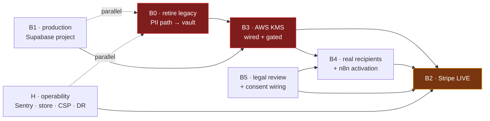

# Phase 10 — Closing B1–B5

> **Purpose.** A sequenced, verifiable plan to close the five hard production blockers in
> `docs/phase-9/production-readiness-review.md` §3.
>
> **Status on writing: BorderPass remains development-only.** Nothing in this document marks a gate
> passed, applies a migration, creates a cloud resource, or authorises real PII, real email or real
> money. `docs/phase-7/gate-ledger.md` remains the single source of truth for gate status; Phase 10
> adds rows to it, it does not tick them here.

---

## 1. Recommended approach

**Close a hidden sixth blocker first, then run B1 → B3 → B5 → B4 → B2 in that order.**

The Phase-9 table treats B3 as "wire an AWS KMS adapter." That is now the *smaller* half of B3. The
larger half is a prerequisite that currently has no blocker number, and it changes the critical path:

> ### 🔴 B0 — two PII custodians still exist, and the legacy one is now fail-closed in production
>
> `docs/production-readiness/kms-production-plan.md` §0 identified two independent PII encryption
> paths and asked for either **K0.1** (make the legacy path fail closed in production) or **K0.2**
> (retire it entirely). **K0.1 landed in Phase 9. K0.2 did not.**
>
> The result is not a security hole any more — it is a *functional* one. `apps/borderpass/app/actions/
> addresses.ts` still calls `sealPii`/`openPii` from `apps/borderpass/src/server/kms.ts`, which now
> throws `DevKmsInProductionError` whenever `BORDERPASS_ENV=production`. So on the day the production
> Supabase project and Vercel environment exist, **`createMyAddress` throws and no customer can save a
> delivery address.** BorderPass cannot take an order in production regardless of how much of B1–B5 is
> done.
>
> Closing B1 without B0 buys a production deployment that cannot transact.

This reordering has three consequences worth stating plainly:

1. **B0 is on the critical path for everything that touches an address** — which is B3, B4 (contact
   info is PII) and the order flow itself. It is not optional cleanup.
2. **B1 can proceed in parallel** with B0, because provisioning a project is independent of which
   ciphertext format the app writes. Do them concurrently; they are the only two that parallelise
   cleanly at the start.
3. **B2 (Stripe LIVE) stays last, unchanged.** Money goes live only after PII handling, comms and
   legal are real. This matches the Phase-9 §5 sequencing and `stripe-live-checklist.md`.

### What changed since the Phase-9 blocker table

The table in `production-readiness-review.md` §3 predates the Phase 9 production-readiness work and is
stale in five places. Verified against the tree at `cfa3a45`:

| Item | Phase-9 review says | Verified state today | Effect on Phase 10 |
|---|---|---|---|
| B5 legal surface | "No `/terms`, `/privacy`, no consent checkbox" | `app/(public)/terms` + `app/(public)/privacy` pages, `src/content/legal/{terms,privacy,consent}.ts`, `consents` table, `consents-policies.sql`, `src/server/consent.ts` all exist | B5 shrinks to counsel review + sign-up wiring + retention/deletion |
| B4 delivery | "only a synthetic resolver" | `src/server/resend.ts` has real delivery with an `EMAIL_DELIVERY_ENABLED` kill-switch and an `EMAIL_SAFE_RECIPIENT` redirect | B4 shrinks to real recipient resolution + n8n activation + bounce/suppression |
| Observability | "a no-op stub — highest-value gap" | Real capture pipeline with sanitize/redact, Sentry DSN transport, `initObservabilityFromEnv` | Gap is now narrower but **still open**: no `instrumentation.ts` exists, so it is never initialised at runtime |
| Rate limiting | "none anywhere" | `src/server/rate-limit.ts` wired into `middleware.ts` with per-route policies | Remaining: provision the shared store; in-memory does not survive multi-instance |
| Security headers / CSP | "none" | Full header set in `next.config.mjs`, incl. CSP with a Report-Only mode for preview validation | Remaining: validate Report-Only on preview, then enforce |
| RLS registry (D1) | 3 policy files applied by nothing | 12/12 registered, `registry.mjs --check` blocking on every PR | Closed |
| KMS fail-open (K0.1) | "NO refusal whatsoever" | `src/server/kms.ts` refuses in production before touching key material | Closed — and it is precisely this fix that creates B0 |

**Net:** B4 and B5 are substantially built, the hardening gaps are mostly built, and the real remaining
work is concentrated in **B0 + B3** (one PII custodian, on a real KMS), **B1** (a production project),
and **B2** (money, last).

### Dependency graph

Critical path: **B0 → B3 → B4 → B2**. B1 and H run alongside. B5's counsel review has external lead
time — start it on day 1 regardless of where the code is.

---

## 2. Workstreams

Each carries explicit **acceptance criteria**. A workstream is closed only when every criterion has
recorded evidence in `docs/phase-7/gate-ledger.md` — not when the code merges.

### B0 — one PII custodian (prerequisite for B3)

**Goal.** Exactly one ciphertext format, one key custodian, one rotation story. Retire
`src/server/kms.ts` + `src/domain/crypto/envelope.ts` in favour of `src/server/pii-vault.ts` →
`@maralito/crypto`.

1. Inventory every caller of the legacy path. Current set:
   `app/actions/addresses.ts` (the only production writer), `src/server/kms.test.ts` (tests the
   module being deleted — it goes with it), plus read-only references in `app/api/health/route.ts`,
   `src/content/legal/privacy.ts`, and the quote page. Re-run the inventory before starting; it is one
   grep and it is the difference between a clean deletion and a broken build:
   `grep -rn "server/kms'\|domain/crypto/envelope\|sealPii\|openPii" apps/borderpass --include=*.ts --include=*.tsx`
2. Migrate `addresses.*Enc` to the vault. The `addresses` table stores seven `v1.…` text columns
   (`recipientEnc`, `line1Enc`, `line2Enc`, `cityEnc`, `stateEnc`, `postalEnc`, `phoneEnc`); the vault
   stores one `EncryptedField` jsonb per subject. Prefer **one vault record per address** keyed by
   `subject_type='delivery_address'` over seven per-column records — `storeDeliveryAddress` /
   `readDeliveryAddress` already exist for exactly this shape.
3. Write the forward migration. Existing dev rows are **synthetic**, so a re-encrypt is optional;
   choose deliberately and record which:
   - *Preferred:* drop the `*Enc` columns in a new migration and re-enter the synthetic fixtures. No
     dual-read code, no half-migrated state.
   - *If any row must survive:* a one-shot backfill script that reads via `openPii` and writes via
     `storeDeliveryAddress` inside a transaction, then a follow-up migration to drop the columns.
     Never leave both paths writable.
4. Delete `src/server/kms.ts` and `src/domain/crypto/envelope.ts`. Add a CI guard — extend
   `scripts/check-server-only-boundary.mjs` or add a sibling — that fails if either module returns.
5. Re-run the full gate set.

**Acceptance criteria**
- [ ] `grep -rn "server/kms'\|domain/crypto/envelope" apps/borderpass --include=*.ts --include=*.tsx` returns nothing.
- [ ] A CI guard fails the build if either module is reintroduced.
- [ ] `createMyAddress` writes through `pii-vault.ts` only, and its unit tests assert the vault is called.
- [ ] With `BORDERPASS_ENV=production` and a **local** provider, `createMyAddress` still fails closed (the B3 refusal must survive the migration — B0 must not accidentally open the door it was protecting).
- [ ] Migration is non-destructive to any non-synthetic data, and `db:generate` output is reviewed and committed.

### B1 — production Supabase project

**Goal.** A production project that shares no credential, no data and no history with
`borderpass-dev-gate`.

1. New Supabase project in its own org/project separation. **PITR enabled at creation** — it cannot be
   applied retroactively to data you have already lost.
2. Apply migrations `0000`–`0006` via `pnpm --filter @maralito/db db:migrate`.
3. Apply **all 12** registered RLS policy files in registry order. Use the registry as the source of
   truth (`registry.mjs --list`), never a hand-typed list — that is what D1 was about.
4. Apply least-privilege grants (`authenticated` only; no `anon`, no `public`).
5. **No synthetic seed in production.** `db:seed` inserts a synthetic org; production gets roles only.
   If the seed script cannot do roles-without-org, fix the script rather than seeding junk.
6. Run `pnpm --filter @maralito/db gate:rls` against the production project. A dev-gate pass does not
   transfer.
7. Vercel Production environment + domain; env matrix per `production-environment-runbook.md`.
   **`BORDERPASS_KMS_KEY` must remain unset** (KMS plan K0.3) until B3 is complete.

**Acceptance criteria**
- [ ] `gate:rls` reports `N passed, 0 failed` against the **production** project, with `leaked_gate_org=0`.
- [ ] Every one of the 12 policy files is applied; RLS is enabled on every table the migrations create.
- [ ] PITR is on; a restore has been rehearsed (see H).
- [ ] No credential is shared with `borderpass-dev-gate`; Preview still points at dev-gate.
- [ ] `BORDERPASS_KMS_KEY` is confirmed **unset** in Production.
- [ ] Recorded as a **new** ledger row — rows 6–10 refer to the dev project and do not transfer.

### B3 — AWS KMS wired and gated

**Goal.** A real CMK is the KEK custodian in production, with least-privilege IAM, audit and rotation.
The AWS provider is already implemented and offline-verified (24/24); this is the wiring and the
infrastructure.

Infrastructure is **Terraform-first** — the key, its policy, the IAM role and the CloudTrail trail all
live in `infra/` as code, not console clicks. The Phase-9 review notes IaC scanning (checkov/tfsec)
was deferred "once `infra/` exists"; this is when it exists, so add that CI job in the same PR.

1. `infra/kms/` — CMK with `enable_key_rotation = true`, an alias, and a **deny-by-default key policy**
   granting `Encrypt`/`Decrypt` only to the application principal and key administration only to a
   separate admin principal (dual control).
2. IAM policy for the app principal: `kms:Encrypt` + `kms:Decrypt` on that key ARN only. No `kms:*`,
   no wildcard resource. Bind it to the encryption context the provider already sets
   (`AWS_KMS_ENCRYPTION_CONTEXT`) with a `kms:EncryptionContext:` condition — this is what stops a
   stolen credential decrypting anything but BorderPass PII.
3. CloudTrail **data events** for KMS (management events alone will not show `Decrypt` calls).
4. Credentials on Vercel Production. Prefer short-lived OIDC over static keys; if static keys are
   unavoidable, document the rotation cadence and set a calendar reminder.
5. Run gates **G2–G4** from `kms-production-plan.md` §7 with a throwaway script *before* touching
   `config.ts`. Fail-closed beats a half-wired key path.
6. Land the one-case factory change in `packages/crypto/src/kms/config.ts` (`case 'aws': return
   createAwsKmsProvider()`), deploy, run **G5–G10**.
7. Owner-approved real encrypt/decrypt smoke against the live key.

**Acceptance criteria**
- [ ] `terraform plan` is clean and the applied state matches; checkov/tfsec pass in CI.
- [ ] Key policy denies by default; app principal holds `Encrypt`/`Decrypt` on one key ARN, scoped by encryption context.
- [ ] CloudTrail shows a real `Decrypt` event from the app principal during the smoke.
- [ ] Automatic CMK rotation is enabled; DEK rotation behaviour is documented.
- [ ] Break-glass is dual-control and **rehearsed**, not just written down.
- [ ] `getKmsProvider` returns the AWS provider for `MARALITO_KMS_PROVIDER=aws` and still throws for `gcp`.
- [ ] G1–G10 pass with recorded evidence; owner sign-off captured per `decision-kms.md`.
- [ ] **Only now** may real PII be stored.

### B5 — legal review and consent capture

**Goal.** Lawful basis for processing PII across US↔MX, and the retention/deletion paths that go with
it. Mostly built; the long pole is external.

1. **Start counsel review on day 1.** `src/content/legal/{terms,privacy}.ts` is drafted; review is
   calendar time you do not control, and B2 depends on it.
2. Wire consent capture at sign-up into the existing `consents` table via `src/server/consent.ts`.
   Record consent **version** and timestamp, not a boolean — a bare boolean cannot answer "what did
   this customer agree to."
3. Implement data-retention and deletion paths. Deletion must cover the vault: a deleted customer's
   `encrypted_pii` rows must go, not just the `addresses` row pointing at them.
4. Confirm the Stripe onboarding requirements against the published ToS/Privacy URLs.

**Acceptance criteria**
- [ ] Counsel has reviewed and signed off ToS + Privacy; the reviewed version is the deployed version.
- [ ] Sign-up records a versioned, timestamped consent row; the flow cannot complete without it.
- [ ] A deletion request provably removes vault records — verified by a test that asserts `readDecryptedPII` returns null afterwards.
- [ ] Retention policy documented with concrete periods, not "as long as necessary."

### B4 — real recipients and n8n activation

**Goal.** Real customers receive real receipts and status emails. **Blocked on B3** (contact info is
PII) and on B5 (consent).

1. Replace the synthetic resolver with a real one reading contact info from the vault.
2. Production env: `EMAIL_DELIVERY_ENABLED=true`, **`EMAIL_SAFE_RECIPIENT` unset**. Getting this wrong
   in either direction is the classic failure — see §5.
3. Activate the n8n workflows (Notification Router, Global Error Handler).
4. Bounce and suppression handling; verify the Resend webhook path end to end.
5. Verify the notification outbox stays idempotent under real dispatch — the `notification_outbox_idem_uq`
   constraint already exists; prove it holds against a real provider, not a fake.

**Acceptance criteria**
- [ ] One real receipt reaches a real inbox for a real (small) order.
- [ ] A hard bounce suppresses correctly and does not retry forever.
- [ ] Duplicate dispatch produces exactly one send.
- [ ] `EMAIL_SAFE_RECIPIENT` is unset in Production and set in Preview — asserted, not assumed.

### B2 — Stripe LIVE (last)

**Goal.** Take real money. `docs/production-readiness/stripe-live-checklist.md` is the operative
document; it already carries preconditions, the round-trip, kill-switch and first-week watch.

Do not begin until B0, B1, B3, B4, B5 and H are closed. Stripe account/business verification has
external lead time — **submit it early**, run it in parallel, but do not flip live keys until the
preconditions are genuinely met.

**Acceptance criteria** — per the checklist, at minimum:
- [ ] Every §1 precondition ✅.
- [ ] Account and business verification complete.
- [ ] Live webhook endpoint + secret; signature verification fail-closed in production.
- [ ] Smallest safe real-money round-trip succeeds, then is refunded.
- [ ] Kill-switch **rehearsed before** the first real charge.
- [ ] Ledger row 15 recorded with evidence; owner sign-off.

### H — operability (parallel, gates B2)

Not a blocker on its own, but B2 must not go live without it.

1. **`instrumentation.ts`** — the observability package is built but never initialised. Add
   `apps/borderpass/instrumentation.ts` calling `initObservabilityFromEnv()`, set `SENTRY_DSN`.
   Highest value per hour of any item in this plan.
2. **Shared rate-limit store.** `rate-limit.ts` is wired but in-memory; on multi-instance Vercel that
   is per-instance and effectively no limit. Provision the store (`rate-limiting-and-headers.md`).
3. **CSP enforcement.** Validate `Content-Security-Policy-Report-Only` on preview, collect violations,
   then switch to enforcing.
4. **Backup/restore drill.** Rehearse a PITR restore into a throwaway project. Document real RPO/RTO
   measured from the drill, not aspirational numbers.
5. **Alerting + on-call.** Route webhook failures, dispatch failures and disputes to a human via the
   n8n Global Error Handler.
6. Retire or fix `docs/current-build-state.md`, which still says nothing is deployed.

**Acceptance criteria**
- [ ] A deliberately thrown server error appears in Sentry with PII redacted.
- [ ] Rate limits hold across instances under a burst test.
- [ ] CSP enforcing with zero console violations on the core flows.
- [ ] A restore drill completed; RPO/RTO recorded from measurement.
- [ ] A test alert pages a human.

---

## 3. Sequencing

```mermaid
gantt
  dateFormat X
  axisFormat %s
  section Critical path
  B0 retire legacy PII path      :crit, b0, 0, 2
  B3 AWS KMS wired + gated       :crit, b3, after b0, 3
  B4 real recipients + n8n       :b4, after b3, 1
  B2 Stripe LIVE                 :milestone, after b4, 0
  section Parallel
  B1 production Supabase         :b1, 0, 2
  H operability                  :h, 0, 3
  section External lead time
  B5 counsel review              :b5, 0, 5
  Stripe business verification   :sv, 0, 5
```

Units are working days of *focused* effort, not calendar days. **~1.5–2 focused weeks** of engineering,
gated by two external dependencies — counsel review and Stripe verification — which is why both start
on day 1 even though neither blocks early code.

Do not compress by running B3 before B0, or B2 before B4. Those two orderings are the ones that create
irreversible states: real PII under the wrong custodian, and real money before real comms.

---

## 4. Security considerations

- **Fail-closed stays fail-closed.** B0 removes a module whose *purpose* is a production refusal. The
  refusal must survive the migration. This is why B0's acceptance criteria include a production-refusal
  test rather than only a "vault is called" test.
- **One custodian, one format.** Two ciphertext formats mean two rotation stories and two ways to get
  decryption wrong. The whole point of B0 is that there is nothing to reconcile later.
- **Encryption context is the real IAM boundary.** Scoping the app principal to a key ARN is table
  stakes; binding it to the encryption context is what makes a leaked credential useless outside
  BorderPass PII.
- **CloudTrail data events, not management events.** Management events will not show you a single
  `Decrypt`. Getting this wrong means believing you have an audit trail when you do not.
- **Production seed is not dev seed.** `db:seed` inserts a synthetic org. Never run it against
  production; roles only.
- **Preview must never reach production data.** Preview stays on dev-gate with
  `EMAIL_DELIVERY_ENABLED=false` and `EMAIL_SAFE_RECIPIENT` set, throughout.
- **The invariants carry over unchanged.** State-machine-only mutations, `withTenant` vs audited
  `withPrivilegedDbAccess`, webhook-as-source-of-truth, the CI boundary guards, RLS registry
  fail-closed. Phase 10 adds infrastructure; it must not soften any of these.

---

## 5. Failure modes and troubleshooting

| Failure | Symptom | Cause | Fix |
|---|---|---|---|
| Address save throws in production | `DevKmsInProductionError` on `createMyAddress` | B0 not done — legacy path still wired and refuses in production | Complete B0. Do **not** "fix" it by weakening the refusal. |
| Real PII under a dev-grade key | Silent; only visible in the DB | `BORDERPASS_KMS_KEY` set in Production before B3 | KMS plan K0.3: keep it unset. Treat any such data as compromised — rotate and re-encrypt. |
| RLS missing on a table in production | Cross-tenant read succeeds | A policy file applied by nothing | Apply from `registry.mjs --list`, never a hand-typed list. `registry --check` is blocking in CI for this reason. |
| Rate limits do nothing under load | Bursts pass on a multi-instance deploy | In-memory store, per-instance | Provision the shared store (H2). |
| No errors in Sentry despite failures | Dashboard empty | `initObservability` never called — no `instrumentation.ts` | H1. The package is built; it is simply never initialised. |
| Every customer email goes to one inbox | Real customers get nothing | `EMAIL_SAFE_RECIPIENT` set in Production | Unset in Production; assert it in a startup check. |
| Real email sent from preview | A synthetic order emails a real person | `EMAIL_DELIVERY_ENABLED` not `false` in Preview | Set it; assert it. |
| `Decrypt` invisible in CloudTrail | Empty audit trail | Data events not enabled | Enable KMS data events (B3.3). |
| Restore fails when needed | PITR unavailable for the window | PITR enabled after the fact | Enable at project creation (B1.1) and rehearse (H4). |
| Stripe LIVE webhook silently failing | Payments succeed, orders never reach `paid` | Live webhook secret missing/mismatched | Signature verification is fail-closed by design — check the live secret, not the code. Rehearse the kill-switch first. |

---

## 6. Go-live gate

A new ledger section with **production** rows — dev-gate rows do not transfer. Required before any
launch recommendation:

- [ ] B0 · one PII custodian, legacy path deleted, CI-guarded
- [ ] B1 · production Supabase, `gate:rls` green **on production**, PITR on
- [ ] B3 · AWS KMS wired, IAM least-privilege, CloudTrail proven, rotation + break-glass rehearsed, owner-signed
- [ ] B5 · counsel-approved ToS + Privacy, versioned consent, deletion proven
- [ ] B4 · real receipt delivered, bounce suppressed, dispatch idempotent
- [ ] H · Sentry live, shared rate-limit store, CSP enforcing, restore drill measured, alerting pages
- [ ] B2 · Stripe LIVE round-trip + refund, kill-switch rehearsed, owner-signed
- [ ] All CI checks green on the release commit
- [ ] **Soft launch** — a handful of real orders under active monitoring before any marketing push

**A market-launch recommendation remains forbidden until every box above carries recorded evidence.**
Passing offline tests is not evidence. A dev-project pass is not evidence. Owner sign-off is required
where `decision-kms.md` and the ledger require it.
