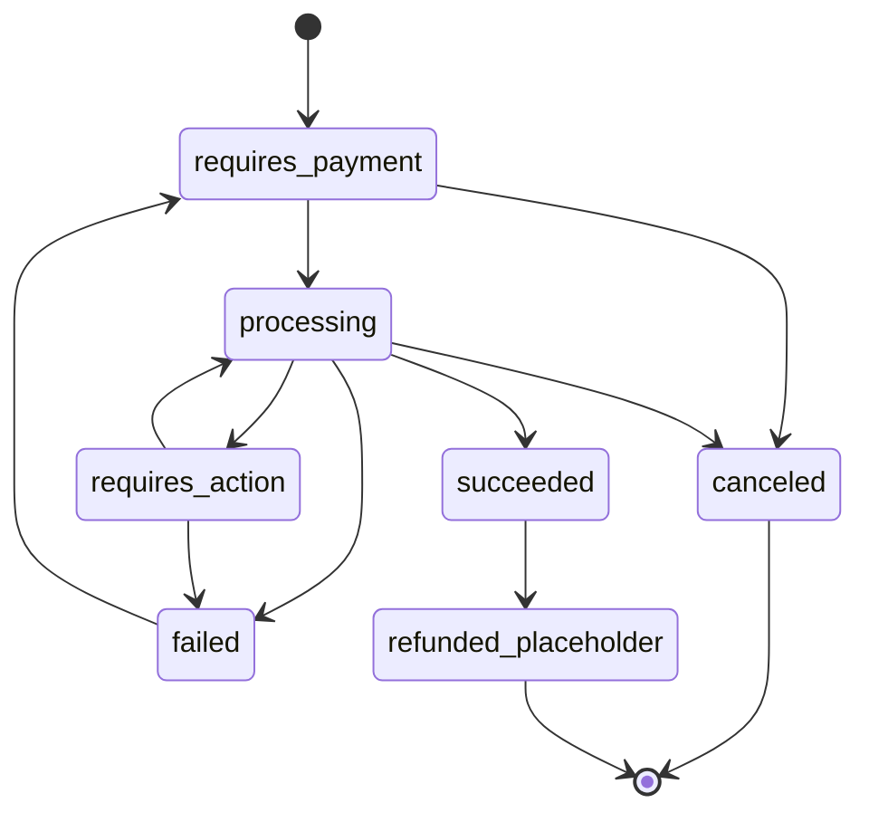

# Phase 4 — Payment State Machine

> Pure, status-only (provider/system-driven; not role-gated). Single mutation seam: `transitionPayment`. ADR-0010.

## States (7)
`requires_payment`, `processing`, `requires_action`, `succeeded`, `failed`, `canceled`, `refunded_placeholder`.

## Legal transitions
| From | To |
|------|-----|
| requires_payment | processing, canceled |
| processing | succeeded, failed, requires_action, canceled |
| requires_action | processing, failed |
| failed | requires_payment |
| succeeded | refunded_placeholder *(reserved; no refund logic in Phase 4)* |
| canceled | — (terminal) |
| refunded_placeholder | — (terminal) |

## The seam — `transitionPayment(p, to, actor, meta?)`
1. `assertPaymentTransition(p.status, to)` — illegal → `IllegalPaymentTransitionError`.
2. Privileged: update `payments.status`; insert a `payment_events` row (from/to + provider event id + minimal summary).
3. `writeAudit('payment.<to>')` (redacted).
4. `emitPaymentEvent('payment.<to>')` (placeholder).
5. **Cascade (only `to === succeeded`):** read order; if `orderPaidCascadeTarget('succeeded', orderStatus) === 'paid'` (i.e. order is `awaiting_payment`), call `transitionOrderPrivileged(awaiting_payment → paid)`. Otherwise no-op.

## Safety guarantee
`orderPaidCascadeTarget` (pure, exhaustively unit-tested) returns `paid` **only** for `succeeded` + `awaiting_payment`. `failed`, `canceled`, `requires_action`, `processing`, `requires_payment`, `refunded_placeholder` → `null`. There is no other path to order `paid`, and `transitionOrder` independently asserts the order edge. A re-delivered success on an already-paid order is an idempotent no-op.
