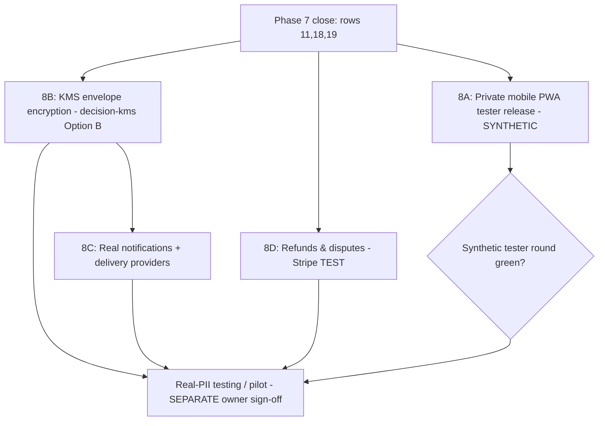

# BorderPass — Phase 8 Plan (PROPOSED)

> **Status:** PLAN ONLY (drafted 2026-07-02). **Phase 8 has NOT started.** No implementation until:
> (1) Phase 7 closes — rows **11 (OTP)**, **18 (secret rotation)**, **19 (owner sign-off)** — and
> (2) the owner sends **`START BORDERPASS PHASE 8`**. ADR-0014 (proposed) records this scope + sequencing.
> Development-only. No real PII, real payments, or public launch is authorized by this document.

## 1. Objective

Take BorderPass from a gate-hardened, synthetic-only dev build to a product that can (a) be exercised by
**real internal testers**, and then (b) safely handle **real customer data and money** — by delivering four
workstreams in a dependency-safe order, each behind its own gates.

Owner-selected scope: **all four** —
**8A** Private mobile PWA tester release · **8B** KMS-gated real PII · **8C** Real notifications + delivery providers · **8D** Refunds & disputes.

## 2. Hard preconditions (Phase 7 close-out — blockers for ALL of Phase 8)

| # | Gate | Owner action |
|---|------|--------------|
| 11 | OTP → provisioning → session smoke | Resolve Supabase redirect save, run synthetic OTP, record evidence |
| 18 | Rotate exposed dev secrets + env/secrets review | Rotate `service_role` + DB password, update secret stores, record |
| 19 | Owner sign-off for testing release | Sign `deployment-readiness-checklist.md` |

Nothing in Phase 8 ships to testers or touches real data until these are ✅.

## 3. Dependency graph

**Rule:** 8A and 8D can run in TEST/synthetic mode right after Phase 7 closes. **8B (KMS) is the gate for any real PII** (real address/RFC/KYC), and therefore must precede real-data use of 8C and any pilot.

## 4. Workstreams (each is its own increment-gated sub-phase: plan → START → increments → review)

### 8A — Private mobile PWA tester release (synthetic only)
- **Goal:** internal testers exercise the full flow on iOS/Android via the installable PWA, synthetic data only.
- **Scope:** deploy PWA to a controlled test host (HTTPS); configure Supabase redirect URLs; run the QA checklist in `mobile-private-testing-checklist.md`; capture per-device results.
- **Acceptance:** OTP login, order create, quote accept, **Stripe TEST** payment (webhook-confirmed), inspection/delivery visibility, cross-tenant isolation on-device — all pass; no real PII; owner sign-off for the tester round.
- **Non-goals:** public listing, real payments, real PII, push notifications (web-push limited on iOS).
- **Risk:** iOS PWA auth/redirect quirks → mitigate with OTP-code fallback.

### 8B — KMS-gated real PII (envelope encryption)
- **Goal:** implement `decision-kms.md` **Option B** so real delivery address / RFC / KYC / documents can be stored encrypted.
- **Scope:** Cloud KMS (AWS/GCP) CMK + app-side envelope encryption seam in the data layer; encrypted columns replace the opaque `delivery_address_ref` for real addresses; key custody, rotation, KMS audit logging, least-privilege encrypt/decrypt IAM, dual-control break-glass; PII access auditing; data-subject/erasure handling design (compliance-aware).
- **Acceptance:** real address/PII stored only as ciphertext; plaintext keys never at rest; RLS + field encryption both enforced; documented rotation + break-glass; validated on the dev-gate project with synthetic-but-realistic data.
- **Non-goals:** collecting real customer PII before this is validated + owner-approved.
- **Risk:** key mismanagement → treat as security-critical; threat-model before build.

### 8C — Real notifications + delivery providers
- **Goal:** turn the `notification_outbox` placeholder into real sends, and wire courier/delivery.
- **Scope:** Resend (email) + Twilio (SMS/WhatsApp) senders driven by the outbox (idempotent, ret/backoff, provider webhooks for delivery status); courier/delivery-provider integration for `delivery_preparations`; suppression/opt-out + rate limits.
- **Acceptance:** outbox → provider send is idempotent and observable; failures retried + dead-lettered; no PII in logs; **real recipient contact info requires 8B (KMS)** if stored.
- **Non-goals:** marketing/bulk sends; sending to real customers before 8B + consent handling.
- **Risk:** deliverability + spam compliance (SPF/DKIM/DMARC, opt-out) — configure before real sends.

### 8D — Refunds & disputes (Stripe)
- **Goal:** complete the payment lifecycle beyond the current `refunds` placeholder.
- **Scope:** refund initiation via a `transitionPayment`-style seam (partial/full), refund + `charge.dispute.*` webhooks into the payment state machine, ledger/audit, customer-visible refund status; **Stripe TEST mode first**.
- **Acceptance:** refund + dispute paths proven in TEST mode with idempotency + isolation tests (PGlite + offline Stripe), mirroring the rows 12–14 pattern; order/payment states stay consistent; no double-refund.
- **Non-goals:** live refunds before Stripe LIVE validation (Phase 7 row 15) + owner approval.
- **Risk:** money-movement correctness → strong idempotency + state-machine tests; never auto-move live money.

## 5. Cross-cutting guardrails (unchanged from Phase 7)

- Status mutated ONLY via the state-machine seams (`transitionOrder/Quote/Payment/Inspection/DeliveryPrep`, and new refund seam).
- Tenant data access ONLY via `withTenant` / `withPrivilegedDbAccess`; raw client stays banned in `apps/**`.
- Server-only secrets never in `NEXT_PUBLIC_`; all new provider secrets go through the secret manager; rotation owners defined.
- Every sub-phase stays development-only until its own gates pass; **real PII, real payments, and public launch each require separate owner sign-off.**
- CI security gates (SAST/secret-scan/Semgrep/OSV) must stay green on every PR.

## 6. Proposed sequencing

1. **Close Phase 7** (rows 11, 18, 19).
2. **8A** private tester release (synthetic) → owner-signed tester round.
3. **8D** refunds & disputes (Stripe TEST) — payment-domain, parallelizable with 8A.
4. **8B** KMS envelope encryption — the gate for any real PII.
5. **8C** real notifications + delivery providers — real recipient data only after 8B.
6. **Only after 8B + 8C + 8D + Stripe LIVE (row 15) + owner sign-off:** consider a real-PII / real-payment pilot (its own plan, not covered here).

## 7. Non-goals for Phase 8

Public launch / app-store GA · real payments before Stripe LIVE validation + sign-off · storing real PII before 8B is validated · bulk/marketing messaging · autonomous money movement · starting a "Phase 9" pilot without a separate plan.

## 8. What happens next

This is a plan. To begin, the owner: (1) closes Phase 7 rows 11/18/19, (2) picks the first sub-phase to build
(recommended: **8A**), and (3) sends **`START BORDERPASS PHASE 8 — <sub-phase>`**. I will then write the sub-phase's
increment plan and wait for per-increment approval, exactly as in Phases 2–7. ADR-0014 (proposed) accompanies this plan.
