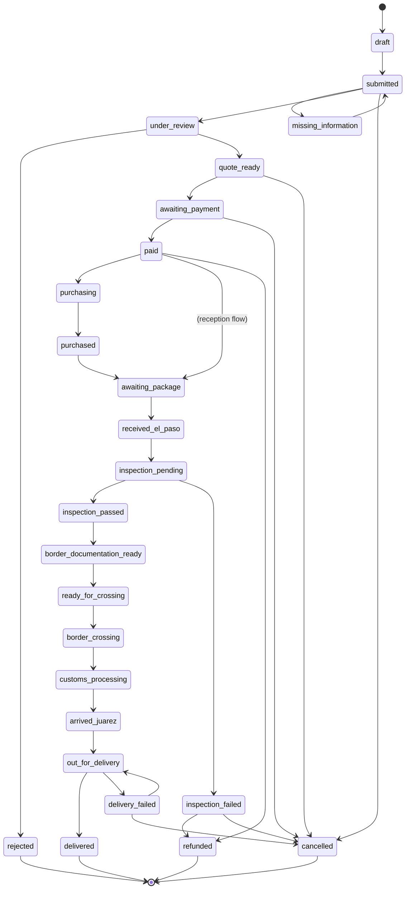

# 09 · Order State Machine

The canonical order lifecycle. Every order has exactly one status at a time; transitions are driven by the [automation workflows](./13-automation-workflows.md) and emit events + audit. Customer-facing labels feed the [Border Journey](./10-border-journey-model.md) (EN/ES). **Every transition is audit-logged.**

---

## 9.1 State diagram

> Note: buy-for-me passes through `purchasing`/`purchased`; package-reception enters at `awaiting_package` after payment (or directly if no upfront fee). Both converge at `received_el_paso`.

---

## 9.2 Status specifications

> Columns: **Meaning · Who can set · Trigger · Customer label (EN / ES) · Internal label · Notification · Next allowed · Automation · Audit.** Audit = **required for all**.

### draft
- **Meaning:** Request started, not submitted. **Set by:** Customer/system. **Trigger:** New Request begun.
- **Customer label:** *Draft / Borrador*. **Internal:** Draft. **Notification:** none.
- **Next:** submitted, (abandon). **Automation:** autosave. 

### submitted
- **Meaning:** Customer submitted the request. **Set by:** Customer/system. **Trigger:** Submit in New Request.
- **Customer:** *Request received / Solicitud recibida*. **Internal:** Submitted. **Notification:** *Request submitted*.
- **Next:** missing_information, under_review, cancelled. **Automation:** Intake workflow starts.

### missing_information
- **Meaning:** Required info/receipt/RFC missing. **Set by:** System/Intake Agent/reviewer. **Trigger:** Validation gap.
- **Customer:** *Action needed / Acción requerida*. **Internal:** Missing info. **Notification:** *Missing information*.
- **Next:** submitted (resubmit), cancelled. **Automation:** Missing-info workflow.

### under_review
- **Meaning:** Risk/compliance review in progress. **Set by:** System/reviewer. **Trigger:** Passed intake → review (MVP: all orders).
- **Customer:** *Reviewing your request / Revisando tu solicitud*. **Internal:** Under review. **Notification:** optional ("reviewing").
- **Next:** rejected, quote_ready, cancelled. **Automation:** Risk-review workflow (Risk Agent recommends, `HUMAN-APPROVAL`).

### rejected
- **Meaning:** Order cannot proceed (prohibited/compliance). **Set by:** Compliance (human). **Trigger:** Rejection decision.
- **Customer:** *Unable to proceed / No podemos continuar*. **Internal:** Rejected. **Notification:** rejection w/ reason.
- **Next:** terminal. **Automation:** notify + audit.

### quote_ready
- **Meaning:** Transparent quote available. **Set by:** System/Quote Agent + reviewer. **Trigger:** Quote approved.
- **Customer:** *Quote ready / Cotización lista*. **Internal:** Quote ready. **Notification:** *Quote ready*.
- **Next:** awaiting_payment, cancelled, (expire). **Automation:** Quote workflow + expiry timer.

### awaiting_payment
- **Meaning:** Customer accepted quote; payment pending. **Set by:** System. **Trigger:** Quote accepted.
- **Customer:** *Awaiting payment / Pago pendiente*. **Internal:** Awaiting payment. **Notification:** payment prompt + expiry reminder.
- **Next:** paid, cancelled, (expire). **Automation:** Payment workflow (Stripe intent).

### paid
- **Meaning:** Payment confirmed. **Set by:** System (Stripe webhook). **Trigger:** `payment.succeeded`.
- **Customer:** *Payment received / Pago recibido*. **Internal:** Paid. **Notification:** *Payment received* + receipt.
- **Next:** purchasing (buy-for-me) | awaiting_package (reception), refunded. **Automation:** Payment-confirmation workflow.

### purchasing
- **Meaning:** BorderPass is buying the item. **Set by:** System/Ops. **Trigger:** Purchase task created.
- **Customer:** *Purchasing your item / Comprando tu artículo*. **Internal:** Purchasing. **Notification:** optional.
- **Next:** purchased, (refund/cancel exception). **Automation:** Purchase-assignment workflow (`HUMAN-APPROVAL` to buy).

### purchased
- **Meaning:** Item bought; awaiting arrival at Hub. **Set by:** Buyer/Ops. **Trigger:** Purchase confirmed + proof.
- **Customer:** *Purchased in the U.S. / Comprado en EE. UU.*. **Internal:** Purchased. **Notification:** *Purchased* (journey stage).
- **Next:** awaiting_package. **Automation:** record receipt; update journey.

### awaiting_package
- **Meaning:** Waiting for package at El Paso Hub. **Set by:** System. **Trigger:** Purchased or reception submitted.
- **Customer:** *On its way to our Hub / En camino a nuestro Hub*. **Internal:** Awaiting package. **Notification:** optional.
- **Next:** received_el_paso. **Automation:** await carrier scan / Hub receipt; timeout → concierge.

### received_el_paso
- **Meaning:** Package received at El Paso Hub. **Set by:** Hub staff (scan). **Trigger:** Hub receipt.
- **Customer:** *Received at El Paso Hub / Recibido en el Hub de El Paso*. **Internal:** Received EP. **Notification:** *Package received*.
- **Next:** inspection_pending. **Automation:** Package-received workflow → create inspection task.

### inspection_pending
- **Meaning:** Awaiting/under inspection. **Set by:** System/Inspector. **Trigger:** Inspection task created.
- **Customer:** *Inspecting your package / Inspeccionando tu paquete*. **Internal:** Inspection pending. **Notification:** optional.
- **Next:** inspection_passed, inspection_failed. **Automation:** Inspection workflow (Assistant recommends).

### inspection_passed
- **Meaning:** Contents verified, sealed. **Set by:** Inspector (+compliance if flagged). **Trigger:** Inspection complete OK.
- **Customer:** *Inspection complete / Inspección completa* (+ View Photos). **Internal:** Inspection passed. **Notification:** *Inspection completed*.
- **Next:** border_documentation_ready. **Automation:** store photos/serial/seal; advance.

### inspection_failed
- **Meaning:** Wrong/damaged/prohibited/mismatch. **Set by:** Inspector/Compliance. **Trigger:** Inspection issue.
- **Customer:** *Issue found / Encontramos un problema*. **Internal:** Inspection failed. **Notification:** *Issue found*.
- **Next:** refunded, cancelled, (resolve→back). **Automation:** halt; `HUMAN-APPROVAL` resolution.

### border_documentation_ready
- **Meaning:** Customs docs assembled. **Set by:** Compliance/Ops (+Journey Agent draft). **Trigger:** Docs prepared + approved.
- **Customer:** *Border documents ready / Documentos listos*. **Internal:** Docs ready. **Notification:** journey stage.
- **Next:** ready_for_crossing. **Automation:** Border-doc step (`HUMAN-APPROVAL`).

### ready_for_crossing
- **Meaning:** Cleared internally to cross; queued. **Set by:** Ops. **Trigger:** Docs + scheduling done.
- **Customer:** *Ready to cross / Listo para cruzar*. **Internal:** Ready for crossing. **Notification:** optional.
- **Next:** border_crossing. **Automation:** dispatch scheduling.

### border_crossing
- **Meaning:** Physically crossing the border. **Set by:** Ops/system. **Trigger:** Crossing begun.
- **Customer:** *Crossing the border / Cruzando la frontera*. **Internal:** Border crossing. **Notification:** *Border crossing started*.
- **Next:** customs_processing. **Automation:** Crossing workflow; location updates.

### customs_processing
- **Meaning:** In customs processing. **Set by:** Ops/system. **Trigger:** At customs.
- **Customer:** *Customs processing / Procesando en aduana*. **Internal:** Customs. **Notification:** *(Customs delay)* if held.
- **Next:** arrived_juarez, (hold/delay). **Automation:** monitor; delay-notification workflow.

### arrived_juarez
- **Meaning:** Arrived in Ciudad Juárez. **Set by:** Ops/system. **Trigger:** Arrival scan.
- **Customer:** *Arrived in Juárez / Llegó a Juárez*. **Internal:** Arrived MX. **Notification:** journey stage.
- **Next:** out_for_delivery. **Automation:** create delivery task / dispatch.

### out_for_delivery
- **Meaning:** With driver for last-mile. **Set by:** Ops/Driver. **Trigger:** Driver assigned + en route.
- **Customer:** *Out for delivery / En reparto*. **Internal:** Out for delivery. **Notification:** *Out for delivery* + window.
- **Next:** delivered, delivery_failed. **Automation:** Delivery workflow.

### delivered
- **Meaning:** Delivered with proof. **Set by:** Driver/system. **Trigger:** Proof captured.
- **Customer:** *Delivered / Entregado*. **Internal:** Delivered. **Notification:** *Delivered* (+ proof).
- **Next:** terminal (follow-up). **Automation:** close order; satisfaction follow-up.

### delivery_failed
- **Meaning:** Attempt failed. **Set by:** Driver/system. **Trigger:** Failed attempt.
- **Customer:** *Delivery attempt failed / Intento de entrega fallido*. **Internal:** Delivery failed. **Notification:** failed-delivery + reschedule.
- **Next:** out_for_delivery (retry), cancelled. **Automation:** Failed-delivery workflow (reschedule/escalate).

### cancelled
- **Meaning:** Order cancelled. **Set by:** Customer/Ops/system. **Trigger:** Cancellation (per rules 08).
- **Customer:** *Cancelled / Cancelado*. **Internal:** Cancelled. **Notification:** cancellation confirm.
- **Next:** terminal (may link to refunded). **Automation:** compensation (reverse tasks).

### refunded
- **Meaning:** Refund processed. **Set by:** Finance (`HUMAN-APPROVAL`)/system. **Trigger:** Refund executed.
- **Customer:** *Refunded / Reembolsado*. **Internal:** Refunded. **Notification:** *Refund processed*.
- **Next:** terminal. **Automation:** Refund workflow; ledger; idempotent.

---

## 9.3 Status groups (for UI + queues)
| Group | Statuses | Customer Border Journey stage |
|-------|----------|-------------------------------|
| Intake | draft, submitted, missing_information, under_review | Request received |
| Quote/Pay | quote_ready, awaiting_payment, paid | Quote ready → Payment received |
| Fulfilment | purchasing, purchased, awaiting_package | Purchased in U.S. |
| Hub | received_el_paso, inspection_pending, inspection_passed/failed | Received → Inspection |
| Crossing | border_documentation_ready, ready_for_crossing, border_crossing, customs_processing | Docs → Crossing → Customs |
| Last mile | arrived_juarez, out_for_delivery, delivered, delivery_failed | Arrived → Out for delivery → Delivered |
| Terminal-exception | rejected, cancelled, refunded | (exception messaging) |

## 9.4 Rules
- **Forward-only** except defined back-transitions (missing_information→submitted, delivery_failed→out_for_delivery, inspection resolution).
- **Money gates:** no `purchasing`/`awaiting_package` fulfilment before `paid`; no crossing before `inspection_passed` + `border_documentation_ready`.
- **Human gates:** `rejected`, quote approval (→quote_ready), purchase (→purchasing), border docs (→border_documentation_ready), inspection_failed resolution, `refunded` all require `HUMAN-APPROVAL`.
- **Every transition** emits a `borderpass.order.*` event + audit record; customer notification per the matrix above.
