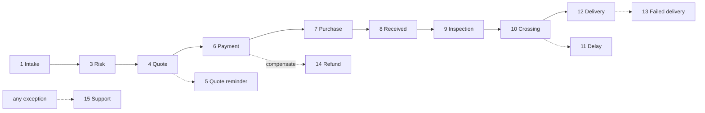

# 13 · Automation Workflows

Fifteen BorderPass automations, defined on the Maralito Automation Platform (durable, idempotent, compensable). Each: **Trigger · Steps · System action · Agent action · Human action · Notifications · Data updates · Failure handling · Retry · Audit.** Statuses per (09); agents per (12). `HUMAN-APPROVAL` = human gate.

> All workflows: durable + idempotent (no duplicate effects on retry), emit events + audit on every step, and compensate on failure. Notifications via platform Notifications (14).

---

## W1 — New request intake
- **Trigger:** `borderpass.order.submitted`.
- **Steps:** validate → enrich (profile/KYC) → AI validate → risk sub-workflow (W3) → branch to quote (W4) or missing-info (W2).
- **System:** create Order/Items; status `submitted`→`under_review`. **Agent:** 🤖 Intake validates; Risk recommends. **Human:** reviewer (MVP all). 
- **Notifications:** *Request submitted*. **Data:** order, items, validation result.
- **Failure:** invalid → W2 / reject. **Retry:** transient steps retried. **Audit:** intake + routing.

## W2 — Missing information request
- **Trigger:** validation gap (from W1 or reviewer).
- **Steps:** identify missing fields → set `missing_information` → notify customer → await resubmit (signal) → re-validate → resume W1.
- **System:** pause order. **Agent:** 🤖 Intake lists gaps. **Human:** customer supplies info; reviewer may clarify.
- **Notifications:** *Missing information* (what's needed). **Data:** missing-field list, resubmission.
- **Failure:** no response in window → reminder → concierge follow-up. **Retry:** reminders. **Audit:** request + resolution.

## W3 — Risk review
- **Trigger:** order reaches review (W1).
- **Steps:** gather facts → rules eval (risk band) → 🤖 Risk Agent narrative → branch: LOW/MED→quote; HIGH→`HUMAN-APPROVAL`; BLOCK→reject.
- **System:** `under_review`; set outcome. **Agent:** 🤖 Risk recommends band+rationale. **Human:** **compliance approves/rejects/holds (`HUMAN-APPROVAL`)**.
- **Notifications:** rejection w/ reason (if rejected). **Data:** risk band, matched rules, rationale, decision.
- **Failure:** non-decision → fail-safe manual review (never auto-clear). **Retry:** fact-gather retried. **Audit:** band + rules + human decision (compliance-critical).

## W4 — Quote generation
- **Trigger:** risk cleared (W3).
- **Steps:** gather pricing facts → pricing rules → 🤖 Quote draft (service+item+duties) → `HUMAN-APPROVAL` (MVP all / non-standard) → generate quote + PDF → present → set expiry.
- **System:** `quote_ready`. **Agent:** 🤖 Quote drafts + duty estimate. **Human:** finance approves/sends.
- **Notifications:** *Quote ready*. **Data:** quote breakdown + version, expiry.
- **Failure:** pricing error → retry/branch. **Retry:** yes. **Audit:** quote + approver.

## W5 — Quote expiration reminder
- **Trigger:** schedule (quote expiry − reminder window), unpaid.
- **Steps:** check unpaid → send reminder → at expiry, mark expired → offer re-quote.
- **System:** expiry timer; mark expired. **Agent:** — . **Human:** none.
- **Notifications:** *Quote expiring* reminder; expiry notice. **Data:** reminder sent, expiry status.
- **Failure:** none material. **Retry:** scheduled. **Audit:** reminder + expiry.

## W6 — Payment confirmation
- **Trigger:** quote accepted → payment intent; resumes on Stripe webhook.
- **Steps:** create intent → await `payment.succeeded/failed` (signal) → on success: `paid`, store receipt, start fulfilment (W7 buy-for-me / W8 reception); on fail: dunning.
- **System:** payment + receipt; advance order. **Agent:** 🤖 Finance reconciles. **Human:** disputes only.
- **Notifications:** *Payment received* + receipt. **Data:** payment ref, receipt, ledger.
- **Failure:** payment fail → retry/dunning → cancel if exhausted; downstream failure → refund (W14, compensation). **Retry:** payment + idempotent webhook (dedupe Stripe event id). **Audit:** payment + reconciliation.

## W7 — Purchase task assignment (buy-for-me)
- **Trigger:** `paid` (buy-for-me).
- **Steps:** create buyer task → 🤖 Shopping re-checks price/availability → buyer purchases (`HUMAN-APPROVAL` to spend) → upload proof → variance check (>budget → finance approval) → `purchased`.
- **System:** `purchasing`→`purchased`. **Agent:** 🤖 Shopping. **Human:** buyer purchases; finance on variance.
- **Notifications:** *Purchased* (journey). **Data:** purchase proof/receipt, actual cost.
- **Failure:** out of stock/price change → notify + options (alt/refund W14). **Retry:** task reassignment. **Audit:** purchase + approvals.

## W8 — Package received
- **Trigger:** Hub receipt / carrier scan.
- **Steps:** register package (weight/dims/photos) → match to order (🤖 match; unmatched→staff task) → `received_el_paso` → start inspection (W9).
- **System:** package record; advance. **Agent:** 🤖 match assist. **Human:** Hub staff receive/scan; resolve unmatched.
- **Notifications:** *Package received*. **Data:** package, photos, match.
- **Failure:** unmatched → staff task; never-arrived (W via timeout) → concierge. **Retry:** scan idempotent. **Audit:** receipt + match.

## W9 — Inspection completed
- **Trigger:** inspection task done (from W8).
- **Steps:** inspector captures photos/serial/seal + checklist → 🤖 Inspection Assistant analyzes vs. declared/receipt → branch: pass→`inspection_passed`→border docs; fail→`inspection_failed`+`HUMAN-APPROVAL`.
- **System:** inspection record; advance/halt. **Agent:** 🤖 Inspection Assistant (recommend). **Human:** inspector; compliance on fail.
- **Notifications:** *Inspection completed* (+View Photos) / *Issue found*. **Data:** inspection, photos, serial, seal, flags.
- **Failure:** fail → resolution (refund/return/replace, `HUMAN-APPROVAL`). **Retry:** re-inspection. **Audit:** inspection + outcome.

## W10 — Border crossing started
- **Trigger:** `inspection_passed`.
- **Steps:** 🤖 Border Journey drafts customs docs → compliance final check + `HUMAN-APPROVAL` → `border_documentation_ready`→`ready_for_crossing`→`border_crossing`→`customs_processing` → await clearance (signal/long wait).
- **System:** docs; crossing/customs state; location. **Agent:** 🤖 Border Journey (docs+ETA+narration). **Human:** **compliance approves docs (`HUMAN-APPROVAL`)**; broker/ops on holds.
- **Notifications:** *Border crossing started*; *(Customs delay)* if held. **Data:** documents, crossing state, ETA.
- **Failure:** customs hold → W11 delay; rejection → compliance path. **Retry:** long-wait durable; resubmit docs. **Audit:** docs + crossing milestones.

## W11 — Delay notification
- **Trigger:** stage exceeds expected window (esp. customs) or known hold.
- **Steps:** detect delay → 🤖 Border Journey explains + updates ETA → ops confirm → notify customer.
- **System:** delay flag + new ETA. **Agent:** 🤖 explanation. **Human:** ops confirm sensitive customs messaging.
- **Notifications:** *Customs delay* (reason + new ETA, calm tone). **Data:** delay reason, updated ETA.
- **Failure:** prolonged hold → escalate concierge/compliance. **Retry:** re-check schedule. **Audit:** delay + comms.

## W12 — Delivery confirmation
- **Trigger:** `arrived_juarez`.
- **Steps:** choose mode (driver/carrier) → create delivery task → `out_for_delivery` → await delivery (signal) → proof captured → `delivered` → schedule follow-up.
- **System:** delivery task; proof; close order. **Agent:** 🤖 Ops Coordinator; Journey "Delivered" moment. **Human:** driver delivers + proof.
- **Notifications:** *Out for delivery*; *Delivered* (+proof). **Data:** delivery timestamp, proof, recipient.
- **Failure:** failed attempt → W13. **Retry:** reattempt. **Audit:** delivery + proof.

## W13 — Failed delivery
- **Trigger:** failed delivery attempt.
- **Steps:** `delivery_failed` → notify + reason → reschedule (up to N) → if exhausted → concierge + options (pickup/return) → possible refund (W14).
- **System:** reschedule; attempt count. **Agent:** 🤖 Ops Coordinator reschedules. **Human:** concierge after N; driver retries.
- **Notifications:** failed-delivery + reschedule. **Data:** attempts, reason, resolution.
- **Failure:** unresolved → abandonment rule (08.13). **Retry:** reattempts (bounded). **Audit:** attempts + outcome.

## W14 — Refund request
- **Trigger:** `borderpass.refund.requested` (customer/support/compensation).
- **Steps:** assess eligibility (rules) → 🤖 Finance recommends amount → `HUMAN-APPROVAL` (finance; compliance if risk) → execute Stripe refund (idempotent) → reverse related tasks (compensation) → `refunded`.
- **System:** refund + ledger; reverse. **Agent:** 🤖 Finance eligibility. **Human:** **finance approves (`HUMAN-APPROVAL`)**, separation of duties.
- **Notifications:** *Refund processed* (amount + timeline). **Data:** reason, eligibility, amount, approver, ledger.
- **Failure:** execution fail → retry (never double-refund) → P0 finance task. **Retry:** idempotent. **Audit:** financial audit trail.

## W15 — Support escalation
- **Trigger:** `borderpass.support.escalated` (exception, SLA breach, customer message).
- **Steps:** assemble context → 🤖 Support triage (classify, draft, suggest) → route by category/priority → human resolves → response (human-sent if sensitive) → resolve.
- **System:** ticket; routing; SLA. **Agent:** 🤖 Support triage. **Human:** concierge/specialist; `HUMAN-APPROVAL` for refunds/compliance.
- **Notifications:** *Support reply*; issue updates. **Data:** ticket, category, resolution.
- **Failure:** SLA breach → escalate lead/manager; unreachable customer → retry contact. **Retry:** reminders. **Audit:** ticket + actions.

---

## 13.1 Workflow chain (happy path)

## 13.2 Cross-cutting guarantees
- **Idempotency + compensation** on every money/irreversible step (no double charge/refund; saga rollback).
- **Human gates** at: risk acceptance/rejection (W3), quotes (W4), purchase (W7), border docs (W10), inspection fail (W9), refunds (W14) — all `HUMAN-APPROVAL`.
- **Every step** emits events + audit; **every customer-relevant transition** fires a notification (14).
