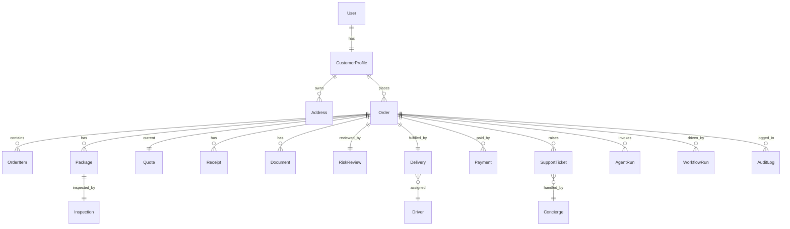

# 15 · Data Requirements

Product-level data model (entities, not SQL). Platform-owned entities (User, Payment, Notification, AuditLog, AgentRun, WorkflowRun) live in Maralito services and are **referenced** by BorderPass; BorderPass owns its domain entities (Order, Package, Inspection, Delivery, RiskReview, etc.). Sensitivity classes: **Public / Internal / Confidential / Restricted (PII/financial/compliance)**. Retention is indicative — `⚠️ VERIFY` against legal/tax/customs retention obligations.

> Each entity: **Purpose · Key fields · Relationships · Sensitive data classification · Retention.**

---

## Platform-owned (referenced)

### User *(Maralito Identity)*
- **Purpose:** Authentication identity across Maralito apps.
- **Key fields:** id, phone (verified), email?, auth identities, status, created_at.
- **Relationships:** 1–1 CustomerProfile; 1–N Orders.
- **Sensitivity:** Restricted (PII, credentials never in BorderPass).
- **Retention:** Life of account + legal minimum; deletable on request.

### Payment *(Maralito Payments / Stripe)*
- **Purpose:** Money movement record (charges, duties, refunds).
- **Key fields:** id, order_id, stripe refs, amount, currency, type (charge/duty/refund), status, ledger entry.
- **Relationships:** N–1 Order; relates Quote, Refund.
- **Sensitivity:** Restricted (financial); **no raw card data** (Stripe refs only).
- **Retention:** Financial retention period `⚠️ VERIFY` (tax/accounting).

### Notification *(Maralito Notifications)*
- **Purpose:** Sent-message record + delivery status.
- **Key fields:** id, recipient, channel, template, status, order_id, sent_at.
- **Relationships:** N–1 Order/User. **Sensitivity:** Confidential (contact + content). **Retention:** Medium-term.

### AuditLog *(Maralito Audit)*
- **Purpose:** Immutable history of who/what did what.
- **Key fields:** id, actor (user/staff/agent/system), action, resource, before/after hash, org, app, trace_id, ts.
- **Relationships:** references any entity. **Sensitivity:** Restricted (immutable). **Retention:** Long (compliance) `⚠️ VERIFY`.

### AgentRun *(Maralito AI)*
- **Purpose:** Record of an AI agent execution.
- **Key fields:** id, agent_key/version, order_id, inputs/outputs, tokens, cost, verdict, confidence, status, trace_id.
- **Relationships:** N–1 Order; links WorkflowRun. **Sensitivity:** Confidential. **Retention:** Medium (eval/audit).

### WorkflowRun *(Maralito Automation)*
- **Purpose:** Record of an automation workflow instance.
- **Key fields:** id, workflow_key/version, subject (order), status, steps, correlation_id, trace_id, timestamps.
- **Relationships:** N–1 Order. **Sensitivity:** Internal. **Retention:** Medium.

---

## BorderPass-owned (domain)

### CustomerProfile
- **Purpose:** Shared customer profile + BorderPass-specific attributes.
- **Key fields:** user_id, name, language (EN/ES), notification prefs, RFC?, KYC status/level, loyalty tier (future), default addresses.
- **Relationships:** 1–1 User; 1–N Address, Order. **Sensitivity:** Restricted (PII, RFC, KYC). **Retention:** Life of account + legal min.

### Address
- **Purpose:** Juárez delivery + El Paso Hub addresses.
- **Key fields:** id, customer_id, type (delivery_juarez/hub_el_paso/business), line, city, region, postal, contact, geo?.
- **Relationships:** N–1 CustomerProfile; used by Order/Delivery. **Sensitivity:** Restricted (PII/location). **Retention:** Life of account.

### Order
- **Purpose:** The central record of a cross-border request.
- **Key fields:** id (BP-####), customer_id, service_type (buy_for_me/reception/pickup/business), status (09), declared_value, purpose, RFC?, risk_band, quote_id, payment_id?, addresses, correlation_id, created/updated.
- **Relationships:** 1–N OrderItem, Package; 1–1 Quote (current), Inspection, Delivery, RiskReview; N–1 Customer. **Sensitivity:** Confidential (+ embedded PII). **Retention:** Order life + legal/tax min `⚠️ VERIFY`.

### OrderItem
- **Purpose:** A line item within an order.
- **Key fields:** id, order_id, description, product_url?, qty, variant, unit_value, category, restriction_flags.
- **Relationships:** N–1 Order. **Sensitivity:** Internal/Confidential. **Retention:** With Order.

### Package
- **Purpose:** Physical parcel handled at the Hub.
- **Key fields:** id, order_id, tracking_number?, carrier?, weight, dims, photos (Files), status, seal_number, location, received_at.
- **Relationships:** N–1 Order; 1–1 Inspection. **Sensitivity:** Internal. **Retention:** Order life.

### Quote
- **Purpose:** Transparent itemized price incl. estimated duties.
- **Key fields:** id, order_id, version, service_fee, item_value, est_duties, taxes, total, currency, rule_version, status, expires_at, approved_by.
- **Relationships:** N–1 Order; relates Payment. **Sensitivity:** Confidential (financial). **Retention:** Order life + financial.

### Receipt
- **Purpose:** Customer-uploaded proof of purchase / BorderPass-issued receipts.
- **Key fields:** id, order_id, type (customer_upload/purchase_proof/issued), file_ref (Files), ocr_data?, amount?, rfc?.
- **Relationships:** N–1 Order. **Sensitivity:** Confidential (financial/PII). **Retention:** Financial/tax `⚠️ VERIFY`.

### Document
- **Purpose:** Customs/border + commercial documents.
- **Key fields:** id, order_id, type (commercial_invoice/customs_declaration/manifest/permit), file_ref, status, approved_by.
- **Relationships:** N–1 Order. **Sensitivity:** Restricted (compliance). **Retention:** Customs retention `⚠️ VERIFY`.

### Inspection
- **Purpose:** Hub inspection record + proof.
- **Key fields:** id, order_id, package_id, inspector_id, checklist, photos (Files), serial_number, serial_match, seal_number, condition, ai_risk_score, outcome (passed/failed), notes, ts.
- **Relationships:** 1–1 Package/Order; relates AgentRun. **Sensitivity:** Confidential. **Retention:** Order life + dispute window.

### Delivery
- **Purpose:** Last-mile delivery record.
- **Key fields:** id, order_id, driver_id, address_id, mode (own/carrier), status, attempts, proof (photo/signature, Files), delivered_at, window.
- **Relationships:** N–1 Order; N–1 Driver. **Sensitivity:** Confidential (PII/location/proof). **Retention:** Order life.

### Driver
- **Purpose:** Delivery personnel/courier.
- **Key fields:** id, name, contact, zones, availability, vehicle?, status, performance.
- **Relationships:** 1–N Delivery. **Sensitivity:** Restricted (staff PII). **Retention:** Employment + legal.

### Concierge
- **Purpose:** Support staff profile shown to customers (Stitch concierge card).
- **Key fields:** id, name, photo, languages, rating, status, assigned_customers?.
- **Relationships:** 1–N SupportTicket/conversations. **Sensitivity:** Internal (public-facing subset). **Retention:** Employment.

### RiskReview
- **Purpose:** Risk/compliance review record + decision.
- **Key fields:** id, order_id, risk_band, matched_rules, ai_rationale, reviewer_id, decision (approve/reject/hold), reason, ts.
- **Relationships:** 1–1 Order; relates AgentRun. **Sensitivity:** Restricted (compliance). **Retention:** Long (compliance) `⚠️ VERIFY`.

### SupportTicket
- **Purpose:** Customer support case.
- **Key fields:** id, customer_id, order_id?, category, severity, status, messages, assignee, sla, resolution, satisfaction.
- **Relationships:** N–1 Customer/Order; N–1 Concierge/agent. **Sensitivity:** Confidential (PII, content). **Retention:** Medium.

---

## 15.1 Entity relationship overview

## 15.2 Data principles
- **PII/financial/compliance minimization:** capture only what's needed; field-encrypt Restricted data (RFC, KYC, financial); files (receipts/docs/photos) in Files with strict ACL.
- **Tenant isolation:** all rows org-scoped (RLS); BorderPass references platform entities by id (no duplication).
- **Auditability:** every state change + sensitive read recorded to AuditLog.
- **Retention + deletion:** support customer data export/deletion; honor legal/tax/customs retention (longer for financial/compliance) — **all `⚠️ VERIFY` with counsel**.
- **No SQL here:** physical schema is engineering's job downstream (Drizzle/migrations), per platform data model.
