# 19 · MVP Roadmap

Phased plan: **30-day MVP build → 60-day V1 → 90-day pilot → post-launch**. Each phase: milestones, deliverables, dependencies, risks, validation goals. Timeboxes are relative and assume the Maralito Platform + Automation MVP foundations are progressing in parallel (auth, payments, notifications, files, audit, workflow engine). `⚠️ VERIFY` — **customs/import legal review is a hard dependency before any real cross-border order; treat as gating.**

> Build sequencing favors the **trust-critical happy path** first; automation depth and self-serve breadth follow.

---

## Phase 0 — Pre-build foundations (parallel, weeks 0–2)
- **Milestones:** Platform MVP services usable (Identity, Payments, Notifications, Files, Audit) + Automation engine wired; BorderPass app registered; Stitch designs handed to engineering; **customs/compliance counsel engaged** (`⚠️ VERIFY` prohibited/accepted lists, duty handling, RFC/invoicing, broker/partner).
- **Dependencies:** Maralito Platform/Automation MVPs; legal counsel; El Paso Hub operational basics.
- **Risk:** legal/compliance unresolved blocks launch → start counsel immediately; Hub readiness.
- **Validation:** signed-off compliance assumptions; design + data model approved.

---

## 30-day MVP plan — "One trustworthy order, end-to-end (ops-assisted)"
**Goal:** A real Juárez customer completes a Buy-for-Me or Package-Reception order with manual ops behind a polished, automated experience.

**Milestones & deliverables**
1. **Auth + onboarding** (EN/ES, phone OTP) + Home hub (Stitch).
2. **New Request flow** (Buy-for-Me + Package Reception; 3 steps) + receipt upload + border info form.
3. **Order + status engine** (24 statuses) + **Border Journey** customer view.
4. **Manual review queue** (every order) + **risk band suggestion** (Risk Agent recommend).
5. **Quote** (AI-drafted, human-approved) + **Stripe payment** + receipt.
6. **El Paso Hub:** package receiving + **inspection checklist + photo/serial/seal** + customer inspection view.
7. **Notifications** (email + WhatsApp/SMS + in-app) for key events + **concierge chat** (WhatsApp).
8. **Admin order dashboard** + **audit logging** + delivery confirmation w/ proof + manual refund/cancel.

**Dependencies:** Phase 0; Stripe + WhatsApp/Resend/Twilio configured; Hub staff + 1+ inspector + 1+ driver; compliance sign-off on initial categories.
**Risks:** scope creep into automation depth (defer); compliance gaps; WhatsApp template approval lead time; Hub process maturity.
**Validation goals:** ≥ 5–10 internal/friendly end-to-end orders delivered; customers understand the quote; inspection proof builds trust; ops can run it from the dashboard.

---

## 60-day V1 plan — "Automate the experience, add depth"
**Goal:** Reduce manual load, raise trust + self-serve, prepare for real pilot volume.

**Milestones & deliverables**
1. **Agent depth:** Shopping Agent (URL resolve), automated **duty estimation** (human-confirmed), Inspection Assistant (vision/OCR match), Border Journey Agent (ETA + narration + delay), Support Agent (triage/draft), Finance Agent (reconcile + refund eligibility), Ops Coordinator (assignment).
2. **Self-serve:** reorder, saved payment methods, BorderPass RFC invoices, notification preferences, push notifications, help center depth.
3. **Workflows:** quote-expiry reminders, delay notifications, failed-delivery handling, refund workflow, support escalation/tickets.
4. **Services:** full Business/freight flow; Local Pickup (assisted→self-serve).
5. **Admin/analytics:** Finance, Compliance/Risk, Support, Analytics dashboards; rules engine config UI.
6. **Automation rate up:** auto-approve low-risk reversible cases (humans keep risky gates).

**Dependencies:** MVP live + stable; agent evals + guardrails; analytics instrumented; more Hub/driver capacity.
**Risks:** AI quality/cost (evals + budgets); over-automating risky decisions (keep human gates); duty-estimate accuracy (legal).
**Validation goals:** rising AI automation rate with falling human-override + error rate; faster cycle time; CSAT ≥ 4.5; repeat orders appearing.

---

## 90-day pilot plan — "Real customers, real corridor, measured"
**Goal:** Run a controlled public pilot in Juárez; prove unit economics + trust + operational reliability.

**Milestones & deliverables**
1. **Limited public launch** (waitlist/invite) to target personas (consumers, students, parents, frequent shoppers, no-visa).
2. **Operational hardening:** capacity, SLAs, on-call, DR/runbooks, fraud rules, abandonment handling.
3. **Marketing + trust:** referral, testimonials, trust content (how it works, fees/duties, prohibited items) EN/ES.
4. **Measurement:** full KPI dashboards (17); weekly ops + monthly business reviews; guardrail alerts.
5. **Feedback loop:** structured user research; iterate on the weakest funnel stage + top edge cases.

**Dependencies:** V1 features stable; compliance fully cleared; payment/refund reliability; concierge staffing.
**Risks:** demand vs. capacity mismatch; customs delays denting trust; CAC vs. CLV; fraud at real volume.
**Validation goals:** activation ≥ 40%, payment conversion ≥ 85%, delivery success ≥ 95%, CSAT ≥ 4.5, **repeat purchase rate ≥ 30%**, positive contribution margin by pilot end, AI override + error rates trending down.

---

## Post-launch roadmap (beyond 90 days)
- **Scale automation autonomy** (graduated trust tiers; auto-handle more low-risk cases).
- **Loyalty/VIP** tiers; premium/concierge upsell.
- **Product-spec V2/V3:** AI Shopping Assistant (full URL→quote), Business Procurement module (multi-user, POs, net terms), Marketplace integration, Subscription shopping, **U.S.-store returns** service.
- **New corridors / cities** (reuse platform + automation; localize).
- **Deeper integrations:** carrier/customs APIs for live tracking; broker partnerships.
- **Continuous trust + cost optimization:** richer inspection proof, insurance products, AI cost/quality tuning.

---

## Roadmap timeline (relative)

```mermaid
gantt
  title BorderPass Roadmap (relative; legal review gates real orders)
  dateFormat X
  axisFormat D%d
  section Foundations
  Platform/Automation MVP + Legal review :0, 2
  section 30-day MVP
  Auth + New Request + Journey           :2, 2
  Quote + Stripe + Manual review         :3, 2
  Hub receive + Inspection + Notify      :3, 2
  Admin dashboard + Audit + Delivery     :4, 1
  section 60-day V1
  Agent depth + duty estimate            :5, 3
  Self-serve + workflows + dashboards    :6, 3
  section 90-day pilot
  Limited public pilot + hardening       :8, 4
  Measure + iterate                      :9, 3
```

## Phase gate criteria
| Gate | Must be true to proceed |
|------|--------------------------|
| MVP → V1 | End-to-end order works; ops can run it; compliance signed off on live categories; audit complete |
| V1 → Pilot | Agents pass evals + guardrails; analytics live; refund/dispute reliable; capacity for pilot volume |
| Pilot → Scale | KPIs hit targets; positive contribution margin; fraud + customs handling proven; trust validated (CSAT + repeat rate) |
